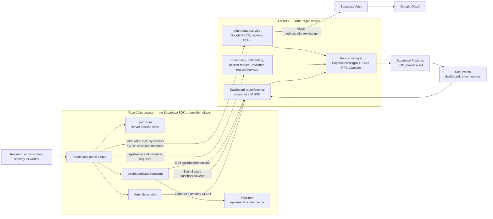
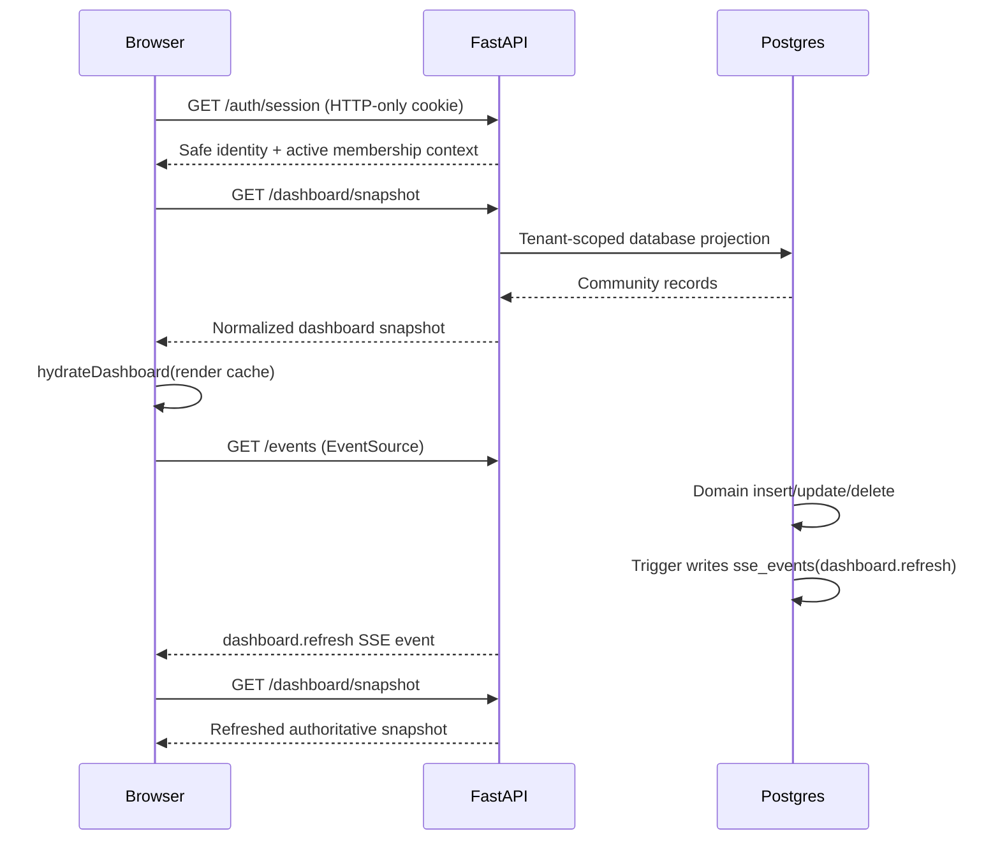

# Current architecture

This document describes the implementation committed in `94556e5`. It replaces
the pre-implementation “current state” assessment in
`AUTH_REGISTRATION_IMPLEMENTATION_PLAN.md` as the architecture reference.

The detailed, source-backed class diagram is available as editable
[PlantUML source](diagrams/HomeBandhu-Architecture-Classes.puml) and a rendered
[PNG](diagrams/HomeBandhu-Architecture-Classes.png).

## Component and trust-boundary diagram

## Runtime sequence for authenticated dashboards

## Live updates

**What we use: server-sent events over a Postgres outbox, fanned out by a
single in-process poller.** Concretely, three parts:

| Part | Where | Job |
| --- | --- | --- |
| Outbox | `sse_events` + `AFTER` triggers | A domain write records that it happened, on the tables carrying a trigger (see *Guarantees and limits*). |
| Poller | `app/core/realtime.py` | One task reads the outbox on a global cursor and routes rows to subscribers by `community_id`, then by audience. |
| Transport | `GET /events` | Same-origin `text/event-stream`; the browser uses the native `EventSource`. `GET /dashboard/events` is a deprecated alias for the same handler. |

The cost model is the point. The poller is **per process, not per client**, so
one indexed primary-key range scan every 500ms serves every connected admin in
every community; adding viewers adds an in-memory queue and nothing else. When
nobody is connected it does not query at all. Each connection costs one asyncio
task, not one OS thread.

That last distinction is not academic. The earlier implementation was a
*synchronous* generator that called `time.sleep(5)`. Starlette iterates sync
generators in the anyio worker threadpool, so every open dashboard held one of
that pool's 40 threads for the entire life of the stream — and because the pool
is shared with all other synchronous work, the 41st dashboard would not merely
lag, it would starve unrelated requests across the whole process.

### Audience scoping

Community was never a sufficient scope. The endpoint's guard is *any active
membership* — it always was — and until `0028_event_audience.sql` the hub fanned
out on `community_id` alone, so a resident who opened the stream received
`access_request.created` for their neighbours, applicant name and all. Nothing
exploited it because no non-admin client connected; the resident portal is what
would have made it exploitable, so the fix landed first.

Every row now declares who may receive it:

| `audience` | Delivered to | Used by |
| --- | --- | --- |
| `community` | every subscriber in the community | genuinely community-wide news |
| `role` | subscribers whose role is in `audience_roles` | `dashboard.refresh`, `access_request.*` — both `{admin, manager}` |
| `member` | the subscriber matching `recipient_membership_id` | anything addressed to one person |

A `check` constraint makes the three shapes mutually exclusive and complete, and
the reader delivers to nobody anything it cannot classify. The point of pairing
those two is that a malformed row is unwritable rather than silently
undeliverable — guessing `community` would be a disclosure.

`_Subscriber` carries `membership_id` and `role` alongside `community_id`, all
three read from the membership the endpoint resolved out of Postgres. The
existing guarantee that a client cannot widen its own stream by replaying
someone else's `Last-Event-ID` therefore extends to the audience unchanged:
both derive from the same verified value, and the resume point only ever seeks.

There is a load argument as well as a privacy one. Twelve tables emit
`dashboard.refresh` on every row change and that frame means *re-read your
snapshot* — a snapshot a resident would be refused. Point five hundred flats at
a community-wide firehose and one unrelated write costs five hundred fetches.

### Why not the alternatives

- **Supabase Realtime** is the native answer and is where this should end up.
  It is a browser-side WebSocket subscription, so adopting it means handing the
  frontend a Supabase key and moving tenant filtering into RLS. That reverses
  the deliberate decision this endpoint exists to enforce — *no provider token
  is exposed to the browser* — so it is a security trade to make on purpose,
  not a performance tweak to slip in. Revisit when RLS covers every table the
  dashboard reads.
- **`LISTEN`/`NOTIFY`** would be true push with no polling at all. It needs a
  direct Postgres connection, and the service holds only Supabase's PostgREST
  client — no `DATABASE_URL`, no driver. It would mean a new dependency, a new
  secret, and a long-lived connection outside the pooler, to remove a latency
  we do not currently notice.
- **Client polling** was what the dead frontend handlers effectively did. It
  scales with viewers rather than with events, which is the wrong way round.

### Guarantees and limits

- **Ordering** is by `sse_events.id` within a community.
- **Reconnects** are covered: the browser resends `Last-Event-ID`, and the
  stream backfills from the database before attaching to the live feed. The
  backfill applies the audience filter twice — once in the query, so a burst of
  admin traffic cannot fill the 100-row page and hide a resident's own events
  behind it, and again in Python, so a mistake in the hand-written PostgREST
  clause can only lose an event and never leak one.
- **Slow consumers** degrade rather than block. A connection more than 64
  events behind stops receiving detail and is sent a resync frame:
  `dashboard.refresh` with `{"resync": true}` for an admin or manager, whose
  listener already handles it by re-fetching the snapshot, and `stream.resync`
  for every other role — the same instruction, under a name that does not claim
  to be about the admin dashboard. The topic is chosen per subscriber because
  the admin listener already ships and this workstream does not edit frontend
  code.
- **The hub is process-local.** Every worker polls independently and each
  serves its own connections correctly, but this scales by adding queries per
  worker. At more than a handful of workers, move to Supabase Realtime rather
  than raising the poll interval.
- **Delivery is at-most-once** and the payload is a hint, never the source of
  truth. The snapshot is authoritative; an event only says "re-read".
- **Trigger coverage is the 12 tables `0007` names**, plus the specific
  `access_requests` topics `0024` adds. The tables introduced by `0018`–`0023`
  — community settings, billing settings, the two category tables, and the
  amenity guest/charge/financial-event tables — carry no trigger, so a write to
  one of them pushes nothing. The admin who made the change sees it because
  their own request re-reads; a *second* admin with the same screen open does
  not, until they act or reload. Closing this is one additive migration
  extending the `to_regclass`-guarded loop, and is not yet scheduled.
- **Retention** is `prune_sse_events()`, which drops rows older than two hours.
  `0024` schedules it every 15 minutes **only where `pg_cron` is installed** —
  the migration's `do` block is a no-op otherwise, and on a project without the
  extension the outbox grows without bound until someone calls the function.
  Enable `pg_cron` from the Supabase dashboard, or schedule the call yourself.

### Topics

| Topic | Audience | Emitted by | Payload |
| --- | --- | --- | --- |
| `dashboard.refresh` | `{admin, manager}` | `emit_dashboard_sse_event` on 12 tables (`0007`, retargeted by `0028`) | `{"table": "..."}` |
| `access_request.created` | `{admin, manager}` | `emit_access_request_sse_event` (`0024`, retargeted by `0028`) | request id, applicant name, relationship, `pending_count` |
| `access_request.decided` | `{admin, manager}` | same | request id, `from`, `to`, `pending_count` |
| `notification.created` | the one recipient | trigger on `notifications` (`0030`) | notification id, kind |
| `stream.resync` | the affected connection | `app/core/realtime.py`, never the database | `{"resync": true}` |

`pending_count` is included so a badge can update from the event itself. The
frontend currently re-snapshots instead, which is also correct — the field is
there so a toast does not need a round trip.

## Out-of-app delivery: notifications and Web Push

**The stream above is not the notification system, and nothing durable is built
on it.** SSE is at-most-once and connection-scoped, and `sse_events` is pruned
every two hours *because* it is ephemeral. A resident whose phone was locked
when a visitor reached the gate must still find out. So there are three layers
over one record:

| Layer | Where | Lifetime | Reaches |
| --- | --- | --- | --- |
| Record | `notifications` + `notify_member()` (`0030`) | until read and pruned | anyone, later |
| In-app live | the SSE frame above | the connection | an open tab |
| Out-of-app | Web Push, `app/core/push.py` | one delivery attempt | a closed tab, a locked phone |

The row is written **first, inside the transaction that caused it**, and both
transports carry it. A notification that can exist without its cause, or a cause
without its notification, is a bug that cannot be reproduced.

**Transport: standards Web Push (RFC 8291/8292) over our own VAPID keypair.**
No vendor account, no SDK in the frontend bundle, and the relays carry
ciphertext they cannot read — which is the same argument that keeps a Supabase
key out of the browser, one layer further out. Rejected: FCM (a Google project,
a service-account secret and a service worker in a frontend we do not own, and
for non-Chrome browsers it wraps this protocol anyway) and OneSignal/Pusher
Beams (a third party *receives the content*, which for flat numbers and visitor
names is a consent decision, not a build convenience).

**The sender obeys a rule the poller does not.**

> The hub may drop. The sender may not duplicate.

Several processes can each poll the outbox and fan out to their own connections
harmlessly. Two senders reading one unsent notification buzz a phone twice. So
claiming is atomic in Postgres — `claim_push_batch()` with `for update skip
locked` — and marks the row sent *before* the HTTP call, making at-most-once the
deliberate bias. Only the last hour is claimed: if the sender is down for a day,
those notifications stay in the feed and simply never buzz, because a phone that
vibrates at 3am about yesterday's visitor is worse than silence.

Limits worth knowing: **push payloads cap at about 4 KB after encryption**, so
the payload is an id and rendered strings, never a record; **a `410` deletes the
subscription** rather than being retried, because hammering a dead endpoint is
how you get rate-limited; **iOS delivers web push only to an installed PWA**, and
since HomeBandhu is web-only that is a ceiling rather than a choice; and
**rotating the VAPID keypair silently unsubscribes every browser**, because a
subscription is bound to the key that created it and the protocol has no
dual-key period.

**Configuration fails closed and quietly.** `PushSettings` is a second
`pydantic-settings` class reading the same `.env`. With no keypair the sender
never starts, `GET /push/vapid-key` and `POST /push/subscriptions` answer `503
push_not_configured`, and everything else works normally — the same shape as
`0024` scheduling under `pg_cron` when the extension is present.

**Not yet observable end to end.** `frontend/public/` has no service worker and
no manifest, and no resident page opens a connection, so nothing can receive a
push today. See `docs/design/RESIDENT_BACKEND_DESIGN.md` §10.6 for what the
frontend must add.

### Who writes into it

`notify_member()` is the only writer, and it is called from inside the RPC that
makes the change — never from Python, and never from a trigger. The distinction
matters: a trigger fires on a row change and knows nothing about *who* should
hear about it or what it should say, and Python writing a second statement after
the first can fail between them.

`notify_community_roles()` (`0032`) is the fan-out for the other direction: one
event, every active member of the community holding one of the given roles.

`notify_community_staff()` (`0031`) is the named audience over it — admins and
managers, the same audience `0028` gives `dashboard.refresh`, deliberately: a
manager who watches the dashboard change but never gets a notification is worse
off than one who gets neither, because only one of those looks like a delivery
bug.

The general function arrived when the visitor writes needed a *different*
audience — `security`, which does not appear in the staff list at all. It
replaced the body of the specific one rather than sitting beside it, because two
copies of a fan-out loop is how one of them ends up filtering on `status =
'active'` and the other does not, and the one that forgets is the one that
notifies people who have left the community.

| Emitter | Kinds | Reaches |
| --- | --- | --- |
| `raise_complaint`, `reopen_complaint`, `confirm_complaint_resolution` (`0031`) | `complaint.raised`, `.reopened`, `.resolution_confirmed` | the community's admins and managers |
| `update_complaint` (`0020`, replaced by `0031`) | `complaint.status_changed`, `.resolved` | the resident who raised it |
| `add_complaint_comment` (`0020`, replaced by `0031`) | `complaint.commented` | whichever side did not write it |
| `decide_visitor_pass` (`0032`) | `visitor.approved`, `.rejected`, `.cancelled` | the community's `security` role, and its admins |
| `settle_resident_payment` (`0033`) | `payment.succeeded`, `.failed` | the resident whose invoice it was |
| `settle_amenity_booking_payment` (`0033`) | `payment.succeeded`, `.failed`, `amenity.booking_paid` | the resident, and — on success only — the community's admins and managers |

Two rules the complaint emitters establish for every later one. **A status change
notifies; an assignee or a progress bar does not** — a resident notified about
everything stops reading notifications, which costs more than the ones they miss.
And **an internal comment notifies nobody**, because a notification leading to a
thread where nothing new is visible tells someone they were discussed and refuses
to say how.

**The payment emitters add the case the rule above does not cover: a failure
notifies too.** A decline nobody is told about leaves a resident believing they
have paid, which is the same failure `US-2.12` names on the booking side and no
better on the invoice side.

**The gateway itself is deliberately not in this list, or in the database.** It
is one pure function — `app/services/payment_simulator.py` — and both RPCs above
*take* an outcome rather than deciding one. That split is what makes swapping in a
real provider a change to one module: the router, the RPC and the migration are
already the shape a live integration needs, including the `payment_events` trail
and the idempotency key a webhook would arrive with.

**The seam also fixes the order of two calls, and the order is the whole point.**
The service looks a prior attempt up by idempotency key *before* it calls the
gateway, not after. With a pure simulator that ordering is invisible; with a real
provider behind the same function it is the difference between a duplicate request
and a duplicate charge — the one failure the key exists to prevent. Both RPCs
check again themselves, which is what covers two identical requests arriving at
once, and both return the recorded payment rather than an id so that a replay is
described by the row that settled it rather than by the attempt that arrived
second.

## One service that composes services

`resident_snapshot_service` is the only service in the backend that calls other
services rather than repositories, and the exception is deliberate. Every figure
on the resident home screen already has an owner — one module decides what
`Unpaid` means, another which stored complaint statuses render as `In Progress`,
a view which visitor passes are still current. Reaching past those into the
repositories would copy each rule into a second place, and the copies would be
correct on the day they were written.

The cost is a projection built from projections and one round trip per part; the
property bought is that **the home screen and the screen it links to cannot
disagree**, which for a screen whose entire job is to summarise the others is the
only property that matters. The parts are read in sequence rather than in one
transaction, so `generatedAt` is when the payload was assembled and not when any
part of it was true — a resident refreshing a home screen is not asking for a
consistent cut of the database.

A notice emitter is still missing: `POST /notices` publishes and fires the SSE
trigger but does not call `notify_member`, so `US-2.4` stays partial. It is one
line inside a write the admin workstream owns.

## Responsibilities

| Layer | Responsibility | Does not do |
| --- | --- | --- |
| Browser routes/pages | Render views and collect user intent. | Direct Supabase calls or tenant authorization. |
| `authStore` | Read backend session, begin Google redirect, logout. | Store OAuth credentials or decide roles. |
| `DashboardDataBootstrap` | Hydrate and refresh the dashboard cache. | Persist tenant records in browser storage. |
| API routers | HTTP contracts, cookies/CSRF dependencies, role guards. | Embed database query logic. |
| Services | Registration, invitation, projection, and policy rules. | Trust client-supplied identity or role. |
| Repositories | Supabase/PostgREST and database RPC operations. | Expose raw provider credentials to the browser. |
| Postgres baseline | Community data, membership scope, RLS, RPC transactions, event outbox. | Authenticate browser users directly. |

## Domain model rules

- `auth.users` is external Google-authenticated identity; `profiles` is its
  application contact record.
- `community_memberships` is the sole tenant-role source. Active, non-ended
  membership determines both community scope and portal authorization.
- `resident_invites` stores opaque token/code hashes and binds redemption to
  the authenticated account email; it is not an authentication factor.
- `access_requests` is the resident join-request workflow. Approval creates
  the resident membership and optional `unit_residencies` record atomically.
- `sse_events` is an internal, tenant-scoped refresh outbox. It does not expose
  direct Postgres subscriptions to the browser. RLS is enabled with no policy,
  so only `service_role` can read it: the rows are cross-tenant by construction
  and the backend fans them out only after checking membership. Retention is
  bounded by `prune_sse_events()` (migration `0024`).

## Design status

The ERD in `homebandhu_submission_erd.dbml` now mirrors the table, enum, key,
and relationship definitions in `backend/supabase/migrations/0001_baseline.sql`.
Compatibility migrations `0006`, `0007`, `0008`, and the timestamped
20260730 migrations exist only for an older hosted project. They reconcile the
legacy schema with the fresh baseline—without changing the fresh-baseline
model—including community status normalization, access-request ownership, and
resident decision RPCs.

The amenity management CRUD flow is database-backed. Booking and ledger read
models are loaded through the snapshot, but their remaining client-side action
handlers require their own backend mutation endpoints before they can claim
durable realtime writes.
