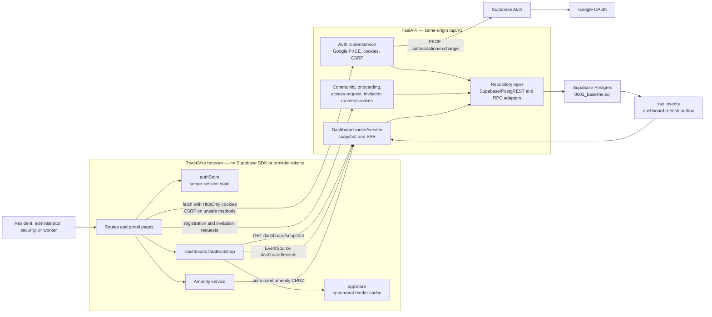
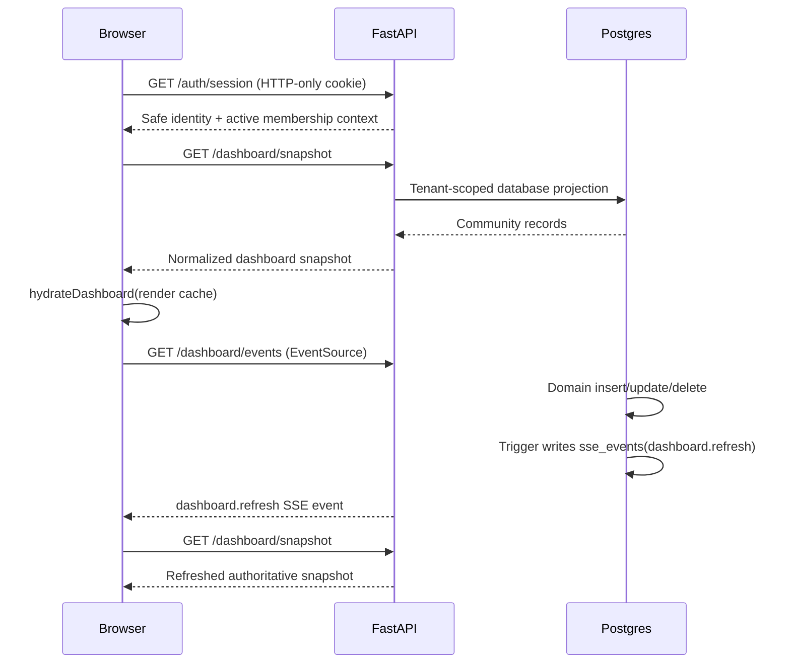

# Current architecture

This document describes the implementation committed in `94556e5`. It replaces
the pre-implementation “current state” assessment in
`AUTH_REGISTRATION_IMPLEMENTATION_PLAN.md` as the architecture reference.

The detailed, source-backed class diagram is available as editable
[PlantUML source](diagrams/HomeBandhu-Architecture-Classes.puml) and a rendered
[PNG](diagrams/HomeBandhu-Architecture-Classes.png).

## Component and trust-boundary diagram

## Runtime sequence for authenticated dashboards

## Live updates

**What we use: server-sent events over a Postgres outbox, fanned out by a
single in-process poller.** Concretely, three parts:

| Part | Where | Job |
| --- | --- | --- |
| Outbox | `sse_events` + `AFTER` triggers | Every domain write records that it happened. |
| Poller | `app/core/realtime.py` | One task reads the outbox on a global cursor and routes rows to subscribers by `community_id`. |
| Transport | `GET /dashboard/events` | Same-origin `text/event-stream`; the browser uses the native `EventSource`. |

The cost model is the point. The poller is **per process, not per client**, so
one indexed primary-key range scan every 500ms serves every connected admin in
every community; adding viewers adds an in-memory queue and nothing else. When
nobody is connected it does not query at all. Each connection costs one asyncio
task, not one OS thread.

That last distinction is not academic. The earlier implementation was a
*synchronous* generator that called `time.sleep(5)`. Starlette iterates sync
generators in the anyio worker threadpool, so every open dashboard held one of
that pool's 40 threads for the entire life of the stream — and because the pool
is shared with all other synchronous work, the 41st dashboard would not merely
lag, it would starve unrelated requests across the whole process.

### Why not the alternatives

- **Supabase Realtime** is the native answer and is where this should end up.
  It is a browser-side WebSocket subscription, so adopting it means handing the
  frontend a Supabase key and moving tenant filtering into RLS. That reverses
  the deliberate decision this endpoint exists to enforce — *no provider token
  is exposed to the browser* — so it is a security trade to make on purpose,
  not a performance tweak to slip in. Revisit when RLS covers every table the
  dashboard reads.
- **`LISTEN`/`NOTIFY`** would be true push with no polling at all. It needs a
  direct Postgres connection, and the service holds only Supabase's PostgREST
  client — no `DATABASE_URL`, no driver. It would mean a new dependency, a new
  secret, and a long-lived connection outside the pooler, to remove a latency
  we do not currently notice.
- **Client polling** was what the dead frontend handlers effectively did. It
  scales with viewers rather than with events, which is the wrong way round.

### Guarantees and limits

- **Ordering** is by `sse_events.id` within a community.
- **Reconnects** are covered: the browser resends `Last-Event-ID`, and the
  stream backfills from the database before attaching to the live feed.
- **Slow consumers** degrade rather than block. A connection more than 64
  events behind stops receiving detail and is sent a `dashboard.refresh` with
  `{"resync": true}`, which its existing listener already handles by
  re-fetching the snapshot.
- **The hub is process-local.** Every worker polls independently and each
  serves its own connections correctly, but this scales by adding queries per
  worker. At more than a handful of workers, move to Supabase Realtime rather
  than raising the poll interval.
- **Delivery is at-most-once** and the payload is a hint, never the source of
  truth. The snapshot is authoritative; an event only says "re-read".

### Topics

| Topic | Emitted by | Payload |
| --- | --- | --- |
| `dashboard.refresh` | `emit_dashboard_sse_event` on 12 tables (migration `0007`) | `{"table": "..."}` |
| `access_request.created` | `emit_access_request_sse_event` (migration `0024`) | request id, applicant name, relationship, `pending_count` |
| `access_request.decided` | same | request id, `from`, `to`, `pending_count` |

`pending_count` is included so a badge can update from the event itself. The
frontend currently re-snapshots instead, which is also correct — the field is
there so a toast does not need a round trip.

## Responsibilities

| Layer | Responsibility | Does not do |
| --- | --- | --- |
| Browser routes/pages | Render views and collect user intent. | Direct Supabase calls or tenant authorization. |
| `authStore` | Read backend session, begin Google redirect, logout. | Store OAuth credentials or decide roles. |
| `DashboardDataBootstrap` | Hydrate and refresh the dashboard cache. | Persist tenant records in browser storage. |
| API routers | HTTP contracts, cookies/CSRF dependencies, role guards. | Embed database query logic. |
| Services | Registration, invitation, projection, and policy rules. | Trust client-supplied identity or role. |
| Repositories | Supabase/PostgREST and database RPC operations. | Expose raw provider credentials to the browser. |
| Postgres baseline | Community data, membership scope, RLS, RPC transactions, event outbox. | Authenticate browser users directly. |

## Domain model rules

- `auth.users` is external Google-authenticated identity; `profiles` is its
  application contact record.
- `community_memberships` is the sole tenant-role source. Active, non-ended
  membership determines both community scope and portal authorization.
- `resident_invites` stores opaque token/code hashes and binds redemption to
  the authenticated account email; it is not an authentication factor.
- `access_requests` is the resident join-request workflow. Approval creates
  the resident membership and optional `unit_residencies` record atomically.
- `sse_events` is an internal, tenant-scoped refresh outbox. It does not expose
  direct Postgres subscriptions to the browser. RLS is enabled with no policy,
  so only `service_role` can read it: the rows are cross-tenant by construction
  and the backend fans them out only after checking membership. Retention is
  bounded by `prune_sse_events()` (migration `0024`).

## Design status

The ERD in `homebandhu_submission_erd.dbml` now mirrors the table, enum, key,
and relationship definitions in `backend/supabase/migrations/0001_baseline.sql`.
Compatibility migrations `0006`, `0007`, `0008`, and the timestamped
20260730 migrations exist only for an older hosted project. They reconcile the
legacy schema with the fresh baseline—without changing the fresh-baseline
model—including community status normalization, access-request ownership, and
resident decision RPCs.

The amenity management CRUD flow is database-backed. Booking and ledger read
models are loaded through the snapshot, but their remaining client-side action
handlers require their own backend mutation endpoints before they can claim
durable realtime writes.
