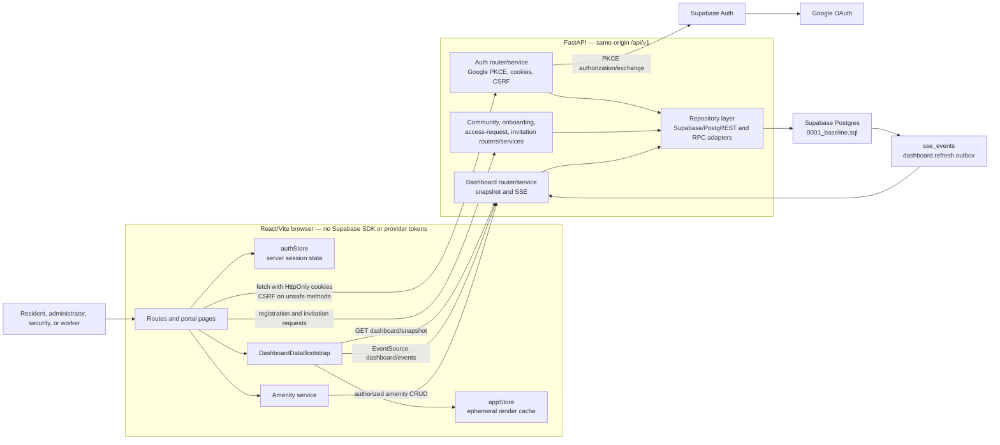
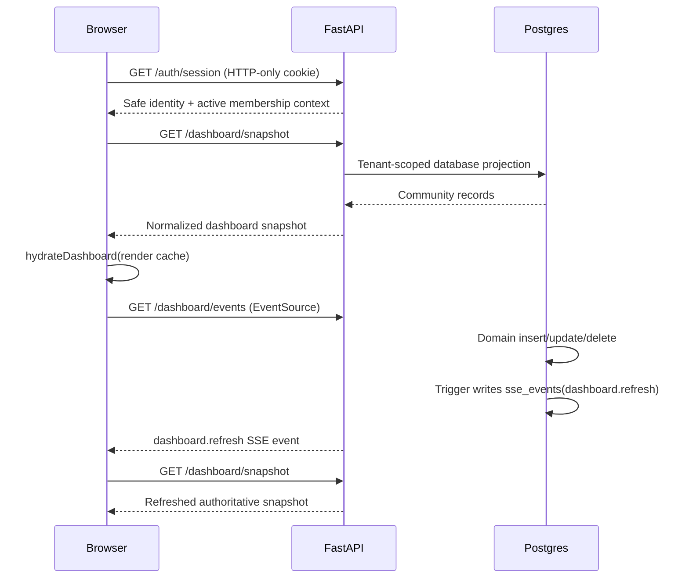

# Current architecture

This document describes the implementation committed in `94556e5`. It replaces
the pre-implementation “current state” assessment in
`AUTH_REGISTRATION_IMPLEMENTATION_PLAN.md` as the architecture reference.

The detailed, source-backed class diagram is available as editable
[PlantUML source](diagrams/HomeBandhu-Architecture-Classes.puml) and a rendered
[PNG](diagrams/HomeBandhu-Architecture-Classes.png).

## Component and trust-boundary diagram

## Runtime sequence for authenticated dashboards

## Responsibilities

| Layer | Responsibility | Does not do |
| --- | --- | --- |
| Browser routes/pages | Render views and collect user intent. | Direct Supabase calls or tenant authorization. |
| `authStore` | Read backend session, begin Google redirect, logout. | Store OAuth credentials or decide roles. |
| `DashboardDataBootstrap` | Hydrate and refresh the dashboard cache. | Persist tenant records in browser storage. |
| API routers | HTTP contracts, cookies/CSRF dependencies, role guards. | Embed database query logic. |
| Services | Registration, invitation, projection, and policy rules. | Trust client-supplied identity or role. |
| Repositories | Supabase/PostgREST and database RPC operations. | Expose raw provider credentials to the browser. |
| Postgres baseline | Community data, membership scope, RLS, RPC transactions, event outbox. | Authenticate browser users directly. |

## Domain model rules

- `auth.users` is external Google-authenticated identity; `profiles` is its
  application contact record.
- `community_memberships` is the sole tenant-role source. Active, non-ended
  membership determines both community scope and portal authorization.
- `resident_invites` stores opaque token/code hashes and binds redemption to a
  verified Google email; it is not an authentication factor.
- `access_requests` is the resident join-request workflow. Approval creates
  the resident membership and optional `unit_residencies` record atomically.
- `sse_events` is an internal, tenant-scoped refresh outbox. It does not expose
  direct Postgres subscriptions to the browser.

## Design status

The ERD in `homebandhu_submission_erd.dbml` now mirrors the table, enum, key,
and relationship definitions in `backend/supabase/migrations/0001_baseline.sql`.
Compatibility migrations `0006` and `0007` exist only for an older hosted
project; they do not change the fresh-baseline model.

The amenity management CRUD flow is database-backed. Booking and ledger read
models are loaded through the snapshot, but their remaining client-side action
handlers require their own backend mutation endpoints before they can claim
durable realtime writes.
