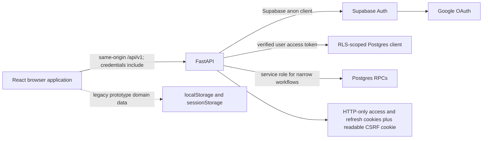

# HomeBandhu authentication and registration implementation plan

Status: implementation-ready design, subject to the policy decisions called out
in Section 1.

Prepared from the working tree on 2026-07-29. This document is a plan, not a
claim that the described target state has already been implemented or tested.

## 1. Executive decision

The current repository can support the requested resident and administrator
registration workflows without replacing its existing Google OAuth foundation.
The cleanest target architecture is:

1. The browser talks only to the same-origin FastAPI API.
2. FastAPI owns Google PKCE, Supabase session exchange, refresh, cookie
   rotation, CSRF protection, and logout.
3. Supabase Auth establishes a person's identity.
4. `community_memberships` establishes that person's role and tenant access.
5. A signed-in person without an active membership is sent to one unified
   `Get started` screen.
6. That screen has `Create a Community` and `Join a Community` tabs.
7. Community creation is one server transaction that creates the community,
   physical structure, enabled features, founder membership, founder residency,
   and active administrator term.
8. Community joining creates an `access_requests` row. An active administrator
   for that same community can approve or reject it. Approval atomically creates
   the resident membership and optional unit residency.
9. Administrator-generated resident links reuse the existing high-entropy,
   email-bound application invitation flow. This is an application invitation
   link, not a Supabase Auth magic link.
10. All identity methods produce the same browser-safe session contract, so the
    presentation order can be changed without changing authorization or
    onboarding code.

### 1.1 Mandatory policy gate: password and OTP

There is a direct conflict between the requested manual password/OTP options and
the repository's current `AGENTS.md`:

- The request asks for email/password registration and previously asked for OTP
  as a secondary option.
- The contributor guide explicitly says Google is the sole provider and says
  not to add password, OTP, magic-link, identity-linking, browser persistence,
  or direct browser-to-Supabase paths.

The implementation must not silently violate that rule. Therefore this plan has
two tracks:

- **Track A — approved current scope:** Google OAuth is the only identity
  method. The method registry and shared session boundary are modular, but only
  Google is enabled. The rest of the admin/resident workflow is fully
  implemented.
- **Track B — conditional extension:** email/password is added only after the
  project owner deliberately edits `AGENTS.md` and accepts the operational
  requirements in Section 16. OTP remains out of scope unless it receives the
  same explicit policy approval.

The user-facing UI must never display an auth method merely because the frontend
knows about it. The backend is the source of truth for enabled methods. This
prevents a deployment from presenting password or OTP when the Supabase project
has not enabled or configured it.

### 1.2 Mandatory deployment gate: the database baseline

The contributor guide requires a single
`backend/supabase/migrations/0001_baseline.sql` for a fresh Supabase project.
That is safe only if the target project can be rebuilt from scratch.

- If the hosted project is disposable or not yet carrying production data:
  update `0001_baseline.sql`, reset the project, and validate the baseline from
  an empty database.
- If the hosted project already contains data that must be preserved: do not
  edit an already-applied migration and assume it will update the database.
  Either authorize a forward migration such as
  `0002_registration_workflows.sql`, or export data and rebuild the fresh
  project. This requires an explicit exception to the single-baseline rule.

Implementation must stop at this gate until `supabase migration list` and the
actual hosted schema establish which case applies.

## 2. Evidence and current validation baseline

### 2.1 Sources inspected

- Current React/Vite routing, auth store, API client, onboarding store, public
  pages, administrator registration pages, resident invitation page, pending
  registration UI, and resident management UI.
- Current FastAPI auth, invitation, onboarding, dependency, security, schema,
  repository, service, and cookie code.
- Current SQL baseline at
  `backend/supabase/migrations/0001_baseline.sql`.
- Current ERD at `docs/homebandhu_submission_erd.dbml`.
- The supplied `ADMIN_REGISTRATION_FLOW.md`, including its four draft steps,
  proposed transactional creation, field constraints, and open decisions.
- Official Supabase documentation for backend PKCE, password auth, password
  security, rate limits, CAPTCHA, full-text search, Realtime, identity linking,
  and production readiness.

The path named in the request, `backend/dbml.txt`, is deleted in the current
working tree. The active diagram is
`docs/homebandhu_submission_erd.dbml`. The plan treats the current source and SQL
as runtime truth, and the diagram as a contract that must be reconciled.

### 2.2 Checkout condition

The checkout is on `main` at the merge commit titled
`Merge origin/main with Google OAuth support`. It already contains a large,
uncommitted refactor: modified, deleted, and untracked auth, onboarding,
migration, documentation, and generated bytecode files. The implementation
must preserve those changes and must not use a broad reset or checkout.

Before implementation, create a focused branch from the exact current working
tree or ask the owner to checkpoint the in-progress changes. Do not mix a schema
reset with unrelated UI changes in one commit.

### 2.3 Commands run against the current checkout

| Check | Result | Evidence boundary |
| --- | --- | --- |
| `npm run build` | Pass | Vite production bundle built; it warned that the main JS chunk is about 850 kB and the onboarding map asset is about 3.8 MB. |
| `npm run lint` | Pass with warnings | Ten existing unused-import warnings; no lint error. |
| `cd backend && python3 -m compileall -q app` | Pass | Python modules compile. |
| `cd backend && UV_CACHE_DIR=<temporary> uv run pytest` | Pass | 17 tests passed: domain contract, invitation pure logic, and role mapping tests. |

These checks do **not** validate Google redirects, cookie attributes, refresh,
CSRF, RLS, hosted Supabase settings, concurrent invitation redemption,
community search, access request decisions, or browser navigation. Those become
required tests in Section 15.

## 3. Current-state architecture map



This boundary is sound: no Supabase JavaScript client is present in the current
frontend, provider tokens stay in HTTP-only cookies, and the browser uses
`/api/v1`. It should be preserved.

### 3.1 Current frontend

| Area | Current behavior | Gap |
| --- | --- | --- |
| `frontend/src/App.jsx` | Restores the server session, exposes `/login`, `/auth/callback`, four founder onboarding steps, `/join`, and protected dashboards. | `/signup` redirects to `/login`; there is no `/register` or `/get-started`; membership-less users are not modeled as a first-class route. |
| `frontend/src/routes/authRoutes.js` | Central route constants and role-to-dashboard mapping. | Missing registration, chooser, review, request-status, and invitation-management route constants. |
| `frontend/src/store/authStore.js` | Restores a session, redirects to Google, completes login, redeems an invite, and logs out. | It collapses identity and membership into `currentUser`; no explicit signed-in/no-membership state; a page calls a nonexistent `resetAdminAuthentication`. |
| `frontend/src/lib/auth/authService.js` | Fetches the session and maps a membership to a legacy application user. | Backend roles are lowercase while the mapper checks uppercase; `portal` is not copied to the mapped user; membership-less users map to `null`, losing authenticated identity. |
| `frontend/src/lib/api/client.js` | Sends same-origin cookies, adds CSRF on unsafe requests, and performs a single refresh retry. | Backend errors use `{ "error": { "code", "message" } }`, but the client does not read that shape, so actionable errors often become `Request failed.` |
| `LandingPage.jsx` | Registration calls-to-action lead to `/login`. | Registration and sign-in intent are indistinguishable. |
| `LoginPage.jsx` | Google-only sign-in. | No registration copy/intent; method order is hard-coded rather than backend-driven. |
| `AuthCallbackPage.jsx` | Restores the session and picks a home route. | A signed-in person with no membership can fall through to `/resident` instead of `/get-started`. |
| `JoinPage.jsx` | Prepares a token/code, starts Google when needed, and redeems the email-bound invitation. | This is already the correct foundation for the requested shareable hash link, but the admin UI does not use its API. |
| `OnboardingFlowRoute.jsx` | Protects founder steps using session state and a persisted draft. | A persisted draft alone is accepted by the UI guard. It must never substitute for a current authenticated, onboarding-eligible server session. |
| `onboardingStore.js` | Persists a versioned four-step founder draft in `sessionStorage`. | The final write occurs on the profile step; no separate review/confirmation step; identity-derived defaults need a one-time merge. |
| Founder pages | Capture community type, blocks/villas, map percentages, features, and founder profile. | Back navigation calls a missing action; server DTOs are loose; current SQL ignores important parts of the draft; success rendering contains stale variables. |
| `PendingRegistrations.jsx` | Shows cards and accept/reject buttons. | Reads and mutates Zustand/local prototype data rather than the database. |
| `Residents.jsx` | Lists local residents and locally generates invitation tokens. | It must call the backend invitation API; a browser-generated token is not an authoritative invitation. |
| `SignupPage.jsx` | Legacy manual form writes a fake pending request to local state. | It is dead/demo auth code and must not be revived. |
| TanStack Query | Already installed and provided by `main.jsx`. | It is not yet used for community search, request status, admin queues, or invitation mutations. |

### 3.2 Current backend

| Area | Current behavior | Gap |
| --- | --- | --- |
| `routers/auth.py` | Backend-owned Google start/callback, session, refresh, and logout. | Needs shared post-auth routing metadata and an enabled-method contract; password stays conditional. |
| `services/auth_service.py` | Builds Supabase authorize URL, exchanges/refreshes tokens, creates profile, and returns membership context. | Membership queries should remain repository-backed; onboarding state and portal routing need explicit contracts. |
| `core/web_session.py` | Signs short-lived OAuth transaction state, creates PKCE, and centralizes cookies. | Preserve it; add no provider tokens to frontend state. |
| `api/deps.py` | Verifies cookie/bearer identity, creates a user-scoped Supabase client, and validates CSRF/origin. | `require_role` references `principal.role`, which does not exist. Authorization must be based on an active membership. |
| `core/security.py` | Verifies Supabase JWTs as identity assertions. | Documentation and callers must not imply that a JWT role is a community role. |
| Invitation router/service/repository | Creates high-entropy email-bound invitations, stores only hashes, prepares a signed pending cookie, and redeems atomically. | Wire the admin UI to it; tighten DTOs; add HTTP/RLS/concurrency tests; optionally generalize intended role for controlled personnel invitations. |
| Onboarding router/service | Calls `create_founder_community` through a service-role client. | Request validation is too loose and the SQL RPC only partially materializes the submitted model. |
| `domain/schemas.py` | Defines browser-safe session, invitation, and founder DTOs. | Mutable literal defaults, `list[dict]`, `dict[str, dict]`, weak enums, redundant invitation email, and no search/access-request contracts. |
| Tests | 17 narrow tests pass. | No FastAPI route tests, Supabase integration tests, browser E2E, cookie/CSRF tests, or transactional workflow tests. |

### 3.3 Current database

The useful existing entities should be reused:

- `profiles` is the application projection of `auth.users`.
- `communities` is the tenant root.
- `community_memberships` owns community-scoped role and lifecycle.
- `unit_residencies` links an active membership to a unit.
- `community_admin_terms` records administrator tenure.
- `resident_invites` already supports opaque email-bound invitation artifacts.
- `access_requests` already models a resident asking to join.
- `audit_events` can record founder creation, request decisions, and invitation
  activity.

The current baseline and ERD are not fully aligned:

- The ERD already includes `access_requests.applicant_profile_id`; the SQL
  baseline does not.
- The ERD requires applicant email and phone; product policy says phone is
  optional.
- The ERD calls the relationship `requested_occupancy_type`; the baseline uses
  the existing `residency_relationship` enum.
- The ERD includes `resulting_invite_id`; a self-service request made by an
  already authenticated person does not need a second invitation confirmation.
- The ERD contains `community_registration_requests`, but the current product
  flow and founder RPC create a community immediately. Adding a second
  platform-operator approval queue would duplicate the founder workflow and is
  not justified by this request. Remove that table from the active ERD or mark
  it explicitly as a future, non-implemented concept.
- Founder `designation` has no correct persistence field. It is scoped to a
  community administrator appointment, not to the person's global profile.
  Add nullable `community_admin_terms.designation` rather than putting it on
  `profiles`.
- The baseline has most postal fields but lacks the ERD's second address line
  and country code. Community search needs city/state disambiguation, and a
  real community record needs a postal identity. Reuse the existing baseline
  naming, add `address_line2` and `country_code`, and make the founder contract
  require line 1, city, state, postal code, and country.
- Several profile, address, building, residency, and invitation fields differ
  between the diagram and baseline. This wider schema drift must be documented,
  but only registration-critical differences should be changed in this scope.
- `access_requests` does not currently have RLS enabled.
- Membership-less authenticated users cannot select communities through the
  current `communities_member` policy.
- `create_founder_community` ignores submitted map locations, most villa
  semantics, designation, profile image, and several response fields. It places
  the founder unit under whichever building happened to be inserted last.

### 3.4 Registration-scope ERD decision log

No new domain table is required for this request.

| Decision | ERD impact | Why it is necessary/minimal |
| --- | --- | --- |
| Reuse `access_requests` | None | It already represents the resident join workflow; a new table would duplicate lifecycle and audit concepts. |
| Add `applicant_profile_id` to the SQL baseline | Baseline catches up to existing ERD | The request must be owned by the verified Supabase identity, not a free-text email. |
| Make applicant email required and phone optional | Adjust ERD phone nullability | Email comes from the verified identity; repository policy explicitly defines phone as optional contact. |
| Use `requested_relationship` with the existing enum | Rename the ERD field | Avoid a second text vocabulary for the same residency concept. |
| Remove `resulting_invite_id` from access request design | Remove ERD field | The requester is already authenticated; approval directly creates membership. |
| Do not add `resulting_membership_id` initially | None | Membership uniqueness plus audit events provide traceability without another FK. |
| Add `community_admin_terms.designation` | One nullable attribute | Designation is appointment/community scoped and otherwise cannot be persisted correctly. |
| Add baseline `communities.address_line2` and `country_code` | Baseline catches up to ERD | Reuses the existing community entity and supports a complete searchable postal identity. |
| Remove/defer `community_registration_requests` | Remove or mark future in ERD | No operator approval workflow was requested; direct founder creation is already the intended transaction. |
| Add trigram extension/index | No entity relationship change | Supports indexed name typeahead without exposing the community table. |
| Add RLS policies and atomic RPCs | No entity relationship change | Enforces tenant and concurrency invariants close to the data. |

## 4. Requirements traceability

| Requested behavior | Reused foundation | Required change |
| --- | --- | --- |
| Homepage Register button | Existing landing CTAs and `/login` | Add `/register`; point only registration CTAs to it. |
| Continue with Google | Existing backend Google PKCE | Reuse; preserve `next` intent and route membership-less identities to `/get-started`. |
| Manual name/email/password | No conforming implementation | Conditional Track B only; never revive `SignupPage` local behavior. |
| Create or join on one screen | Existing founder pages and invitation page | Add `/get-started` with two tabs; create tab launches founder draft, join tab owns directory search/request. |
| Admin workflow from attached document | Existing four founder screens/store | Tighten validation, add review step, correct transactional RPC, refresh server session after creation. |
| Live community name search | `communities` table and TanStack Query | Add an authenticated projection endpoint, trigram index, debounce, cancellation, empty/loading/error states. |
| Admin approves/rejects request | Existing `access_requests` table and pending UI | Add applicant identity binding, APIs, atomic decision RPCs, tenant checks, and query-backed UI. |
| Shareable hash link | Existing invitation service and `/join` | Replace admin local token generation with backend invitation API; display link/code once. |
| Other personnel | Existing membership roles | Reuse invitation/auth session; never allow self-selection of a privileged role. |
| Primary/secondary method swapping | No method catalog | Add backend-provided enabled-method metadata and a small frontend renderer; keep authorization independent. |
| Save/retrieve from database | Founder RPC and invitation tables | Replace local auth/registration mutations with API/database flows; keep unrelated demo modules outside this change. |

## 5. Target domain invariants

These are implementation and test requirements, not suggestions.

1. A Supabase identity does not grant a HomeBandhu role.
2. Only an active, non-ended `community_memberships` row grants tenant access.
3. A browser cannot supply or change its membership role, tenant ID, reviewer
   ID, verified identity email, or profile ID.
4. A founder becomes administrator only inside the same transaction that
   creates the community.
5. A membership-less person may see only a minimal searchable community
   projection: ID, name, type, city, and state.
6. Community search never exposes members, units, administrator identities,
   addresses beyond the approved projection, feature configuration, or billing
   data.
7. An access request is bound to the authenticated `profiles.id`.
8. Only one pending request may exist for a profile/community pair.
9. Only an active administrator of the requested community may decide a
   request.
10. Approval is atomic and idempotent: it cannot create duplicate memberships
    or residencies under retries or concurrent clicks.
11. Rejection never deletes the request; it preserves an audit trail.
12. An invitation plaintext token and code are returned once and never stored.
13. An invitation can be redeemed only by its normalized, verified Google
    email, before expiry, once.
14. Phone is optional contact data and never authenticates a person.
15. Founder contact email defaults to the verified identity email; changing a
    contact field does not change the Supabase identity.
16. No access token, refresh token, OAuth code verifier, service-role key,
    invitation plaintext token, or password is written to browser storage,
    application logs, analytics, or database profile fields.
17. Session cookies, not frontend state, are the authority for authentication.
18. Draft persistence improves UX but cannot authorize access to a route or
    server operation.

## 6. Target navigation and state model

### 6.1 Routes

| Route | Access | Purpose |
| --- | --- | --- |
| `/` | Public | Marketing/home page. |
| `/login` | Public; redirects an active member home | Existing-member sign-in. |
| `/register` | Public; redirects an active member home | Registration auth entry. Google is the only enabled method in Track A. |
| `/auth/callback` | Public callback | Restores the server-created session and routes by membership/intent. |
| `/get-started?tab=create` | Authenticated, no active membership | Unified page with `Create a Community` and `Join a Community`. |
| `/get-started?tab=join` | Authenticated, no active membership | Same page with join tab selected. |
| `/onboarding/community/details` | Authenticated, no membership | Founder step 1. Existing path may be retained temporarily with redirects. |
| `/onboarding/community/map` | Authenticated, no membership | Founder step 2. |
| `/onboarding/community/features` | Authenticated, no membership | Founder step 3. |
| `/onboarding/community/admin` | Authenticated, no membership | Founder step 4. |
| `/onboarding/community/review` | Authenticated, no membership | Review and the sole `Create community` submission. |
| `/onboarding/community/success` | Authenticated new admin | Refreshes session and hands off to `/admin`. |
| `/registration/request` | Authenticated, no membership | Optional stable status page after a join request. This may also be an inline state in `/get-started`. |
| `/join/:token` and `/join` | Public, then authenticated | Existing invitation prepare/auth/redeem flow. |
| `/account` | Authenticated member | Safe account landing for a valid personnel role that does not yet have a dedicated operational portal. |

Route aliases from the current application can remain for one release and use
`<Navigate replace>` to avoid breaking bookmarks.

### 6.2 Explicit session states

The frontend should stop treating `currentUser === null` as both anonymous and
authenticated-without-membership.

```js
export const SESSION_STATUS = Object.freeze({
  LOADING: 'loading',
  ANONYMOUS: 'anonymous',
  ONBOARDING: 'onboarding',
  MEMBER: 'member',
  ERROR: 'error',
});
```

The auth store should retain:

```js
{
  status: SESSION_STATUS.LOADING,
  identity: null,
  membership: null,
  portal: null,
  capabilities: [],
  onboardingEligible: false,
  error: null,
}
```

`currentUser` may remain temporarily as a compatibility selector for existing
dashboards, but it must be derived from `identity + membership`; it must not be
the session source of truth.

### 6.3 Post-auth routing

```js
export function routeForSession(context, fallbackIntent = 'login') {
  if (!context?.identity) return '/login';
  if (!context.membership && context.onboarding_eligible) {
    return fallbackIntent === 'join' ? '/get-started?tab=join' : '/get-started';
  }

  switch (context.membership?.role?.toLowerCase()) {
    case 'admin':
      return '/admin';
    case 'manager':
      return context.portal === 'security-manager'
        ? '/security-manager'
        : '/account';
    case 'security':
      return '/security';
    case 'worker':
      return '/account';
    case 'resident':
      return '/resident';
    default:
      return '/account';
  }
}
```

`/account` shows verified identity, community, membership role/status, logout,
and a clear message that no operational portal is assigned. It must not render
resident or administrator data. Replace it with dedicated worker/manager portals
when those product surfaces are defined.

## 7. Modular authentication method design

“Modular” should mean one stable session boundary and a small data-driven method
catalog. It should not mean building an unused plugin framework.

### 7.1 Backend is the enabled-method source of truth

Add:

```http
GET /api/v1/auth/methods
```

Track A response:

```json
{
  "primary": "google",
  "methods": [
    {
      "id": "google",
      "kind": "redirect",
      "label": "Continue with Google",
      "enabled": true
    }
  ]
}
```

Config:

```env
AUTH_PRIMARY_METHOD=google
AUTH_ENABLED_METHODS=google
```

Startup validation must fail when:

- the primary method is not present in enabled methods;
- an unknown method is enabled;
- Google is enabled without the required Supabase and cookie configuration;
- a forbidden method is enabled while repository policy remains Google-only.

The ordering rule is simple: primary first, then the remaining enabled methods
in configured order. Changing primary/secondary is a configuration change, not
a rewrite of pages or membership logic.

### 7.2 Frontend method renderer

Create a small catalog for rendering behavior:

```js
const renderers = {
  google: {
    start: ({ next }) => {
      window.location.assign(
        `/api/v1/auth/google/start?next=${encodeURIComponent(next)}`
      );
    },
  },
};

export function enabledAuthMethods(serverConfig) {
  return serverConfig.methods
    .filter((method) => method.enabled && renderers[method.id])
    .sort((a, b) =>
      a.id === serverConfig.primary ? -1 : b.id === serverConfig.primary ? 1 : 0
    );
}
```

The server response controls enablement and order; the catalog controls only
how a known method renders/starts. An unsupported server method must be logged
as a configuration error and hidden, not presented as a broken button.

### 7.3 Shared session establishment

Google callback and any future approved identity method must call the same
backend function:

```python
@dataclass(frozen=True)
class ProviderSession:
    access_token: str
    refresh_token: str
    expires_in: int


def establish_browser_session(
    response: Response,
    provider_session: ProviderSession,
) -> None:
    set_access_cookie(response, provider_session.access_token,
                      max_age=provider_session.expires_in)
    set_refresh_cookie(response, provider_session.refresh_token)
    rotate_csrf_cookie(response)
```

Provider-specific code may obtain a `ProviderSession`; it must not decide role,
tenant, onboarding eligibility, cookie names, or post-auth authorization.

## 8. Unified registration experience

### 8.1 Registration entry

The homepage `Register` calls-to-action go to `/register`. Existing-member
`Sign in` calls-to-action remain `/login`.

The two pages may reuse one `AuthEntryPage` component:

```jsx
<AuthEntryPage
  intent="register"
  title="Create your HomeBandhu account"
  subtitle="Use your Google account, then create or join a community."
/>
```

In Track A there is no manual password form. The page can collect no
identity-critical data before Google because Google supplies the verified email
and name. Profile fields are confirmed after authentication.

`next` must remain a server-validated relative path. For registration use:

```text
/api/v1/auth/google/start?next=/auth/callback?intent=register
```

The current signed OAuth transaction cookie remains the authority for the
return path. Do not store OAuth state in `localStorage`.

### 8.2 Get-started tabs

`/get-started` renders:

- `Create a Community`
- `Join a Community`

Tab selection belongs in the URL query string so reload/back/forward behavior
works. Do not create separate auth states for the tabs.

The route guard requires:

```text
session.identity exists
AND session.membership is null
AND session.onboarding_eligible is true
```

An active member who visits `/get-started` is redirected to the dashboard
derived from the active membership. An anonymous user is redirected to
`/register?next=/get-started`.

### 8.3 Create tab

The create tab explains the founder workflow and starts/resumes the existing
versioned session draft. The draft contains non-secret form data only.

The steps are:

1. Association details
2. Map configuration
3. Feature configuration
4. Administrator profile
5. Review and create

The administrator profile is prefilled once from `session.identity`:

- `fullName <- identity.full_name`
- `email <- identity.email`
- profile image may use identity avatar only if the session contract explicitly
  exposes a safe URL

The verified identity email is shown as the account email. If a separate contact
email is editable, label it `Contact email`, store it as contact data, and never
present it as changing the login identity.

### 8.4 Join tab

The join tab has:

1. A search combobox.
2. A selected community summary.
3. Optional unit selector only if the product chooses to expose a safe unit
   projection. The current request does not require it, so defer it.
4. Relationship (`owner`, `tenant`, `family_member`, `caregiver`, `other`).
5. Optional phone contact.
6. `Request to join` mutation.
7. A durable pending/approved/rejected status state.

Name and verified email come from the authenticated session and are not editable
request ownership fields.

## 9. Community search design

The phrase “live database search” should be implemented as debounced PostgreSQL
search through the same-origin API. Supabase Realtime is for subscriptions to
database changes; it is not required for a keystroke-driven lookup. The official
[Supabase full-text search guide](https://supabase.com/docs/guides/database/full-text-search)
describes indexed Postgres search. The
[Realtime Postgres Changes guide](https://supabase.com/docs/guides/realtime/postgres-changes)
is relevant only if the product later needs pushed changes while the results
panel is open.

For short proper names, `pg_trgm` is more useful than word-oriented English
stemming because it supports prefix/substring matching and ranking. The first
release does not need typo autocorrection beyond trigram similarity.

### 9.1 Endpoint

```http
GET /api/v1/communities/search?q=palm&limit=10
```

Requirements:

- authenticated identity;
- at least two normalized characters;
- maximum query length 100;
- limit clamped to 1–20;
- rate limited by user and IP;
- active communities only;
- minimal projection only;
- deterministic ranking and tie-break;
- no raw database filter syntax accepted from the browser.

Response:

```json
{
  "items": [
    {
      "id": "5cb79bf4-6a34-4a6c-b61d-b0aa49f723f3",
      "name": "Palm Grove Residency",
      "community_type": "apartment",
      "city": "Kolkata",
      "state": "West Bengal"
    }
  ]
}
```

### 9.2 Frontend query

```js
export function useCommunitySearch(rawQuery) {
  const query = useDebouncedValue(rawQuery.trim(), 250);

  return useQuery({
    queryKey: ['community-search', query],
    enabled: query.length >= 2,
    staleTime: 30_000,
    queryFn: ({ signal }) =>
      registrationApi.searchCommunities({ query, limit: 10, signal }),
  });
}
```

The existing API client already spreads fetch options, so it can forward
`signal`. The UI needs accessible combobox semantics, keyboard selection,
loading text, empty results, retry, and protection against stale results.

### 9.3 Database index and narrow function

Representative baseline SQL:

```sql
create extension if not exists pg_trgm;

create index communities_active_name_trgm
  on public.communities using gin (lower(name) gin_trgm_ops)
  where status = 'active';

create or replace function public.search_joinable_communities(
  p_query text,
  p_limit integer default 10
)
returns table (
  id uuid,
  name text,
  community_type text,
  city text,
  state text
)
language sql
stable
security definer
set search_path = public
as $$
  select c.id, c.name, c.community_type, c.city, c.state
  from public.communities c
  where c.status = 'active'
    and length(btrim(p_query)) between 2 and 100
    and lower(c.name) % lower(btrim(p_query))
  order by
    case when lower(c.name) like lower(btrim(p_query)) || '%' then 0 else 1 end,
    similarity(lower(c.name), lower(btrim(p_query))) desc,
    c.name asc,
    c.id asc
  limit least(greatest(coalesce(p_limit, 10), 1), 20);
$$;

revoke all on function
  public.search_joinable_communities(text, integer)
  from public, anon, authenticated;
grant execute on function
  public.search_joinable_communities(text, integer)
  to service_role;
```

The API calls this narrow function only after verifying a current user session.
This avoids weakening the general `communities_member` RLS policy.

## 10. Resident access request workflow

### 10.1 Minimal schema reconciliation

Reuse `access_requests`. Do not add a parallel `join_requests` table.

Required registration-scope changes:

```sql
alter table public.access_requests
  add column applicant_profile_id uuid
    references public.profiles(id) on delete cascade;

alter table public.access_requests
  alter column applicant_email set not null;

alter table public.access_requests
  add constraint access_requests_status_check
    check (status in ('pending', 'approved', 'rejected', 'withdrawn'));

alter table public.access_requests
  add constraint access_requests_decision_shape
    check (
      (status = 'pending'
        and reviewed_by_membership_id is null
        and reviewed_at is null)
      or
      (status in ('approved', 'rejected')
        and reviewed_by_membership_id is not null
        and reviewed_at is not null)
      or status = 'withdrawn'
    );

create unique index access_requests_one_pending_per_profile_community
  on public.access_requests (community_id, applicant_profile_id)
  where status = 'pending';

alter table public.access_requests enable row level security;

create policy access_requests_applicant_read
  on public.access_requests
  for select
  using (applicant_profile_id = auth.uid());

create policy access_requests_admin_read
  on public.access_requests
  for select
  using (
    exists (
      select 1
        from public.community_memberships m
       where m.community_id = access_requests.community_id
         and m.profile_id = auth.uid()
         and m.role = 'admin'
         and m.status = 'active'
         and m.ended_at is null
    )
  );
```

For a fresh baseline, define `applicant_profile_id not null` directly. For an
existing database, add it nullable, backfill only after a verified mapping, then
set it `not null`. Never infer profile ownership from an unverified free-text
email.

Phone remains nullable because repository policy defines it as optional contact
data. Update the ERD accordingly. Keep the existing
`requested_relationship public.residency_relationship`; update the ERD name
instead of introducing a second equivalent text concept.

Do not add `resulting_invite_id` for this self-service path. The applicant is
already authenticated. Approval can directly activate membership. The request
row, resulting membership unique constraint, and audit event provide the
necessary traceability. If the project requires a direct foreign-key pointer,
`resulting_membership_id` would describe the actual outcome better, but it is
not needed for the first implementation.

The RLS policies intentionally allow reads only. Create, withdraw, approve, and
reject remain controlled backend operations/RPCs. If withdrawal uses a
user-scoped client instead of a service RPC, add a narrowly constrained update
policy that permits only the owner and only the `pending -> withdrawn`
transition; do not add a generic applicant update policy.

### 10.2 Create request API

```http
POST /api/v1/access-requests
Content-Type: application/json
X-CSRF-Token: ...

{
  "community_id": "5cb79bf4-6a34-4a6c-b61d-b0aa49f723f3",
  "requested_unit_id": null,
  "requested_relationship": "tenant",
  "phone": "+919812345678"
}
```

The service derives:

- `applicant_profile_id` from verified principal;
- `applicant_email` from verified principal;
- `applicant_name` from profile/session;
- `status = pending`.

Validation:

- identity email must be verified;
- requester must have no active membership in that community;
- under the current ERD rule, requester must not already hold an active
  resident/admin home-community membership elsewhere; staff memberships may be
  handled separately;
- requester cannot have another pending request for the community;
- community must be active;
- if present, unit must belong to that community;
- phone must either be absent or normalized to E.164;
- client cannot submit status/reviewer/role/profile/email/name.

Response: `201 Created`.

```json
{
  "id": "ba93...",
  "community": {
    "id": "5cb7...",
    "name": "Palm Grove Residency"
  },
  "status": "pending",
  "requested_relationship": "tenant",
  "created_at": "2026-07-29T12:00:00Z"
}
```

Duplicate pending submission returns a stable `409 ACCESS_REQUEST_PENDING` and
the existing request summary, allowing the UI to resume instead of duplicating
data.

### 10.3 Applicant status APIs

```http
GET /api/v1/access-requests/mine
POST /api/v1/access-requests/{request_id}/withdraw
```

Only the owning profile can list/withdraw. Withdrawal is allowed only while
pending. The frontend can poll `mine` every 30 seconds while visible and refetch
on focus; no direct Supabase Realtime subscription is required.

### 10.4 Administrator queue APIs

```http
GET  /api/v1/admin/access-requests?status=pending&cursor=...&limit=25
POST /api/v1/admin/access-requests/{request_id}/approve
POST /api/v1/admin/access-requests/{request_id}/reject
```

Approve body:

```json
{
  "unit_id": "optional-admin-selected-unit-id",
  "relationship": "tenant"
}
```

Reject body:

```json
{
  "reason": "The provided occupancy details could not be verified."
}
```

The community ID is not accepted as an authority claim. The server loads the
request and verifies that the caller has an active admin membership for that
request's community.

### 10.5 Atomic approval

Representative RPC logic:

```sql
create or replace function public.approve_access_request(
  p_request_id uuid,
  p_reviewer_profile_id uuid,
  p_unit_id uuid default null,
  p_relationship public.residency_relationship default null
)
returns jsonb
language plpgsql
security definer
set search_path = public
as $$
declare
  request_row public.access_requests%rowtype;
  reviewer public.community_memberships%rowtype;
  member_id uuid;
begin
  select *
    into request_row
    from public.access_requests
   where id = p_request_id
   for update;

  if request_row.id is null then
    raise exception using errcode = 'P0002',
      message = 'Access request not found';
  end if;

  select *
    into reviewer
    from public.community_memberships
   where profile_id = p_reviewer_profile_id
     and community_id = request_row.community_id
     and role = 'admin'
     and status = 'active'
     and ended_at is null;

  if reviewer.id is null then
    raise exception using errcode = '42501',
      message = 'Active administrator membership required';
  end if;

  if request_row.status = 'approved' then
    select id into member_id
      from public.community_memberships
     where community_id = request_row.community_id
       and profile_id = request_row.applicant_profile_id
       and status = 'active'
       and ended_at is null;
    return jsonb_build_object(
      'request_id', request_row.id,
      'membership_id', member_id,
      'status', 'approved'
    );
  end if;

  if request_row.status <> 'pending' then
    raise exception 'Access request is no longer pending';
  end if;

  if p_unit_id is not null and not exists (
    select 1 from public.units
     where id = p_unit_id
       and community_id = request_row.community_id
       and status = 'active'
  ) then
    raise exception 'Selected unit does not belong to this community';
  end if;

  insert into public.community_memberships (
    community_id, profile_id, role, status, is_default_community
  )
  values (
    request_row.community_id,
    request_row.applicant_profile_id,
    'resident',
    'active',
    not exists (
      select 1 from public.community_memberships
       where profile_id = request_row.applicant_profile_id
         and status = 'active'
         and ended_at is null
         and is_default_community
    )
  )
  on conflict (community_id, profile_id)
    where ended_at is null
  do nothing
  returning id into member_id;

  if member_id is null then
    select id
      into member_id
      from public.community_memberships
     where community_id = request_row.community_id
       and profile_id = request_row.applicant_profile_id
       and role = 'resident'
       and status = 'active'
       and ended_at is null
     for update;

    if member_id is null then
      raise exception 'Applicant already has an incompatible membership';
    end if;
  end if;

  if p_unit_id is not null then
    insert into public.unit_residencies (
      unit_id, membership_id, relationship_type
    )
    values (
      p_unit_id,
      member_id,
      coalesce(p_relationship, request_row.requested_relationship)
    )
    on conflict (unit_id, membership_id)
      where ended_at is null
    do nothing;
  end if;

  update public.access_requests
     set status = 'approved',
         reviewed_by_membership_id = reviewer.id,
         reviewed_at = now(),
         rejection_reason = null,
         updated_at = now()
   where id = request_row.id;

  insert into public.audit_events (
    community_id, actor_membership_id, action, payload
  )
  values (
    request_row.community_id,
    reviewer.id,
    'access_request.approved',
    jsonb_build_object(
      'access_request_id', request_row.id,
      'membership_id', member_id
    )
  );

  return jsonb_build_object(
    'request_id', request_row.id,
    'membership_id', member_id,
    'status', 'approved'
  );
end;
$$;
```

The exact `ON CONFLICT` syntax must be tested against the final index definition.
If PostgreSQL cannot infer the partial index in the target version, explicitly
select/lock then insert and catch `unique_violation`. Do not weaken the unique
constraint.

Rejection uses the same row lock and reviewer check, changes only a pending row,
stores a bounded reason, inserts an audit event, and returns the existing result
on an identical retry.

## 11. Administrator founder workflow

### 11.1 Canonical wire contract

Replace generic dictionaries with typed nested DTOs. Use snake_case on the API;
map the current camelCase Zustand draft in one frontend adapter.

```python
from enum import StrEnum
from pydantic import BaseModel, ConfigDict, EmailStr, Field, field_validator


class StrictRequest(BaseModel):
    model_config = ConfigDict(extra="forbid")


class CommunityType(StrEnum):
    APARTMENT = "apartment"
    LAYOUT_VILLA = "layout_villa"


class MapPoint(StrictRequest):
    x: float = Field(ge=0, le=100)
    y: float = Field(ge=0, le=100)


class StructureInput(StrictRequest):
    client_id: str = Field(min_length=1, max_length=80)
    name: str = Field(min_length=1, max_length=100)
    location: MapPoint


class AddressInput(StrictRequest):
    address_line1: str = Field(min_length=3, max_length=200)
    address_line2: str | None = Field(default=None, max_length=200)
    city: str = Field(min_length=2, max_length=100)
    state: str = Field(min_length=2, max_length=100)
    postal_code: str = Field(min_length=3, max_length=20)
    country_code: str = Field(default="IN", min_length=2, max_length=2)


class FounderProfileInput(StrictRequest):
    full_name: str = Field(min_length=2, max_length=160)
    designation: str | None = Field(default=None, max_length=120)
    contact_email: EmailStr | None = None
    phone: str | None = None
    unit_number: str = Field(min_length=1, max_length=80)
    founder_structure_client_id: str = Field(min_length=1, max_length=80)
    profile_image_upload_id: str | None = None


class CreateCommunityRequest(StrictRequest):
    name: str = Field(min_length=3, max_length=100)
    community_type: CommunityType
    address: AddressInput
    structures: list[StructureInput] = Field(min_length=1, max_length=50)
    enabled_features: list[str] = Field(default_factory=list, max_length=10)
    founder: FounderProfileInput
```

Use `default_factory`, not mutable `[]`/`{}` literals. Validate:

- apartment: at most 10 structures and each represents a block;
- layout/villa: at most 50 structures and each represents a villa;
- postal address and uppercase ISO two-letter country code are present;
- unique case-insensitive structure names;
- every structure has a map point;
- feature codes are unique and exist in active `feature_catalog`;
- founder `contact_email`, if omitted, defaults to verified identity email;
- founder account email comes only from the verified principal;
- `founder_structure_client_id` names one submitted structure;
- unit number is normalized and unique within the new community;
- base64 profile images are rejected.

For a fresh baseline, the corresponding minimal persistence additions are:

```sql
alter table public.communities
  add column address_line2 text,
  add column country_code char(2) not null default 'IN'
    check (country_code ~ '^[A-Z]{2}$');

alter table public.community_admin_terms
  add column designation text
    check (designation is null or length(designation) between 1 and 120);
```

The existing `address_line1`, `city`, `state`, and `postal_code` should be
required by the founder API. In a fresh baseline they should also be `not null`.
In a data-preserving forward migration, backfill and validate existing rows
before changing nullability.

### 11.2 Profile image handling

The current draft may carry a base64 image. Do not put that value inside the
founder JSON transaction:

- it can exceed proxy/body/database limits;
- it duplicates binary data;
- it is difficult to scan and expire;
- retries repeat a large payload.

Preferred first release: defer custom upload and use the Google avatar if a safe
URL is available. If custom upload is required, add a separate authenticated
presign/upload/finalize flow to Supabase Storage and pass only a validated
temporary upload ID. The founder transaction then creates the `media` row and
assigns `profiles.avatar_media_id`.

### 11.3 Review step

`AdminProfilePage` validates and saves the draft, then navigates to the new
review page. It no longer calls the create API.

The review page:

- shows every submitted field;
- links back to individual steps for editing;
- shows that the signed-in Google account will become founder administrator;
- has one `Create community` button;
- disables duplicate submission;
- sends a stable client request ID for retry diagnostics;
- handles field errors, conflict, expired session, and server error separately.

### 11.4 Correct founder transaction

`create_founder_community` must be rewritten, not patched with more ad hoc JSON
lookups. It must:

1. Lock founder creation for the profile (transaction advisory lock is
   sufficient while the product permits one active founder community).
2. Return the existing founder community on a retry when the same person already
   completed the operation, rather than creating another tenant.
3. Upsert only permitted profile/contact fields.
4. Create the community and validated address fields.
5. Insert every submitted block/villa and its map percentage.
6. Create the founder unit deterministically:
   - apartment: the review UI must select the founder's block plus unit number;
   - villa: the selected villa itself may be the founder unit.
7. Create active admin membership.
8. Create founder residency with relationship `owner`.
9. Create active administrator term and persist its optional designation.
10. Set `communities.active_admin_membership_id`.
11. Insert one row for every selected feature and explicitly preserve disabled
    defaults when needed.
12. Insert a detailed `community.created` audit event.
13. Return a typed response that matches the success page.
14. Roll back every insert if any step fails.

The attached workflow currently asks for a free-text unit number but does not
identify the founder block in apartment communities. That is not enough to
construct an unambiguous `units.building_id`. Add a required founder block
selector to step 4 after blocks exist. This is a UI/DTO addition, not a new
entity.

The founder phone may update `profiles.phone_e164` because it is optional global
contact data. The designation must be stored on
`community_admin_terms.designation`, because the same person can have different
appointments over time or across communities. These are the only new
registration-specific persistence fields proposed beyond reconciling columns
already present in the ERD.

### 11.5 Post-create session refresh

After `201 Created`:

1. Keep the success payload in memory only long enough to render confirmation.
2. Call `GET /auth/session`.
3. Assert the returned membership is active admin for the new community.
4. Clear the onboarding draft.
5. Navigate to `/admin`.

If creation commits but the session refresh temporarily fails, the success page
must offer `Retry loading dashboard`; it must not resubmit creation.

## 12. Administrator invitation link workflow

The existing invitation design already satisfies the security intent behind
“a magic link with a hash”:

- random high-entropy token;
- short human-enterable code;
- hashes only in the database;
- expiry and one-time status;
- prepared invitation stored in a signed HTTP-only cookie;
- redemption bound to the verified Google email.

Use the term **registration invitation link** in UI and code. Do not call it a
Supabase Auth magic link, because it does not authenticate by itself.

### 12.1 Admin create invitation API

Keep:

```http
POST /api/v1/admin/invitations
```

Tighten request:

```json
{
  "intended_unit_id": "unit-uuid",
  "invitee_email": "resident@example.com",
  "invitee_name": "Resident Name",
  "phone": "+919812345678",
  "intended_role": "resident"
}
```

Do not accept `community_id` from the browser when the admin has one current
community context. If multi-community switching is later introduced, accept a
selected community ID only as a target and re-authorize it against memberships.
Remove the redundant `email` field from `CreateInvitationRequest`.

The service derives:

- creator membership from the authenticated profile;
- community from that active membership;
- invite expiry from server config;
- link origin from configured frontend base URL.

The plaintext link/code response is shown once. The database API must not offer
an endpoint that re-serves plaintext artifacts.

### 12.2 Admin UI replacement

In `Residents.jsx`:

- remove `buildInviteLink`, `issueInvite`, and local invitation lookup;
- load real units/residents through the relevant backend APIs;
- require invitee email;
- call the mutation;
- show link and code in a one-time result dialog;
- allow copy using the browser clipboard;
- show expiry;
- to renew, revoke the old invitation and create a new one through APIs;
- never put the plaintext link/code in Zustand persistence or localStorage.

### 12.3 Other personnel

Identity works the same for resident, worker, security, manager, and additional
administrator accounts. Authorization onboarding differs.

- Residents may join through an access request or resident invitation.
- Worker/security/manager accounts must be invited or provisioned by an
  administrator with an explicit allowed role.
- Additional administrators require a dedicated administrator-management
  permission and, if the product supports only one active administrator term,
  a transfer/delegation workflow.
- A public registration form must never let a person choose `admin`, `manager`,
  `security`, or `worker` as an authoritative role.

Generalizing the invitation DTO to `intended_role` is safe only with a server
allowlist keyed by the creator's capabilities. Keep resident-only behavior until
the personnel screens are ready.

## 13. Backend implementation layout

### 13.1 Files to modify

| File | Change |
| --- | --- |
| `backend/app/config.py` | Add and validate enabled/primary auth method configuration, search limits, request limits, and allowed origins. Password settings only in Track B. |
| `backend/app/api/v1/__init__.py` | Mount community directory and access-request routers. |
| `backend/app/api/v1/routers/auth.py` | Add `/auth/methods`; reuse a shared session establishment helper; preserve safe `next`. |
| `backend/app/api/v1/routers/invitations.py` | Tighten request shape, consistent errors/status codes, and admin context derivation. |
| `backend/app/api/v1/routers/onboarding.py` | Accept typed founder DTO, use `201`, map domain errors, and reject ineligible/member callers. |
| `backend/app/api/deps.py` | Remove/fix JWT-role `require_role`; add membership-based dependencies. |
| `backend/app/core/exceptions.py` | Add stable domain/API error codes without leaking raw Supabase/Postgres messages. |
| `backend/app/core/logging.py` | Add request/workflow event fields and ensure auth/invitation secrets and unnecessary PII are redacted. |
| `backend/app/core/security.py` | Clarify identity-only JWT responsibility; no tenant role claim. |
| `backend/app/core/web_session.py` | Keep cookie/PKCE helpers centralized; expose one session establishment function if not placed in auth service. |
| `backend/app/domain/schemas.py` | Add strict auth method, directory, access request, decision, and founder DTOs; use enums/default factories/extra-forbid. |
| `backend/app/services/auth_service.py` | Return explicit session/onboarding context; repository-based membership lookup; normalize provider profile data. |
| `backend/app/services/invitation_service.py` | Remove redundant input, derive creator community, preserve email-bound invariants, optional role policy later. |
| `backend/app/services/onboarding_service.py` | Build canonical RPC payload from typed DTO and verified principal; map RPC result to typed response. |
| `backend/app/repositories/memberships_repository.py` | Add active-membership/admin lookups used by dependencies and services. |
| `backend/app/repositories/profiles_repository.py` | Keep profile materialization/contact updates centralized if they are not wholly contained in the founder RPC. |
| `backend/supabase/migrations/0001_baseline.sql` | Reconcile access requests, add search index/functions, decision RPCs/RLS, and correct founder RPC—only under the fresh-baseline decision. |
| `backend/supabase/config.toml` | Keep local Supabase Auth URLs/provider behavior aligned with the backend callback; do not put OAuth secrets in source control. |
| `docs/homebandhu_submission_erd.dbml` | Align registration-critical fields and relationships with the verified SQL design. |
| `backend/.env.example` | Document auth method ordering and operational configuration without secrets. |
| `backend/API_REFERENCE.md` | Document every new/changed endpoint and error code. |
| `backend/README.md` and root `README.md` | Setup, Google redirect URLs, migration strategy, and test instructions. |

### 13.2 Files to create

| File | Responsibility |
| --- | --- |
| `backend/app/api/v1/routers/communities.py` | Authenticated minimal community directory endpoint. |
| `backend/app/api/v1/routers/access_requests.py` | Applicant create/list/withdraw endpoints. |
| `backend/app/api/v1/routers/admin_access_requests.py` | Admin queue/approve/reject endpoints, if keeping admin surface separate is clearer than one router. |
| `backend/app/services/community_directory_service.py` | Search normalization, rate-limit integration, projection. |
| `backend/app/services/access_request_service.py` | Ownership rules and create/list/withdraw orchestration. |
| `backend/app/services/access_request_decision_service.py` | Admin authorization and atomic approve/reject RPC calls. |
| `backend/app/repositories/communities_repository.py` | Narrow search RPC and safe community lookup. |
| `backend/app/repositories/access_requests_repository.py` | Access request queries/RPC adapters. |
| `backend/tests/test_auth_routes.py` | Auth method contract, callback/session/refresh/logout, cookies, safe next. |
| `backend/tests/test_csrf.py` | Origin and double-submit enforcement. |
| `backend/tests/test_community_search.py` | Query validation, projection, authorization, ranking contract. |
| `backend/tests/test_access_requests.py` | Applicant ownership, duplicates, lifecycle, cross-tenant rejection. |
| `backend/tests/test_admin_access_request_decisions.py` | Admin isolation, approval/rejection, retry/concurrency semantics. |
| `backend/tests/test_onboarding.py` | Typed validation and founder service behavior. |
| `backend/tests/integration/test_registration_rpcs.py` | Local Supabase transaction/RLS/RPC tests. |

The exact router split is a maintainability choice: use one
`access_requests.py` router if the file remains small; split applicant/admin
surfaces once it becomes hard to scan. Do not create layers that contain only
pass-through methods.

### 13.3 Membership dependencies

Replace the invalid JWT-role helper with:

```python
async def require_active_membership(
    principal: Principal = Depends(get_current_principal),
    repository: MembershipsRepository = Depends(get_memberships_repository),
) -> MembershipContext:
    membership = await repository.get_default_active(principal.user_id)
    if membership is None:
        raise ForbiddenError("ACTIVE_MEMBERSHIP_REQUIRED")
    return membership


def require_membership_role(*allowed: MembershipRole):
    async def dependency(
        membership: MembershipContext = Depends(require_active_membership),
    ) -> MembershipContext:
        if membership.role not in {role.value for role in allowed}:
            raise ForbiddenError("INSUFFICIENT_COMMUNITY_ROLE")
        return membership

    return dependency
```

For deciding an access request, still verify the loaded request's community
matches the reviewer membership. A role alone is insufficient.

## 14. Frontend implementation layout

### 14.1 Files to modify

| File | Change |
| --- | --- |
| `frontend/src/App.jsx` | Add registration/get-started/review/status routes; replace ambiguous guards with explicit session guards; retain redirects for old onboarding paths. |
| `frontend/src/routes/authRoutes.js` | Add all route constants and normalize lowercase role routing. |
| `frontend/package.json` | Add frontend unit/E2E scripts and test dependencies only if the chosen test runner is not already available. |
| `frontend/src/main.jsx` | Keep the existing Query provider; add no Supabase provider. |
| `frontend/src/store/authStore.js` | Store explicit session states; expose `refreshSession`; remove references to nonexistent admin-auth reset. |
| `frontend/src/lib/auth/authService.js` | Preserve identity without membership, copy portal, normalize roles, add method discovery. |
| `frontend/src/lib/api/client.js` | Parse backend error envelope; support typed error code/status/details; preserve abort signals and single refresh. |
| `frontend/src/pages/Landing/LandingPage.jsx` | Route Register CTAs to `/register` and Sign in CTAs to `/login`. |
| `frontend/src/pages/Login/LoginPage.jsx` | Reuse `AuthEntryPage` with sign-in copy. |
| `frontend/src/pages/AuthCallback/AuthCallbackPage.jsx` | Route membership-less registrations to `/get-started`; retain join intent. |
| `frontend/src/routes/OnboardingFlowRoute.jsx` | Require a restored authenticated/onboarding-eligible server session regardless of draft presence. |
| `frontend/src/store/onboardingStore.js` | Add review step, canonical draft selector, one-time identity prefill, migration/version bump, and post-success clear. |
| `frontend/src/store/slices/createOnboardingAdminProfileSlice.js` | Add optional phone and required founder structure selection; separate verified account email from editable contact fields. |
| `frontend/src/store/slices/createOnboardingCompletionSlice.js` | Store only the typed creation result needed for success/retry; clear it and the draft after session refresh. |
| `frontend/src/data/onboarding.js` | Define five steps and route metadata. |
| `frontend/src/utils/onboarding.js` | Add shared address/structure/founder validation and canonical normalization; keep page validation and submit adapter consistent. |
| `frontend/src/components/onboarding/ProgressStepper.jsx` | Render the new review step from route metadata rather than hard-coded four-step assumptions. |
| `frontend/src/pages/AssociationRegistration/AssociationRegistrationPage.jsx` | Add postal address fields, preserve community/structure capture, fix Back behavior, and navigate within the guarded flow. |
| `frontend/src/pages/MapConfiguration/MapConfigurationPage.jsx` | Preserve percentage coordinates and validate every selected structure has a location. |
| `frontend/src/pages/FeatureConfiguration/FeatureConfigurationPage.jsx` | Keep the exact feature catalog codes and prevent unknown/duplicate module IDs. |
| `frontend/src/pages/AdminProfile/AdminProfilePage.jsx` | Add founder structure selection/optional phone; prefill identity; save draft and navigate to review instead of creating. |
| `frontend/src/services/onboardingRegistrationService.js` | Convert draft to canonical API DTO and call create only from review. |
| `frontend/src/pages/OnboardingSuccess/OnboardingSuccessPage.jsx` | Remove stale `createdAdmin` usage; consume typed response, refresh session, and route to admin. |
| `frontend/src/pages/AdminDashboard/PendingRegistrations.jsx` | Replace Zustand demo data with query/mutations and decision dialogs. |
| `frontend/src/pages/AdminDashboard/Residents.jsx` | Replace local invitation generation with backend API and one-time result dialog. |
| `frontend/src/store/appStore.js`, `useApp.js` | Stop exporting auth-related pending/invitation actions once consumers migrate. Preserve unrelated prototype state. |
| `frontend/src/store/slices/createPendingRequestsSlice.js` | Remove from the authoritative store after the admin queue migrates; delete only when no consumer remains. |
| `frontend/src/store/slices/createInvitationsSlice.js` | Remove browser invitation generation/persistence after the admin UI migrates. |
| `frontend/src/lib/tokens.js` | Remove registration-link generation after all callers use the backend response. |
| `frontend/.env.example` | Continue documenting that the browser has no Supabase/auth secrets; add no provider keys. |

### 14.2 Files to create

| File | Responsibility |
| --- | --- |
| `frontend/src/features/auth/components/AuthEntryPage.jsx` | Shared login/register shell and backend-driven method rendering. |
| `frontend/src/features/auth/components/AuthMethodButtons.jsx` | Primary/secondary display order and provider-specific rendering. |
| `frontend/src/features/auth/authMethods.js` | Small known-method renderer catalog. |
| `frontend/src/pages/Registration/RegistrationPage.jsx` | Registration-specific copy and next intent. |
| `frontend/src/pages/Account/AccountPage.jsx` | Safe authenticated landing for personnel whose valid membership has no dedicated portal yet. |
| `frontend/src/pages/GetStarted/GetStartedPage.jsx` | Unified accessible tabs and membership-less guard handoff. |
| `frontend/src/features/registration/components/CreateCommunityTab.jsx` | Create workflow introduction/resume action. |
| `frontend/src/features/registration/components/JoinCommunityTab.jsx` | Search, selection, request form, and current status. |
| `frontend/src/features/registration/components/CommunitySearchCombobox.jsx` | Accessible debounced typeahead. |
| `frontend/src/features/registration/components/JoinRequestForm.jsx` | Relationship/phone form and mutation states. |
| `frontend/src/features/registration/hooks/useCommunitySearch.js` | Debounced/cancellable TanStack query. |
| `frontend/src/features/registration/hooks/useAccessRequests.js` | Applicant and admin query/mutation factories with cache invalidation. |
| `frontend/src/features/registration/registrationApi.js` | Same-origin search/request/decision/invitation calls. |
| `frontend/src/pages/OnboardingReview/OnboardingReviewPage.jsx` | Full founder review and sole create mutation. |
| `frontend/src/components/common/ConfirmDialog.jsx` | Reusable accessible confirmation/reason dialog if an equivalent does not already exist. |
| `frontend/src/features/registration/__tests__/...` | Component/hook tests. |
| `frontend/e2e/registration.spec.js` | Browser registration scenarios. |

### 14.3 Files to retire from auth/registration use

- `frontend/src/pages/Signup/SignupPage.jsx`
- `frontend/src/store/slices/createPendingRequestsSlice.js`
- `frontend/src/store/slices/createInvitationsSlice.js`
- `frontend/src/lib/tokens.js`
- static pending request/invitation fixture files

Delete them only after `rg` proves no remaining runtime consumer. If unrelated
prototype screens still depend on them, leave the files in place but remove them
from authoritative auth/registration routes and add a clearly scoped cleanup
task. Do not perform a broad store rewrite in this feature.

### 14.4 API error handling

Replace:

```js
throw new Error(payload.message || payload.detail || 'Request failed.');
```

with a typed error:

```js
export class ApiError extends Error {
  constructor({ status, code, message, details }) {
    super(message);
    this.name = 'ApiError';
    this.status = status;
    this.code = code;
    this.details = details;
  }
}

function toApiError(response, payload) {
  const error = payload?.error;
  return new ApiError({
    status: response.status,
    code: error?.code ?? 'REQUEST_FAILED',
    message:
      error?.message ??
      payload?.message ??
      (typeof payload?.detail === 'string' ? payload.detail : null) ??
      'Request failed.',
    details: error?.details ?? null,
  });
}
```

Pages should branch on stable codes, not string-match English messages.

## 15. Test strategy and acceptance matrix

The flow is not complete until all relevant layers pass. Mock-only tests are not
enough for cookie, PKCE, RLS, and transaction behavior.

### 15.1 Static/unit checks

Required on every change:

```bash
npm run build
npm run lint
cd backend && python3 -m compileall -q app
cd backend && UV_CACHE_DIR=/private/tmp/homebandhu-uv-cache uv run pytest
```

Add frontend unit infrastructure only if absent:

- Vitest
- React Testing Library
- `@testing-library/user-event`
- MSW or a small fetch mock at the API boundary

Do not mock internal implementation details of Zustand/TanStack Query.

### 15.2 Backend HTTP tests

Use FastAPI `TestClient`/`httpx` and injected fake Supabase adapters to test:

**Auth**

- method endpoint returns Google primary;
- unsafe/absolute/protocol-relative `next` is rejected or normalized;
- callback rejects missing, invalid, expired, or replayed state;
- callback maps provider exchange failure to a stable safe error;
- session returns identity with no membership instead of 401;
- active roles map to correct portal;
- refresh is single-purpose and rotates cookies/CSRF as designed;
- logout clears every development and production cookie name;
- responses never contain access/refresh tokens.

**CSRF**

- unsafe cookie-auth request without trusted Origin is rejected;
- untrusted Origin is rejected;
- missing/mismatched double-submit token is rejected when required;
- safe GET search works without CSRF mutation token;
- bearer-only non-browser behavior is explicitly tested if supported.

**Search**

- anonymous rejected;
- one-character query returns validation error or empty contract;
- normalized query and limit clamp;
- only minimal fields;
- inactive community absent;
- wildcard/control input cannot alter filters;
- result ordering stable.

**Access requests**

- profile/email/name derived from session;
- unverified email rejected;
- inactive community rejected;
- cross-community unit rejected;
- phone optional and normalized;
- duplicate pending request returns existing summary;
- owner can list/withdraw only own request;
- active membership cannot submit a redundant join.

**Admin decisions**

- anonymous, resident, worker, security, manager without permission rejected;
- admin of community A cannot see/decide community B request;
- approve creates resident membership;
- optional unit creates matching residency;
- repeated approve returns same result;
- concurrent approve yields one membership/residency;
- reject requires bounded reason;
- repeated/cross-state decision handled predictably;
- every decision writes audit event.

**Founder**

- every field and feature code validated;
- verified identity overrides client identity fields;
- all submitted structures/map points reach canonical RPC payload;
- active member cannot found another community under current rule;
- RPC error maps to safe code;
- retry after committed success returns existing founder community.

### 15.3 Local Supabase integration tests

Run against a disposable local Supabase database built from the baseline:

1. Start from empty.
2. Apply `0001_baseline.sql`.
3. Seed auth users/profile/community fixtures.
4. Exercise search RPC projection.
5. Exercise request create/approve/reject RPCs as service role.
6. Query final tables and audit events.
7. Force failures at intermediate founder steps and confirm zero partial rows.
8. Run concurrent approval/redeem operations.
9. Verify grants: `anon` and `authenticated` cannot execute service-only RPCs.
10. Verify RLS for profiles, communities, memberships, units, invitations, and
    access requests.

Schema checks:

- DBML parses with `@dbml/core`;
- every registration-critical SQL column/FK matches the ERD;
- migration applies twice only in the documented reset workflow, not as an
  assumed idempotent production patch;
- Supabase lint/advisor has no high-severity security finding.

### 15.4 Browser E2E

Use Playwright with a staging/local Supabase project and dedicated test
identities. Do not run destructive founder tests against production.

**Google**

- Register CTA -> `/register`;
- Google button -> backend start -> Supabase/Google -> callback;
- new identity -> `/get-started`;
- existing resident -> `/resident`;
- existing admin -> `/admin`;
- security -> `/security`;
- refresh at every callback/onboarding route restores the same state;
- back button does not replay OAuth exchange.

Google itself may be stubbed in routine CI at the redirect/exchange boundary.
Run a real-provider smoke test in staging before release because only Google can
validate consent-screen, client, redirect URI, and organization policy.

**Founder**

- fill every step;
- refresh and resume non-secret draft;
- cannot jump ahead;
- map positions preserved;
- review edits return to correct step;
- double click creates one community;
- success refreshes active admin session and dashboard;
- server failure preserves draft and shows retry;
- transaction failure leaves no partial community.

**Join**

- type fewer than two characters -> no request;
- type quickly -> canceled stale requests do not overwrite latest results;
- keyboard selects result;
- submit creates database request;
- reload resumes pending state;
- admin A sees it; admin B from another tenant does not;
- reject updates applicant state;
- approve routes applicant to resident dashboard after session refresh.

**Invitation**

- admin creates link/code;
- plaintext is visible once;
- link opens in logged-out browser;
- Google account with matching verified email redeems;
- mismatched email receives safe denial;
- expired/revoked/used/tampered links fail;
- two tabs racing redemption create one membership;
- successful redeem routes by membership.

### 15.5 Conditional password tests

Run only if Track B is approved:

- sign-up with email confirmation on/off according to environment;
- password policy and leaked-password rejection;
- generic anti-enumeration messages;
- rate limits/CAPTCHA;
- confirmation callback establishes the same cookie session;
- Google and password identity collision/linking policy;
- reset/recovery;
- primary/secondary reorder from backend config;
- disabling password removes it from UI and rejects endpoint use.

## 16. Conditional Track B: email/password

This section is deliberately isolated. It is not authorized by the current
contributor guide.

Supabase supports email/password signup and sign-in through its server client;
see the official
[Python signup reference](https://supabase.com/docs/reference/python/auth-signup),
[Python password sign-in reference](https://supabase.com/docs/reference/python/auth-signinwithpassword),
and [password auth guide](https://supabase.com/docs/guides/auth/passwords).
If enabled, follow the
[password security guide](https://supabase.com/docs/guides/auth/password-security),
[Auth rate limits](https://supabase.com/docs/guides/auth/rate-limits),
[CAPTCHA guide](https://supabase.com/docs/guides/auth/auth-captcha), and
[production checklist](https://supabase.com/docs/guides/deployment/going-into-prod).

### 16.1 Policy changes required first

Edit the contributor guide to explicitly allow:

- backend-mediated password signup/sign-in;
- email confirmation and recovery;
- the chosen Google/password identity-linking behavior;
- production SMTP;
- CAPTCHA and rate limiting;
- test accounts and recovery support.

Continue to prohibit:

- browser Supabase client;
- browser token persistence;
- phone-as-credential;
- client-selected role;
- logging credentials;
- bypassing verified email.

### 16.2 Backend-only password endpoints

```http
POST /api/v1/auth/password/signup
POST /api/v1/auth/password/signin
POST /api/v1/auth/password/confirm
POST /api/v1/auth/password/recovery
POST /api/v1/auth/password/update
```

The browser sends a password only over HTTPS to FastAPI. FastAPI calls Supabase
Auth and returns no provider token. Successful sign-in uses the same
`establish_browser_session` helper as Google.

Signup request:

```json
{
  "full_name": "Aishik",
  "email": "user@example.com",
  "password": "not logged or persisted",
  "password_confirmation": "validated then discarded"
}
```

The confirmation field is a UI affordance; the server may validate equality,
but neither password is stored by HomeBandhu. Supabase Auth owns the hash.

Do not return whether an arbitrary email already exists. Use generic responses
and apply user/IP rate limits. Configure a real SMTP provider before production;
the default Supabase email service is not a production delivery strategy.

### 16.3 Identity linking decision

A person may use Google and password with the same email. That affects whether
they reach the same `auth.users.id` and therefore the same profile/membership.
Do not discover this behavior accidentally in production. Define and test it
against Supabase's official
[identity linking documentation](https://supabase.com/docs/guides/auth/auth-identity-linking).

Recommended rule:

- one verified email should resolve to one Supabase user where the provider and
  project settings safely support automatic linking;
- never merge identities using only an unverified client-supplied email;
- provide an authenticated settings flow for any manual linking;
- do not create duplicate HomeBandhu profiles and attempt to merge memberships
  ad hoc.

### 16.4 Primary/secondary switching

After password is approved:

```env
AUTH_PRIMARY_METHOD=google
AUTH_ENABLED_METHODS=google,password
```

Switching:

```env
AUTH_PRIMARY_METHOD=password
AUTH_ENABLED_METHODS=password,google
```

No onboarding, membership, access-request, invitation, or dashboard code changes
because both methods establish the same session contract.

### 16.5 OTP

OTP should not be treated as a trivial backup toggle. It adds delivery,
rate-limit, abuse, account-recovery, and enumeration concerns. It remains
prohibited. If later approved, add it as another backend method with the same
method-discovery/session boundary, not as special cases scattered across
resident/admin pages.

## 17. Security, privacy, and reliability requirements

### 17.1 Cookies and PKCE

Preserve the current backend-owned PKCE design. Supabase documents PKCE as the
appropriate flow where the code exchange is controlled by the application;
see the official
[PKCE flow guide](https://supabase.com/docs/guides/auth/sessions/pkce-flow).

- `Secure` in production;
- `HttpOnly` for access, refresh, OAuth transaction, and pending invitation;
- `SameSite=Lax` unless a demonstrated cross-site requirement changes it;
- `__Host-` cookie prefix in production;
- narrow paths where practical;
- short OAuth transaction TTL;
- rotate CSRF after login/refresh;
- clear every cookie on logout and failed terminal callback;
- never reflect arbitrary `next`.

### 17.2 Service role

The service-role key remains backend-only. Each service-role operation must be a
narrow repository/RPC call preceded by verified identity and business
authorization. Service-role use must not become a generic way to bypass RLS.

### 17.3 Rate limiting

Apply explicit limits to:

- Google auth start and callback errors;
- session refresh;
- invitation prepare/redeem;
- community search;
- join request creation/withdrawal;
- admin approve/reject;
- invitation creation/renewal;
- conditional password signup/sign-in/recovery.

Use stable buckets without storing raw invitation tokens or passwords. Return
`429` with `Retry-After`.

### 17.4 Observability

Structured events:

- `auth.google.started`
- `auth.google.completed`
- `auth.session.refreshed`
- `registration.community.created`
- `registration.access_request.created`
- `registration.access_request.approved`
- `registration.access_request.rejected`
- `registration.invitation.created`
- `registration.invitation.redeemed`

Include request ID, outcome, error code, duration, and internal record IDs.
Avoid access/refresh tokens, OAuth code/state/verifier, invitation token/code,
passwords, full phone numbers, and unnecessary full emails. Use an irreversible
diagnostic hash where correlation is genuinely needed.

### 17.5 Error contract

All API errors:

```json
{
  "error": {
    "code": "ACCESS_REQUEST_PENDING",
    "message": "A request to join this community is already pending.",
    "details": null
  }
}
```

Expected stable codes include:

- `AUTH_REQUIRED`
- `AUTH_STATE_INVALID`
- `EMAIL_NOT_VERIFIED`
- `ACTIVE_MEMBERSHIP_REQUIRED`
- `ONBOARDING_NOT_ELIGIBLE`
- `COMMUNITY_NOT_FOUND`
- `ACCESS_REQUEST_PENDING`
- `ACCESS_REQUEST_NOT_PENDING`
- `CROSS_TENANT_ACCESS_DENIED`
- `INVITATION_NOT_REDEEMABLE`
- `INVITATION_EMAIL_MISMATCH`
- `VALIDATION_FAILED`
- `RATE_LIMITED`

Do not expose raw Supabase/Postgres messages to the browser.

## 18. Rollout plan

### Phase 0 — checkpoint and decisions

1. Checkpoint the current dirty tree.
2. Confirm the target Supabase project is disposable or authorize a forward
   migration.
3. Choose Track A or explicitly amend policy for Track B.
4. Record staging Google client/redirect URLs and test identities.
5. Capture current hosted migration list without reading/logging secrets.

Exit criteria: migration strategy and auth policy are unambiguous.

### Phase 1 — foundation fixes

1. Fix API error envelope parsing.
2. Normalize lowercase membership roles and preserve `portal`.
3. Model authenticated/no-membership explicitly.
4. Replace invalid JWT-role dependency.
5. Add auth method discovery with Google only.
6. Add route constants and safe post-auth routing unit tests.

Exit criteria: existing Google member flows still work and a new Google identity
lands at `/get-started`.

### Phase 2 — registration entry and chooser

1. Add `/register`.
2. Split landing sign-in/register CTAs.
3. Add guarded `/get-started` tabs.
4. Preserve invitation join intent across Google.
5. Ensure drafts never bypass the server session.

Exit criteria: anonymous, onboarding, and member states route deterministically.

### Phase 3 — community directory and access requests

1. Reconcile `access_requests`.
2. Add trigram search function/index.
3. Add search and applicant APIs.
4. Build combobox/request UI.
5. Add applicant status and withdrawal.
6. Validate database/RLS integration locally.

Exit criteria: a Google-authenticated membership-less resident can find a
community and create exactly one pending database request.

### Phase 4 — administrator decisions

1. Add admin queue API.
2. Add atomic approve/reject RPCs.
3. Replace pending registration local store UI.
4. Refresh applicant session/status after approval.
5. Add cross-tenant and concurrency tests.

Exit criteria: only the correct active admin can decide; approval produces one
active resident membership.

### Phase 5 — founder workflow completion

1. Tighten DTOs and draft adapter.
2. Add founder block selection.
3. Add review step.
4. Rewrite founder transaction.
5. Fix success/session refresh.
6. Add rollback/idempotency tests.

Exit criteria: all submitted founder data is stored and the new admin reaches
the dashboard with an active membership.

### Phase 6 — invitation UI

1. Tighten invitation request DTO.
2. Replace browser token generation.
3. Add one-time link/code modal and renewal/revoke APIs if required.
4. Add real browser mismatch/expiry/race tests.

Exit criteria: an admin-created email-bound link onboards exactly one matching
Google identity.

### Phase 7 — conditional password

Only after policy approval:

1. Configure Supabase password auth, URLs, SMTP, rate limits, CAPTCHA, password
   policy, and identity linking.
2. Add backend endpoints and UI form renderer.
3. Enable `password` in method config as secondary.
4. Run conditional security/E2E matrix.
5. Exercise primary/secondary reorder without code changes.

Exit criteria: Google and password produce the same session/membership behavior,
and disabling either method removes it cleanly.

### Phase 8 — cleanup and release

1. Remove auth/registration consumers of local prototype slices.
2. Re-run `rg` for direct Supabase/browser token/OTP/password/demo-login paths.
3. Run static, API, local Supabase, staging E2E, and real Google smoke tests.
4. Validate DBML and migration alignment.
5. Review Supabase security/performance advisors.
6. Roll out behind a registration feature flag if existing users are live.
7. Monitor callback errors, request decision failures, invite mismatch, and
   duplicate/conflict rates.

## 19. Acceptance criteria

The implementation is complete only when all statements below are true.

### Identity and routing

- Google is displayed as primary in Track A.
- No disabled/unconfigured auth method is displayed.
- A new Google user lands on `/get-started`.
- Existing admin/resident/security/manager users land on the correct portal.
- Refresh and logout work through backend-owned cookies.
- No provider token appears in frontend code, storage, responses, or logs.

### Founder

- Create and Join are tabs on one guarded screen.
- The create flow follows all attached admin steps plus review.
- All validated community, structure, map, feature, founder, membership,
  residency, and admin-term data is stored transactionally.
- A failure creates no partial tenant.
- Double submission creates one tenant.
- Success refreshes session and opens `/admin`.

### Resident request

- Search is debounced, cancellable, indexed, and minimal.
- Applicant identity fields are server-derived.
- Request persists in `access_requests`.
- The correct admin can approve/reject; another tenant cannot.
- Approval creates one active resident membership and optional residency.
- Applicant sees pending/rejected/approved state after reload.

### Invitation

- The administrator can create a link/code through the backend.
- Plaintext is shown once and only hashes persist.
- The matching verified Google identity can redeem.
- Tampered, expired, revoked, reused, and mismatched artifacts fail safely.
- A race creates one membership.

### Modularity

- Enabled auth method order comes from backend configuration.
- Provider-specific code ends at the common browser-session boundary.
- Onboarding and authorization contain no Google/password/OTP branches.
- Community role derives only from active memberships.
- Track B, if approved, can reorder Google/password without changing
  registration or dashboard code.

## 20. Explicit non-goals

- Migrating every existing dashboard's prototype localStorage data.
- Adding direct browser Supabase access or Realtime subscriptions.
- Allowing public self-selection of privileged personnel roles.
- Building multi-community switching unless separately specified.
- Implementing a complete media pipeline solely for founder avatar.
- Treating phone as an auth credential.
- Adding OTP under the current policy.
- Renaming every existing route in one release.
- Solving all wider ERD/baseline drift unrelated to registration.

## 21. Recommended final choice

Proceed with Track A immediately:

- Google-only identity;
- unified Create/Join screen;
- correct founder transaction;
- indexed community search;
- database-backed join requests and admin decisions;
- existing secure invitation link wired to the admin UI;
- method registry that supports later reordering.

Before any password code is added, deliberately amend the repository policy and
approve Track B's SMTP, rate-limit, CAPTCHA, recovery, and identity-linking
requirements. This preserves the user's modularity goal without creating a
second, contradictory auth system or weakening the current backend-owned
security boundary.
