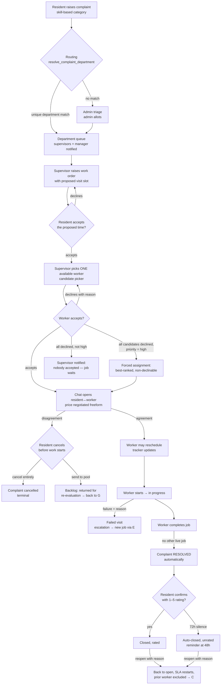

# Complaint Management Engine v2 — Product Requirements Document

**Written:** 2026-08-12, on the `services-and-security` branch.
**Status:** Approved rulings — this document *settles* the open questions in
[`COMPLAINT_ENGINE_HANDOFF.md`](COMPLAINT_ENGINE_HANDOFF.md) and specifies the
target behaviour of the complaint management system end to end.
**Companion documents:**
[`COMPLAINT_ENGINE_STATE.md`](COMPLAINT_ENGINE_STATE.md) (what is built today),
[`plans/COMPLAINT_ENGINE_V2_IMPLEMENTATION_PLAN.md`](plans/COMPLAINT_ENGINE_V2_IMPLEMENTATION_PLAN.md)
(how to build the delta), and
[`COMPLAINT_ENGINE_MANUAL_TESTING.md`](COMPLAINT_ENGINE_MANUAL_TESTING.md)
(how to verify it by hand).

Every ruling in §12 was made explicitly by the product owner on 2026-08-12 in a
structured decision session; none is a silent default.

---

## 1. Purpose and scope

A resident reports a problem; the right department's supervisor puts the right
available worker on it with that worker's consent; the resident and worker talk
(and negotiate price) in a controlled channel; the resident watches progress on
an order-tracking stepper; the work gets done, the complaint gets resolved, the
resident rates it, and the system cleans up after silence. Reopens, cancels,
declines, forced assignment and automation backstops are all specified.

**In scope:** the complaint lifecycle, department routing, manual-first worker
assignment with consent, the auto-dispatch fallback, the resident↔worker chat's
role in this flow, cancellation and the re-evaluation pool, completion/rating/
auto-close/reopen, the tracker UI, availability surfacing, and every
notification these produce.

**Out of scope (deliberate, YAGNI):**
- Staff-side complaint origins (walk-ins, phone complaints logged by a guard or
  admin). Complaints are raised by residents only.
- Money: no price fields, quotes, invoices or payment integration. Price
  negotiation is freeform conversation in the existing chat (§7).
- Transfer consent from a receiving department (H§9): stays
  notify-after-the-fact.
- Multi-community anything: a complaint lives in one community, as today.

## 2. Actors

| Actor | Meaning in this document | Established by |
|---|---|---|
| **Resident** | The raiser of a complaint; only residents create complaints | `resident` role membership |
| **Supervisor** | Anyone who may run a department's work: the department **manager** or a worker with **supervisor rank** in it | `can_supervise_department()` |
| **Manager** | The department's manager specifically (transfer decisions, escalation target) | `can_manage_department()` |
| **Admin** | Community admin; triage queue, unrouted complaints, every department | `is_community_admin()` |
| **Worker** | A service professional on a department roster; receives offers, holds jobs | `staff_assignments` row |
| **System** | The dispatcher loop firing `dispatch_tasks` (timers, fallback, auto-close) | `app/core/dispatcher.py` |

“Supervisor’s dashboard” below means the department complaint queue as mounted
for whichever portal the person uses (manager portal, or worker portal at
supervisor rank) — one screen, two mounts, as built today.

## 3. Vocabulary and catalogues

### 3.1 One catalogue for “what kind of problem” (Ruling R5)

The resident's **category dropdown** in the raise-complaint dialog and the
service professional's **onboarding skill picker** render from the **same
source**: the global active `skills` catalogue, grouped by trade category —
exactly the list `GET /skills` already serves to onboarding. Parity is
structural; the two lists cannot drift because they are one list.

- `POST /complaints` carries `skillId`. The complaint stores the skill id and
  snapshots the skill name into `complaints.category` (display continuity; old
  complaints keep their old free text untouched).
- The per-community `complaint_categories` table remains (departments still
  declare which categories they handle, and historical complaints reference
  them) but **stops feeding the resident dropdown**.
- A skill added to the catalogue is immediately raisable-under and immediately
  claimable at onboarding — one act, both surfaces.

### 3.2 Statuses (unchanged words, new movement)

| Machine | Values | Change in v2 |
|---|---|---|
| `complaints.status` | `open · acknowledged · in_progress · resolved · closed · cancelled` | now **advanced automatically** by job progress (§6), forward-only |
| `work_orders.status` | `draft · awaiting_resident · offered · scheduled · in_progress · completed · failed · cancelled` | unchanged |
| `work_order_assignments.status` | `offered · accepted · declined · withdrawn · completed · failed` | unchanged values; new `is_forced` flag |

Wire vocabulary (resident/admin see `Pending | In Progress | Resolved`) is
unchanged and remains defined **only** in `app/domain/vocabularies.py`.

### 3.3 Priority and “critical” (Ruling R2)

Priorities remain `low | medium | high`. **`high` is the critical tier.**
There is no fourth level. Two behaviour changes:

1. `high` **no longer skips worker consent** at dispatch. It goes through the
   normal offer flow like everything else.
2. The **forced-assignment rule** (§5.6) applies only to `high` complaints,
   and only after every candidate has declined.

SLA hours are unchanged: 24/48/72 for high/medium/low.

## 4. The complaint lifecycle at a glance

Timers (2h/24h supervisor fallback, 30-min offer timeout inside the fallback,
48h/72h auto-close, 2h failed-visit escalation) are `dispatch_tasks` rows fired
by the existing dispatcher loop; every firing function is idempotent.

## 5. Assignment: manual first, consent always, engine as backstop

### 5.1 Arrival in the queue

On raise, routing runs exactly as built (category/skill precedence §3.1,
resident's department pick second, admin triage third; ambiguity → triage).
**New:** the owning department's supervisors are now notified on
`complaint.raised`, alongside the manager and the community admins. (This
reverses the earlier deliberate silence; under manual-first dispatch the
supervisor is the actor who must notice. The old reason — double-pinging,
because the dispatch engine's offer was their signal — no longer holds.)

### 5.2 Raising the work and agreeing the time (Ruling R6)

Unchanged from the built flow, because every downstream guard needs a time
slot: the supervisor raises a work order with a proposed visit slot; the
resident accepts or declines the time from their portal. Declining returns it
to the supervisor to re-propose. Silence for 24h proceeds as proposed (built
`resident_timeout` behaviour, unchanged).

### 5.3 The candidate picker

Once the slot is agreed, the supervisor sees the **candidate list** for the
job: every active roster member of the department who

- has no accepted assignment overlapping the slot (**occupied workers do not
  appear** — the user-visible availability rule),
- is inside their weekly availability rules (or has none),
- has no time-off block overlapping the slot,
- is not barred by a pending departure,
- and **has not previously declined or been cancelled-on for this complaint**
  (§5.5, §8.3) — excluded by default, overridable (§5.7).

Each candidate row shows: name, current open-job load, distance (when known),
“has another job that day” flag, and **“away until ⟨date⟩”** — the end of any
current time-off block, which is the worker-maintained “likely available
again” date (§9).

This is the existing `dispatch_candidates` ranking, surfaced as UI instead of
consumed by a robot.

### 5.4 Offer and consent (Ruling R1)

Picking a candidate writes an **offer**, not an assignment. This is the one
deliberate behaviour break with the built system, whose direct-assign wrote an
`accepted` row without asking. Now:

- The offer withdraws any other open offer on the job first (one live offer at
  a time on the manual path).
- The worker sees it in their portal (and is notified) and **accepts** or
  **declines with a mandatory reason**.
- On **accept**: assignment `accepted`, job `scheduled`, resident notified
  with the worker's name, chat thread opened (§7). Timeline event
  `job_assigned` (existing word — from the resident's side, somebody is now
  coming).
- On **decline**: supervisor notified with the reason; the worker joins the
  complaint's exclusion set; the supervisor picks again from §5.3. No timeline
  event for the resident (a worker's refusal is not the resident's business,
  and reusing `job_declined` — which means *the resident* declined a time — is
  forbidden; see handoff §3).
- An un-responded offer expires after **30 minutes** (the built offer-timeout
  timer, reused), returning the job to the supervisor as a decline-with-reason
  `offer expired`.

### 5.5 Decline-and-reassign loop

Each decline returns the supervisor to the picker with the decliner excluded.
The loop ends in one of three ways: someone accepts; the supervisor stops (job
waits in the queue); or the candidate set empties, which splits by priority:

| Situation | Response |
|---|---|
| Every candidate declined, priority `high` | **Forced assignment** (§5.6), immediately, automatically |
| Every candidate declined, priority `medium`/`low` | Supervisor and manager notified “nobody accepted”; job remains unassigned in the queue; supervisor may re-offer (including to decliners, §5.7), reschedule to a different slot, or escalate priority |
| No candidates existed at all (empty roster, everyone on leave/busy) | Same notification path with “nobody available”; forced assignment **cannot** fire (there is nobody to force — being busy/away is not overridden by force); supervisor reschedules or the manager escalates |

### 5.6 Forced assignment (Rulings R2, R8)

Preconditions, all required: complaint priority is `high`; at least one
candidate is *available* for the slot (per §5.3's availability tests, ignoring
only the exclusion-by-decline rule); **every** available candidate has
declined this job.

On the last decline, the system — not a human — immediately:

1. assigns the **best-ranked** still-available worker (the existing ranking:
   least loaded, then nearest; *not* random — deterministic and auditable),
2. marks the assignment `accepted` with `is_forced = true` — **the worker
   cannot decline it**; the decline verb refuses with `HB409`,
3. notifies the worker (“you have been assigned — this critical job could not
   wait for a volunteer”), the supervisor, and the resident (standard
   somebody-is-coming notification),
4. writes timeline event `job_assigned` (same resident-facing fact) and an
   internal `job_force_assigned` event for the audit trail.

A forced worker who truly cannot attend goes through the supervisor
(reschedule/reassign, §5.8) — the same path as any post-acceptance problem.

### 5.7 Supervisor override of the exclusion set

Exclusion filters the *default* candidate list. The picker has a “show
excluded” toggle; a supervisor may knowingly re-offer to a worker who declined
(perhaps the objection was resolved in the meantime). The offer is a normal
declinable offer. This keeps exclusion a guardrail, not a straitjacket.

### 5.8 The automation backstop (Rulings R1, R7)

Two timers keep the manual path honest:

- **Supervisor fallback:** when the resident accepts the slot, a
  `manual_window` dispatch task is created, due in **2 hours** (`high`) or
  **24 hours** (`medium`/`low`). When it fires, if the job still has no live
  offer and no accepted assignment, the **built auto-dispatch engine takes
  over**: offer round to up to 5 ranked candidates, 30-minute auto-assign
  timeout — exactly the machinery that exists today, now demoted to fallback.
  The supervisor is notified that the system took over. Exclusions (§5.5)
  apply to the engine's candidate list too.
- **Offer timeout:** any single offer (manual or engine) expires in 30
  minutes, as built.

A complaint whose supervisor never raises a work order at all is *not* covered
by auto-dispatch (there is no slot to dispatch against). It is covered by the
raise-time notification (§5.1), the queue's overdue/`due_at` visibility, and
the SLA clock — a management problem surfaced to management, not a robot
guessing a visit time. *(Recorded as a ruling; revisit only with evidence of
queues rotting.)*

## 6. Status coupling and the tracker (Rulings R4, and H§0/H§1 settled)

### 6.1 The complaint now moves when the work moves

A forward-only projection advances `complaints.status` from job activity:

| Job fact | Complaint becomes | Only if currently |
|---|---|---|
| First offer goes out on any of its work orders | `acknowledged` | `open` |
| Any work order starts (`in_progress`) | `in_progress` | `open`, `acknowledged` |
| A work order completes **and no other live work order exists** on the complaint | `resolved` | `open`, `acknowledged`, `in_progress` |

Never backward; never past `resolved`; never touching `closed`, `cancelled` —
those exits remain human/resident acts (or the auto-close timer, §8.2). A
“live” work order is one in `draft · awaiting_resident · offered · scheduled ·
in_progress`. Failed and cancelled jobs are not live; a failed visit therefore
does **not** resolve the complaint even when it is the last job standing —
failure escalates (§8.4) instead.

### 6.2 The tracker

The resident's complaint detail renders the timeline as an **order-tracking
stepper** — horizontal on desktop, vertical on mobile. It is a pure projection
of `complaint_events`; it adds no state.

Main-line nodes (reached = filled, current = highlighted, future = hollow):

`Raised → Assigned → Scheduled → In progress → Work done → Closed`

- **Assigned** carries the worker's display name once `job_assigned` exists.
- **Scheduled** carries the agreed date/time; a reschedule updates it in place
  and adds an annotation.
- Off-path events render as annotations attached to the line rather than
  nodes: *time declined*, *rescheduled*, *visit unsuccessful*, *returned for
  re-evaluation*, *reopened* (which visually restarts the line), *auto-closed
  without confirmation*.
- Unknown event types render raw (built rule, kept: a silent timeline hides
  its own bug).

Staff complaint detail (admin and supervisor screens) reuses the same
component read-only over the same events.

### 6.3 Timeline vocabulary is locked

`complaint_events.event_type` gains a CHECK constraint enumerating the
registry: the nine lifecycle types, the eight `job_*` types, the four routing
types, and the v2 additions — `job_force_assigned`, `returned_to_pool`,
`auto_close_warning`, `auto_closed`. Adding a type is now a migration, which
is the point: two workstreams already write into this namespace.

## 7. The chat channel and price negotiation (Ruling R3)

Built substrate, two behaviour changes.

- **When it opens:** on worker acceptance (manual, forced, or engine-assigned)
  the work-order thread (`dm_threads`, `kind='work_order'`) is **opened by the
  system in the same transaction**, with a system line (“You're connected
  about job #… — agree the details here”). Both parties find it waiting in
  their ChatDock; the accept notifications deep-link to it. (Today the thread
  only exists once somebody opens it by hand.)
- **What happens in it:** everything freeform — price negotiation included. No
  quote objects, no money fields anywhere. The record of an agreed price is
  the conversation itself, which is retained read-only forever.
- **When it locks:** on any terminal job status (built) — completion, failure,
  cancellation — including **resident cancellation** (§8.3). Locked threads
  are readable; writes refuse with `HB409` and a system line explains the
  lock. The lock is the product-owner's protection against a private line
  outliving the job.
- **Disagreement outcome:** the resident's lever is cancellation (§8.3), not
  the chat. Nothing in the chat carries state the engine reads.

## 8. Endings: cancel, complete, close, reopen, fail

### 8.1 Resident cancellation and the re-evaluation pool (Rulings R9, R10)

**Window:** from worker acceptance until the worker marks the job started.
Before acceptance there is nothing to cancel (the resident can simply decline
the proposed time); after `start`, cancellation is refused with `HB409` and
the message directs the resident to the office (a worker mid-visit with a
silently cancelled job is the situation this refusal exists to prevent —
supervisors retain their cancel verb throughout).

Cancelling frees the worker (assignment `withdrawn`, job `cancelled` with
`cancelled_by = 'resident'`, chat locked, worker + supervisor notified) and
requires the resident to choose, in the same dialog:

| Choice | Effect |
|---|---|
| **Cancel the request entirely** | Complaint → `cancelled` (terminal). Raising the issue again means a brand-new complaint from scratch. Timeline: `status_changed`. |
| **Send to request pool for re-evaluation** | Complaint stays `open` (status rewinds from `acknowledged`/`in_progress` is *not* performed — the status stays where it was; the returned flag is what queues read), stamped `returned for re-evaluation`, and appears in the **Backlog** section of the department queue. The cancelled-on worker joins the exclusion set. Timeline: `returned_to_pool`, rendered to the resident as “Sent back for re-evaluation — the team will assign someone else.” Supervisor restarts from §5.2/§5.3 (a new slot proposal is allowed; the old job is dead). |

The backlog is a *section* of the existing supervisor queue (returned and
reopened complaints, visibly badged), not a separate screen.

### 8.2 Completion, rating, auto-close (Rulings R4, R11)

- **Worker's act:** `complete` closes the job (built) and — via §6.1 — moves
  the complaint to `resolved` when no other live job exists. The worker's
  “mark as completed” from the user's flow is exactly this verb.
- **Resident's act:** the existing confirm-with-mandatory-1–5-rating, which is
  the resident's “mark as completed”: `resolved → closed`, rating stored.
- **Silence:** at `resolved`+48h with no confirmation and no reopen, the
  resident is reminded (“confirm or reopen — this closes itself in 24h”). At
  `resolved`+72h it **auto-closes unrated** (`auto_closed` timeline event,
  resident notified). Both are dispatch tasks; both no-op if the resident
  acted first, or if the complaint was reopened.
- Reopen remains available **after** auto-close (built reopen accepts
  `closed`), which is what makes auto-close defensible.

### 8.3 Reopen (Ruling R12)

Built mechanics unchanged (raiser only, mandatory reason, from
`resolved`/`closed`, SLA restarts, rating cleared, `reopened_count`
incremented). v2 adds the routing consequence: the complaint returns to its
department queue **flagged `reopened` in the Backlog section**, and every
worker who held an accepted assignment on any of its previous work orders
joins the exclusion set. Any supervisor — including the same one — may take
it (small teams may only have one). The “different supervisor” clause of the
old product doc is retired by this ruling.

### 8.4 Failed visits

Unchanged: `failed` requires a reason; 2h later the manager is notified
(admins as fallback); no auto-replacement job; the complaint is untouched (a
failed job is not live, §6.1, so it never triggers resolution). The
supervisor raises the next work order by hand; the tracker shows *visit
unsuccessful* and continues.

### 8.5 Work against ended complaints (Ruling — H§10 settled)

`create_work_order` now **refuses** a complaint in `resolved · closed ·
cancelled` with `HB409` (“Reopen the complaint to raise more work”). A snag
found after closure is a *reopen* (resident's act, restarts SLA, or admin
sets status back) followed by new work — with statuses now coupled, a job
quietly completing on a closed complaint would corrupt the projection. The
triage screen's raise-work tab filters terminal complaints out; the RPC is
the boundary.

### 8.6 Department transfer with live work (new ruling)

`assign_complaint_department` and the accept-transfer path now refuse when a
**live work order** exists (`HB409`, “Cancel or finish the open job first”).
A job belongs to a department; moving the complaint under it would strand the
job's authorization chain. Supervisor “not ours” requests remain possible at
any time; the decision simply cannot land while work is live.

## 9. Availability (user-visible model)

- **Occupied = invisible:** a worker with an accepted assignment overlapping
  the candidate slot does not appear in the picker (built exclusion, now
  user-visible). There is no global “busy” flag — occupation is per-slot,
  which is strictly more accurate than the requested boolean.
- **“When will I be available again”:** the worker's existing *time off*
  blocks (start, end, reason) are the mechanism; the block's end is exactly
  the “likely date and time when he will be available to work again”. The
  picker surfaces it as “away until ⟨date⟩” on excluded-by-leave workers
  (shown greyed, not hidden, so a supervisor can plan around a return date).
  No new worker-side feature is needed; the Availability screen already
  exists.
- Weekly availability rules and departure bars continue to apply as built.

## 10. Notifications matrix (delta from built)

| Event | Notify | Status |
|---|---|---|
| Complaint raised | admins + dept manager **+ dept supervisors** | **changed** (supervisors added) |
| Offer made to worker | the worker | **new** (`job.offered`) |
| Offer declined / expired | offering supervisor | **new** |
| All candidates declined (high) → forced | forced worker, supervisor, resident | **new** |
| All candidates declined (med/low) / none available | supervisor + manager | **new** |
| Worker accepted | resident (name + slot), supervisor | built, now deep-links to chat |
| Fallback engine took over | supervisor | **new** |
| Reschedule | resident, supervisor | built |
| Resident cancelled (either mode) | worker, supervisor | **new** |
| Returned to pool | supervisor | **new** (same notification as above, distinct type) |
| Job completed → complaint resolved | resident (“confirm or reopen”), supervisor | **changed** (resident copy now asks for confirmation) |
| Auto-close warning (48h) | resident | **new** |
| Auto-closed (72h) | resident | **new** |
| Reopened | admins + dept manager + supervisors | **changed** (supervisors added) |
| Failed visit escalation | manager (admins fallback) | built |

All URLs stay in the `/admin/…` shape rewritten per portal by
`portalNotificationUrl`, as built.

## 11. Permissions matrix (delta only)

| Action | Resident (raiser) | Worker (assignee) | Supervisor | Manager | Admin |
|---|---|---|---|---|---|
| See candidate list w/ availability | — | — | ✓ (own dept) | ✓ (own dept) | ✓ |
| Offer job to worker | — | — | ✓ | ✓ | ✓ |
| Accept/decline offer | — | ✓ (not forced) | — | — | — |
| Cancel before start (repool choice) | ✓ | — | ✓ (staff cancel, no repool dialog) | ✓ | ✓ |
| Reschedule after accept | — | ✓ (own job) | ✓ | ✓ | ✓ |
| Mark complete | via rating (closes) | ✓ (job) | ✓ (via PATCH status, unchanged) | ✓ | ✓ |
| Read complaint detail + timeline | ✓ (own) | job view (built) | **✓ new staff read** | **✓** | **✓** |

Authorization lives inside the SECURITY DEFINER RPCs as today; router guards
stay coarse pre-filters.

## 12. Rulings ledger

All 2026-08-12, product owner, structured decision session:

| # | Question (handoff ref) | Ruling |
|---|---|---|
| R1 | Fate of auto-dispatch | Hybrid: manual supervisor pick first; engine is the fallback after the manual window |
| R2 | “Critical” | `high` = critical; no fourth level; forced-assign only after all-declined |
| R3 | Price negotiation | Freeform in the existing work-order chat; no money schema |
| R4 | Completion semantics (H§1) | Worker's complete resolves (when no other live job); resident closes with rating |
| R5 | Category/skill parity | One shared source: the global skills catalogue feeds both surfaces |
| R6 | Scheduling order | Slot proposed at raise + resident consent (built); worker reschedules after accept |
| R7 | Fallback timer | 2h (`high`) / 24h (`medium`/`low`) |
| R8 | Forced-assign selection | Best-ranked instant, not random; non-declinable; all three parties notified |
| R9 | Cancel window | Acceptance → start; after start, office only |
| R10 | Exclusion | Decliners and cancelled-on workers excluded per complaint; supervisor may override |
| R11 | Auto-close (H§2) | 72h after `resolved`, 48h reminder, reopen survives |
| R12 | Reopen routing (H§4) | Same queue, flagged, previous workers excluded; no different-supervisor rule |
| R13 | Admin assign control (H§8) | Replaced by “Raise work order”; `assigneeStaffId` and the optimistic field deleted |
| R14 | Work on terminal complaints (H§10) | Refused in the RPC, `HB409` |
| R15 | Transfer with live work | Refused, `HB409` |
| R16 | Transfer consent (H§9) | Unchanged: notify after the fact |
| R17 | Status coupling (H§0) | Forward-only trigger projection, §6.1 |
| R18 | Supervisor raise notification | Supervisors now notified on raise and reopen |
| R19 | Timeline vocabulary (worklist 11) | CHECK-locked registry |

## 13. Edge-case catalogue

Situations and their specified responses, beyond those inline above:

| # | Situation | Response |
|---|---|---|
| E1 | Raise with a skill no department holds | Routes to admin triage (null department), as any no-match |
| E2 | Raise with a skill two departments hold | Triage — ambiguity is a human question (built rule, kept) |
| E3 | Resident's department pick is stale/foreign | Silently ignored; routes by remaining precedence (built, kept) |
| E4 | Department has no supervisors and no manager | Raise notification reaches admins (built fallback); admin can act on any department |
| E5 | Two supervisors offer the same job concurrently | Second offer withdraws the first (one-live-offer rule); the first worker's accept then fails politely (`HB409` “this offer was withdrawn”) |
| E6 | Worker accepts an expired/withdrawn offer | `HB409`; portal refreshes the job list |
| E7 | Two workers race to accept (engine round) | One-holder rule: first accept wins, second gets `HB409` (built) |
| E8 | Forced assignment target is the *only* worker in the department and they declined | They are force-assigned — the rule is deliberate: consent yields to a critical complaint when the alternative is nobody |
| E9 | Forced assignment finds zero available workers | Cannot fire; “nobody available” notification (§5.5); no forcing of busy/away workers, ever |
| E10 | Worker's availability lapses between offer and accept (new booking, new leave) | Accept re-checks overlap (built exclusion constraint); refused `HB409`, supervisor re-picks |
| E11 | Resident cancels while the worker is en route but pre-`start` | Allowed by rule (R9 window is status-based); worker is notified immediately; social cost accepted and documented |
| E12 | Resident tries to cancel after `start` | `HB409`, “work has begun — contact the office”; supervisor cancel remains available |
| E13 | Repooled complaint's supervisor proposes a new slot | Normal §5.2 flow; the resident consents again (new job, new time) |
| E14 | Every worker declines a repooled job again | §5.5/§5.6 apply again; exclusion accumulates across the complaint's life |
| E15 | Resident confirms (rates) during the 48–72h window | Normal close; pending auto-close tasks no-op on firing |
| E16 | Resident reopens at hour 71 | Reopen wins; auto-close no-ops (status is no longer `resolved`) |
| E17 | Rating submitted on an auto-closed complaint | Refused as today (`confirm` requires `resolved`); the resident's path is reopen |
| E18 | Reopen of an auto-closed complaint | Allowed (built: reopen from `closed`); flagged in backlog per §8.3 |
| E19 | Supervisor raises second job while first is live | Allowed (D5, many jobs); resolution waits for *all* live jobs (§6.1) |
| E20 | Job completes while a sibling job is live | Complaint stays `in_progress`; resolves when the last live one completes |
| E21 | Last live job is cancelled (not completed) after another completed earlier | No auto-resolve on cancellation; supervisor judges (PATCH status by hand remains) — cancellation is not evidence work was done |
| E22 | Worker starts before the scheduled time | Allowed (built); tracker shows actual start |
| E23 | Complete without start | Refused by job machine (built transitions) |
| E24 | Worker on a forced job cannot attend | Supervisor reschedules or reassigns (withdraw + new offer); force does not survive reassignment — the next offer is declinable |
| E25 | Departing worker (0043/0045) mid-flow | Existing departure machinery governs; candidates exclude departure-barred workers (built) |
| E26 | Chat message to a locked thread | `HB409` + system line (built) |
| E27 | Resident writes in chat before any worker exists | Impossible — thread exists only from acceptance |
| E28 | Admin edits complaint status by hand (PATCH) | Still allowed (office override, unchanged); trigger never fights a human — forward-only guards mean a hand-set `resolved` simply stands |
| E29 | Complaint transferred after triage but before any job | Allowed (no live work order); new department's supervisors notified |
| E30 | `high` complaint raised at 03:00, supervisor asleep | 2h manual window → engine offers to candidates → 30-min timeout → auto-assign; resident sees “assigned” by ~05:30 worst case |
| E31 | Priority escalated on a complaint with a live job (H§5) | Out of scope, unchanged: inheritance is at job creation; the lever (`update_work_order p_priority`) stays manual |
| E32 | Skill catalogue entry deactivated with open complaints under it | Complaints keep their snapshot text; routing of *new* complaints no longer offers it (dropdown lists active only, built) |

## 14. Success criteria

1. A resident can follow their complaint from raise to close on the tracker
   without reading a timeline list.
2. No worker is ever assigned work without consenting, except the documented
   forced case, which is auditable (`is_forced`, `job_force_assigned`).
3. No complaint sits `resolved` for more than 72h.
4. A supervisor can see, for every candidate, whether they are free at the
   slot, how loaded they are, and when the absent ones return.
5. The onboarding skill list and the raise-dialog dropdown are the same list,
   observed equal in the UI and by construction in the code.
6. Every existing test suite still passes; the migration chain applies cleanly
   to the hosted project.
