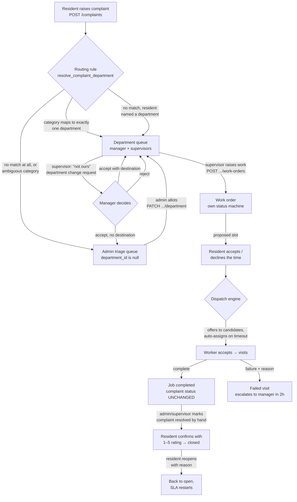

# The complaints engine as built

**Written:** 2026-08-12, from the `services-and-security` branch.
**For:** the complaint-lifecycle owner. This is the *orientation* document — what
exists, where it lives, and how a complaint actually moves through the system
today. Its companion, [`COMPLAINT_ENGINE_HANDOFF.md`](COMPLAINT_ENGINE_HANDOFF.md),
is the *questions* document: every judgement call we deliberately left to you,
with its working default and what that default costs. Read this one first to
learn the terrain, then that one to learn where the terrain is unsettled.

**One update that changes how to read everything:** as of 2026-08-12 the entire
migration chain — `0001_baseline.sql` through `20260812160000` — **is applied to
the hosted Supabase project and verified**, including the complaint routing file.
The handoff's old caveat ("no migration has ever been applied to any database")
is no longer true. What is described below is what the hosted database is
actually doing.

**Updated 2026-08-20**, for the admin-raised complaints work: §2 (a complaint now
has two origins), §8 (the new endpoint, and "resident role" is now "resident
capability"), §9 (the admin raise modal) and §10 item 6. The rulings behind all
of it are `COMPLAINT_ENGINE_HANDOFF.md` §12, and the migration is
`20260820150000_admin_raised_complaints.sql` — applied by hand by the repository
owner, like the rest of the chain.

---

## 1. The big picture in four sentences

A **complaint** is the resident's record of a problem; a **work order** is one
staff response to it, and one complaint may carry several work orders over its
life. The two have **separate status machines that are deliberately not
coupled** — completing a job does not resolve the complaint (handoff §0 and §1
explain why, and how to couple them if you decide to). The single source of
truth for "what has happened" is the **complaint timeline**
(`complaint_events`), which both sides write to and the resident reads. Since
2026-08-12 a complaint also has a **department** from the moment it is raised,
which is what routes it to the right manager's queue instead of to everybody.

The one dashed line in that picture that does not exist in code: nothing moves a
complaint to `resolved` automatically when its work is done. That step is a
human act today (handoff §1 lists the three ways you could change that).

---

## 2. Where a complaint can come from

**There are two origins since 2026-08-20: the resident, and an admin.**

**The resident.** `POST /complaints`, guarded by the **resident capability** —
the `resident` role, *or* an active `unit_residencies` row on any membership, so
an admin who owns a flat is the resident of that flat. The form (resident portal
→ Complaints → new) collects title, description, **category** (from the
community's `complaint_categories` catalogue) or a `skillId`, priority
(`low | medium | high`), optional location, and an optional **department pick**
with a "Not sure" option that sends `null`.

**An admin, from the admin portal.** `POST /complaints/admin-raise`
(`require_admin` + CSRF) → `admin_raise_complaint`
(`20260820150000_admin_raised_complaints.sql`), in two modes decided by one
optional `forMembershipId`:

| | Owner | `complaints.raised_via` | Seen on |
|---|---|---|---|
| **on a resident's behalf** — they telephoned the office | that resident's membership | `resident` | their resident portal, with every resident verb, **and** the admin queue |
| **attached to no flat** — a lobby light, a treadmill, a gate | the admin's own membership | `admin` | the admin queue only |

The `raised` event's actor is **always the admin** in both modes, with
`"on_behalf": true` in the payload when filing for somebody. That is where *who
typed it* lives; `raised_via` answers only *which portal owns the raiser-side
view*, and the resident list and detail filter on it. Routing, SLA, notifications
and the work-order pipeline are the same code paths as the resident raise —
**an admin-raised complaint is a complaint.**

Still nothing else creates complaints:

- **A guard taking a phone complaint at the gate still has no path.** The new
  endpoint is admin-only; `security` is not an admin. If the gate should be able
  to log one, that is new work and it is the engine owner's to shape.
- Work orders never create complaints; the dependency runs the other way
  (`create_work_order` requires a complaint, and refuses one with no
  department — `HB409`).

## 3. Routing: which department owns it

Applied 2026-08-12 as `20260812090300_complaint_department_routing.sql`. The
rule lives in **one** function, `resolve_complaint_department`, called at raise
time, and the precedence is a product-owner ruling:

1. **The category wins.** If the complaint's category maps through
   `department_categories` to exactly one active department, it goes there.
2. **Then the resident's pick.** Only consulted when the category matched
   nothing; a stale or foreign department id is silently ignored (routes to
   triage, never refuses the complaint).
3. **Then nobody.** `department_id` stays null — the admin triage queue.

A category attached to *several* departments deliberately routes to nothing:
ambiguity becomes a visible question in the triage queue, not a silent guess.
"Other"/"Not sure" are not special values anywhere — they are simply inputs
that match nothing and fall through.

The routing decision is recorded on the timeline (the `raised` event's payload
carries `department_id` and `department_chosen_by_resident`), so "why did this
go to Plumbing?" has a readable answer a week later.

**Moving a complaint afterwards:**

| Actor | Mechanism | Authorization |
|---|---|---|
| Admin | `PATCH /complaints/{id}/department` (→ `assign_complaint_department`) | `is_community_admin` for unrouted; `can_manage_department` passes for every department for admins |
| Manager of the *holding* department | same endpoint | `can_manage_department` on the department it is **leaving** — never the destination |
| Supervisor | may only *ask*: `POST /complaints/{id}/department-requests` → the manager decides via `PATCH .../department-requests/{requestId}` (accept/reject, optional destination override; accepting with no destination returns it to triage) | `can_supervise_department` to ask; `can_manage_department` (holding side) to answer |

One open request per complaint (partial unique index). The receiving department
is notified after the fact and has no consent step — flagged as a lifecycle
question in handoff §9.

## 4. Assignment: which *person* is on it

There are **three** notions of assignment, and knowing which is which is the
single most valuable thing this document can tell you:

1. **`work_order_assignments.staff_assignment_id`** — the real one. Written by
   `create_work_order`, the dispatch engine, and `POST /work-orders/{id}/assign`.
   This is who is actually coming to the door, and the resident is notified
   from it.
2. **`complaints.assigned_to_membership_id`** — a nullable column on the
   complaint, settable through the admin's `PATCH /complaints/{id}`. Today it
   means whatever the admin wants it to mean ("who is accountable"), and
   nothing else reads it.
3. **`complaint.assigneeStaffId` in the admin frontend** — an *optimistic local
   field* in zustand, set by the "Assign to staff" dropdown on
   `DepartmentDetail.jsx`. It is not persisted as a work-order assignment and
   nothing reconciles it with (1) or (2). **This is the fork handoff §8/§10
   asks you to settle** — the dropdown could create a work order, assign an
   existing one, or stay a separate accountability field; all three are now
   cheap, and the choice is a statement about what "assigned" means on a
   complaint.

The dispatch chain (how (1) gets filled without a human): supervisor raises a
work order with a proposed slot → resident accepts or declines the time
(`resident_scheduling.py`) → on acceptance the engine offers the job to up to 5
ranked candidates (`dispatch_ping_candidates`) → 30 minutes later
`dispatch_auto_assign` gives it to the best candidate still free → a `high`
priority complaint skips the offer round and auto-assigns immediately.
Failed visits escalate to the department's manager after 2 hours
(`dispatch_failed_visit_escalation`), falling back to community admins if the
department has no manager. Escalation notifies a human and stops — it never
raises a replacement job and never touches the complaint.

## 5. The status machines and the wire vocabulary

| | Values | Written by |
|---|---|---|
| `complaints.status` (Postgres enum) | `open · acknowledged · in_progress · resolved · closed · cancelled` | `raise_complaint`, admin `PATCH /complaints/{id}`, `reopen_complaint`, `confirm_complaint_resolution` — **all yours** |
| `work_orders.status` (text + CHECK) | `draft · awaiting_resident · offered · scheduled · in_progress · completed · failed · cancelled` | supervisor triage RPCs, the dispatcher, the worker's five verbs |

The frontend never sees the raw enum. `app/domain/vocabularies.py` is the seam:
residents and admins see `Pending | In Progress | Resolved` (both `resolved`
and `closed` render as *Resolved*), and comment visibility maps
`resident`⇄`public`. **If you add a status, a visibility or a priority, add it
in `vocabularies.py`, not in a service** — handoff §6 records the defect that
rule comes from.

SLA: `complaint_sla_hours(priority)` — 24/48/72 hours for high/medium/low —
sets `expected_resolution_at` (the resident's clock) and, since the routing
file, `due_at` (the admin's clock) to the same instant at raise time. An admin
may move `due_at` afterwards; divergence is then a decision someone made.

Reopening: the raiser (only) can reopen a `resolved`/`closed` complaint with a
mandatory reason; it restarts the SLA, clears the rating, increments
`reopened_count`, and writes two events (`status_changed` + `reopened`).
Confirmation: the raiser (only) confirms a `resolved` complaint with a
mandatory 1–5 rating → `closed`.

## 6. The timeline: one namespace, no lock

`complaint_events.event_type` is free text — anything can write any word. The
current vocabulary and who owns each word is tabled in handoff §3; the short
version: nine lifecycle types are yours (`raised`, `status_changed`,
`comment_added`, `reopened`, `resolution_confirmed`, …), eight `job_*` types
belong to the work-order chain, and the routing file added
`department_assigned`, `department_change_requested`,
`department_change_accepted/rejected`. The renderer is `_EVENT_LABELS` in
`resident_complaints_service.py`; unknown types render raw rather than
vanishing. Internal comments' event shadows are stripped **in Python, not in
SQL** (`_is_internal_comment_event`) — read handoff §3 before moving that.

## 7. Notifications (fixed 2026-08-12 — the audience narrowed)

Complaint events used to notify *every* admin and *every* manager in the
community (`notify_community_staff`), so the plumbing manager heard about lift
complaints and the link led to a screen their portal could not open. Now:

- `notify_complaint_staff(complaint_id, …)` = the community's admins **plus the
  owning department's manager** (null department → admins only). Used by
  `raise`, `reopen`, `resolution_confirmed`, resident comments, and — since
  2026-08-20 — `admin_raise_complaint`.
- **Nobody notifies the raiser, and that is now visible.** It was harmless while
  the raiser was always the person who pressed the button; a complaint filed
  **on a resident's behalf** gives them an SLA clock and three verbs with no
  in-app signal that any of it exists. Open question, handoff §12 Q12.1.
- Department moves notify the **receiving** manager; change requests notify the
  **holding** manager; decisions notify the requesting supervisor either way.
- Work-order events notify the assigned worker, the supervisor who raised the
  job, and the resident (who is coming, when, completed, failed-with-reason).
  Their links now deep-link to the work-order triage screen filtered to the job.
- Supervisors are deliberately *not* notified on `complaint.raised` — their
  signal is the work order dispatch creates; a second ping would double every
  job in the bell.
- URLs are written in the `/admin/…` shape and rewritten per reader at click
  time by `portalNotificationUrl` (`features/notifications/portalUrl.js`).

## 8. Backend surface, by audience

All complaint state changes go through SECURITY DEFINER RPCs with the
authorization *inside the function* — router guards are coarse pre-filters,
never the boundary. CSRF required on all unsafe methods.

### Resident (`resident_complaints.py`, `resident_scheduling.py` — the resident **capability**)

Since 2026-08-20 the guard is `require_resident_capability`, not the role: the
`resident` role **or** one active `unit_residencies` row on the membership. Reads
and `…/read` need only an active membership. The refusal is unchanged — `403`
`community_role_required`.

| Method + path | Does |
|---|---|
| `GET /complaints` | my complaints, with unread flags. **Filters `raised_via = 'resident'`** |
| `POST /complaints` | raise (title, description, category or `skillId`, priority, location?, **departmentId?**) → routed per §3. **Resident capability required since 2026-08-20** — previously any active membership |
| `GET /complaints/{id}` | detail + full rendered timeline. Same `raised_via` filter as the list |
| `POST /complaints/{id}/reopen` | reason required; only my own resolved/closed |
| `POST /complaints/{id}/resolution` | 1–5 rating required; `resolved` → `closed` |
| `POST /complaints/{id}/read` | clear the unread flag |
| `GET /complaints/{id}/schedule-request` | the proposed visit slot awaiting me |
| `POST /complaints/{id}/schedule` | accept / decline the proposed time |

### Admin (`complaints.py` — admin only)

| Method + path | Does |
|---|---|
| `POST /complaints/admin-raise` | raise from the admin portal, on a resident's behalf (`forMembershipId`) or attached to no flat — see §2. `201 {id, message}` |
| `PATCH /complaints/{id}` | edit status (wire words), progress, assignee label, `assignedToMembershipId`, expected resolution, resident-visible update note |
| `POST /complaints/{id}/comments` | comment, `resident` or `internal` visibility |
| `GET /complaints/staff/complaints/{id}` | staff detail with the full timeline. The odd path avoids the resident router's `GET /complaints/{id}` |

### Department staff (`complaint_routing.py` — admin/manager/worker/security roles; real check in the RPC)

| Method + path | RPC check |
|---|---|
| `GET /unassigned-complaints` | admin only — the triage queue |
| `GET /department-options` | any active member — id/name/kind for pickers |
| `PATCH /complaints/{id}/department` | admin (unrouted) or holding manager |
| `POST /complaints/{id}/department-requests` | supervisor of the holding department |
| `PATCH /complaints/{id}/department-requests/{requestId}` | holding manager decides |
| `GET /departments/{id}/complaints` | manager or supervisor of that department |
| `GET /departments/{id}/complaint-department-requests` | that department's manager |

### Work orders (`work_orders.py` — same coarse guard; `can_supervise_department` inside)

`POST /complaints/{id}/work-orders` · `GET /complaints/{id}/work-orders` ·
`GET /departments/{id}/work-orders` · `GET /work-orders/{id}` ·
`PATCH /work-orders/{id}` · `POST /work-orders/{id}/assign` ·
`POST /work-orders/{id}/reschedule` · `POST /work-orders/{id}/cancel`

### Worker (`worker_jobs.py`, `/worker` prefix — the five verbs)

`GET /worker/snapshot` · `GET /worker/jobs` · `GET /worker/jobs/{id}` ·
`POST …/accept` · `…/decline` · `…/start` · `…/complete` (optional notes) ·
`…/failure` (reason **required** — "could not be done" with no reason
guarantees a second wasted visit).

## 9. Frontend surface, by portal

| Portal | Screen | Data path | State |
|---|---|---|---|
| Resident | `ResidentDashboard/Complaints.jsx` | `residentApi.js` + react-query | **fully wired**: list, create (CategoryPicker + department pick), timeline, reopen, rating, read, schedule respond |
| Admin | `AdminDashboard/ComplaintTriage.jsx` | `features/complaints/routingApi.js` + react-query | **fully wired**: unassigned queue, allot to department |
| Admin | `AdminDashboard/WorkOrderTriage.jsx` (also mounted `/manager` and `/security-manager` at `departments/:id/work-orders`) | `features/workOrders/workOrdersApi.js` | **fully wired**: all eight work-order ops, `?job=` deep link |
| Admin | `AdminDashboard/Complaints.jsx` | reads zustand `complaints` (hydrated from `GET /dashboard/snapshot` — real DB data); writes `PATCH` + comments through `createComplaintsSlice.js`; **raises through `features/complaints/AdminRaiseComplaintModal.jsx` → `adminComplaintsApi.raise` → `POST /complaints/admin-raise`** (react-query, with an optional on-behalf resident picker) | **half-modern**: server-backed, but the timeline events it shows after an edit are *invented client-side* and the slice is optimistic-first. The raise modal is the one part of this screen on the newer pattern. Candidate for a react-query rewrite; see §10 |
| Admin | `AdminDashboard/DepartmentDetail.jsx` | roster from `GET /departments` | "Assign to staff" dropdown is **optimistic local only** — the §8 fork |
| Manager | `ManagerDashboard/Complaints.jsx` | `routingApi.js` | **fully wired**: department queue (`DepartmentComplaintList`) + supervisors' change requests (`ChangeRequests`) with accept/reject |
| Worker (supervisor rank) | `WorkerDashboard/Complaints.jsx` | `workerApi` snapshot for the rank gate, then `routingApi.js` | **fully wired**: department queue + "this isn't ours" request; offered for the first department where the caller ranks supervisor/manager |
| Worker | `WorkerDashboard/Dashboard.jsx` + `JobDetailModal.jsx` | `workerApi` | **fully wired**: the five job verbs |

## 10. What remains — the worklist

In rough order of resident-visible impact. Items marked **(H§n)** are argued in
full in the handoff; read that section before deciding.

1. **The missing step from *work done* to *resolved*** (H§1). After a completed
   visit nobody moves the complaint to `resolved`, so the resident *cannot*
   confirm even if they want to. Recommended shape there: a `job_completed`
   trigger that resolves only when no other live work order exists.
2. **Status coupling generally** (H§0). A complaint can read *Pending* while a
   technician is mid-visit. If you couple them: forward-only trigger on
   `work_orders`, worked example in `0037`.
3. **Auto-resolution after 24 h of resident silence** (H§2). Specified in the
   product doc, deliberately not implemented; if built, build it against the
   complaint's own clock (`expected_resolution_at`), not the dispatcher's, and
   lean on the already-built `reopen_complaint` as the safety net.
4. **The assignment fork** (H§8, H§10). Decide what the admin's "Assign to
   staff" control means; all three options are now cheap. Until then it is the
   one control still pretending.
5. **Rewire `AdminDashboard/Complaints.jsx` to react-query.** The resident
   screen shows the real timeline; the admin screen shows a client-side
   imitation of it after every edit. `GET /complaints/{id}` exists for
   residents only, so this needs either an admin read endpoint or a shared one
   — an API-shape decision, hence yours.
6. ~~**A staff-side origin for complaints**~~ **Half-closed 2026-08-20** (§2,
   H§12). An **admin** now has a path in — `POST /complaints/admin-raise` and
   the raise modal on `AdminDashboard/Complaints.jsx` — covering the phoned-in
   complaint and the amenity fault that belongs to no flat. What is still open
   is the **gate**: `security` is not an admin, so a guard logging a walk-in
   still has no endpoint. Also open, and new: nothing notifies the resident that
   a complaint was filed for them (H§12, Q12.1).
7. **Reopened complaints should go to a different supervisor** (H§4) — product
   doc says so, nothing implements it; it is a routing rule about complaints.
8. **Priority escalation does not re-prioritise live jobs** (H§5). The lever
   (`update_work_order` takes `p_priority`) exists; nothing pulls it.
9. **Transfer consent** (H§9): should the receiving department consent to (or
   at least pre-acknowledge) an incoming complaint transfer?
10. **Work against terminal complaints** (H§10): `create_work_order` never
    reads `complaints.status` — a job can be raised on a closed complaint.
    Defensible default, never decided. Refuse in the RPC, hide in the screen,
    or keep?
11. **Lock the timeline vocabulary** (H§3) — `event_type` is free text with
    two workstreams writing into it; a CHECK (or at least a registry doc) is
    cheap insurance. Never reuse `job_declined` for a worker's refusal.

## 11. What to read, in order

| Document / file | For |
|---|---|
| [`COMPLAINT_ENGINE_HANDOFF.md`](COMPLAINT_ENGINE_HANDOFF.md) | every open judgement call, argued in full |
| `backend/supabase/migrations/0031_resident_complaints.sql` | the resident lifecycle RPCs — but note four of its functions are superseded: **read the routing file's definitions, not 0031's**, for `raise_complaint`, `reopen_complaint`, `confirm_complaint_resolution`, `add_complaint_comment` |
| `backend/supabase/migrations/20260812090300_complaint_department_routing.sql` | routing, transfer requests, the four rebuilt functions, the queue reads |
| `backend/supabase/migrations/20260820150000_admin_raised_complaints.sql` | `complaints.raised_via`, `admin_raise_complaint`, and `complaint_overview` recreated to carry the column. **Read handoff §12 first** — the two modes are a product ruling, not a shape choice |
| `backend/supabase/migrations/0036/0037/0039` | work orders, the dispatch timers, the worker verbs |
| `backend/app/domain/vocabularies.py` | the wire-word seam — extend here, nowhere else |
| `docs/API.md` §complaints / §work-orders | request/response shapes with status codes |
| [`plans/SERVICE_OPERATIONS_PLAN.md`](plans/SERVICE_OPERATIONS_PLAN.md) D5/D6 | the two decisions everything above rests on |
