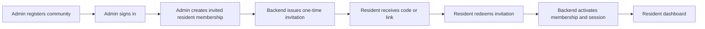
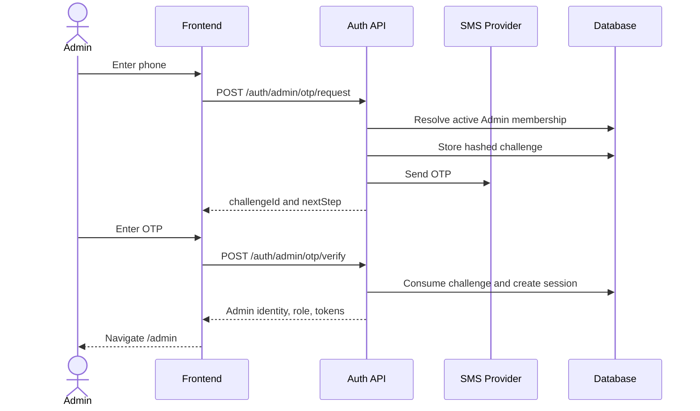
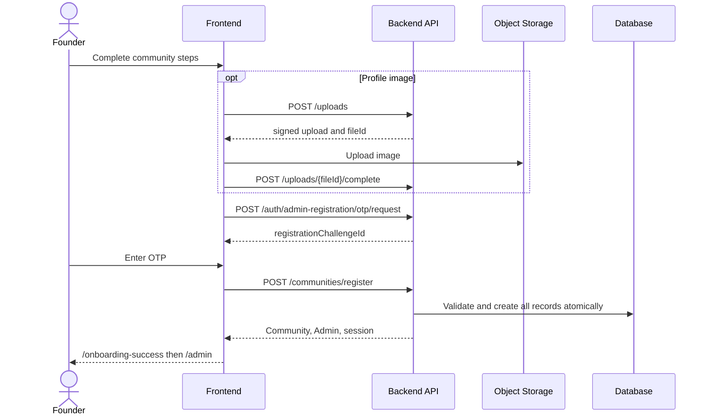
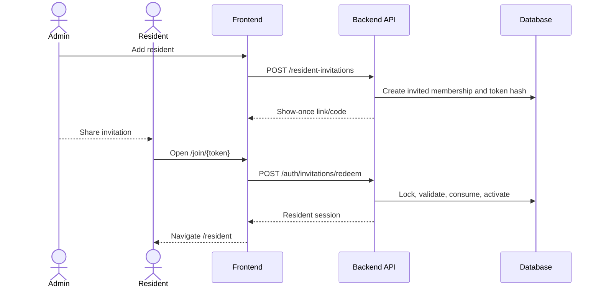
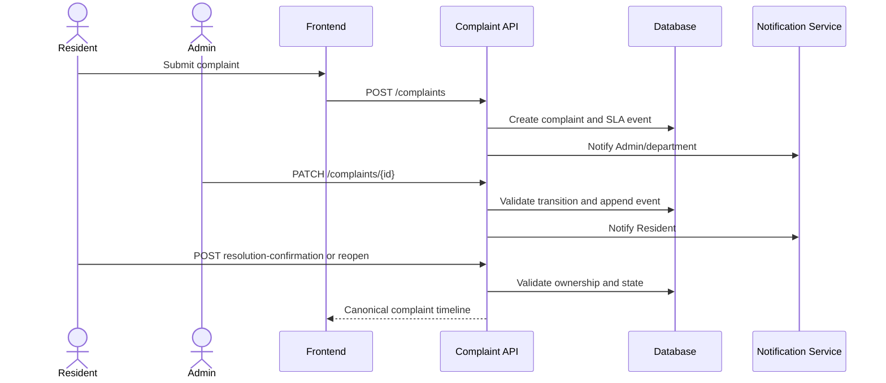
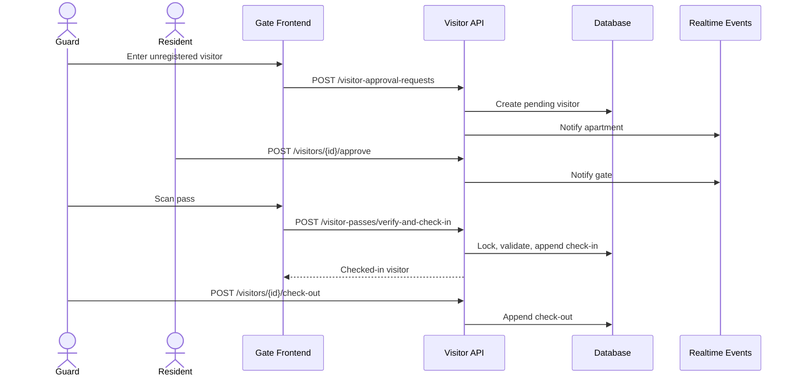
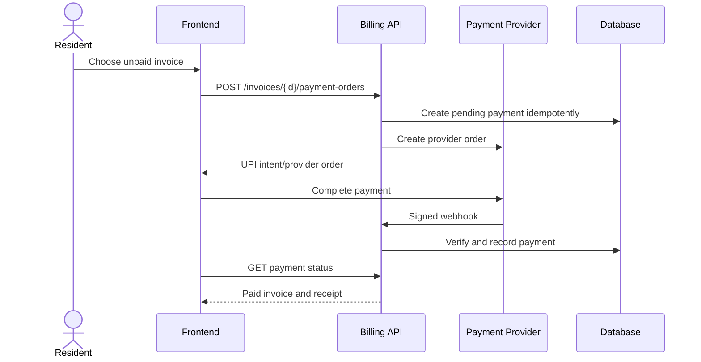
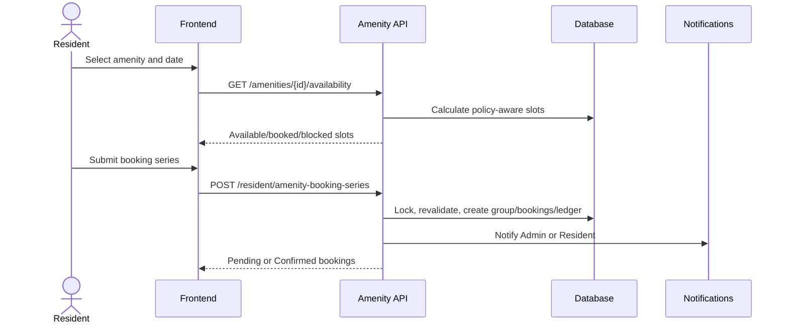

# HomeBandhu Frontend-Derived Backend SRS and API Design

**Audience:** Backend engineers, API designers, database engineers, security engineers, and integration testers
**Scope:** Functional behavior inferred exclusively from `frontend/`
**API namespace:** `/api/v1`
**Document status:** Implementation contract requiring resolution of the explicitly listed open decisions

This document describes the backend required by the current HomeBandhu frontend. It deliberately excludes React component construction, styling, and other presentation internals unless they impose a backend contract.

The current application is a browser-only prototype. Static arrays seed Zustand stores, business mutations execute in the browser, domain data persists in `localStorage`, and the current user persists in `sessionStorage`. Cross-tab storage events imitate realtime updates. A production backend must replace those mechanisms as the source of truth.

# System Purpose and Scope

HomeBandhu is a multi-role apartment and residential-community management system. It supports community onboarding, resident invitations, complaints, visitors, security-gate operations, notices, maintenance invoices, payments, departments, staff, and amenity operations.

The implemented frontend contains two public entry experiences:

- The Admin landing experience begins at `/`. An Admin can log in or register a new community.
- The shared community-user experience begins at `/residentlanding`. Residents, Security Guards, and Security Managers authenticate through `/residentlogin`.

The backend determines the role. The frontend must never be asked to select or assert a privileged role during login.

The primary onboarding journey is:



The backend is expected to provide:

- verified authentication and server-side sessions;
- tenant and role isolation;
- durable transactional persistence;
- authoritative validation and state transitions;
- idempotency and optimistic concurrency;
- secure file and payment integrations;
- structured audit, notification, and activity records;
- realtime invalidation or a documented polling alternative.

# Architecture and API Conventions

```mermaid
flowchart TB
    Browser[React and Vite frontend]
    API[HomeBandhu API /api/v1]
    Auth[Authentication and authorization]
    Domain[Domain services]
    DB[(Transactional database)]
    Cache[(Cache and rate-limit store)]
    Files[(Object storage)]
    SMS[SMS provider]
    Pay[Payment provider]
    Events[WebSocket or SSE]

    Browser -->|HTTPS JSON| API
    Browser <-->|Authorized events| Events
    API --> Auth
    API --> Domain
    Auth --> DB
    Auth --> Cache
    Auth --> SMS
    Domain --> DB
    Domain --> Files
    Domain --> Pay
    Domain --> Events
```



## API conventions

All endpoints use JSON unless an upload URL explicitly accepts binary content.

Authenticated requests use:

```http
Authorization: Bearer <access-token>
Accept: application/json
```

State-changing requests use:

```http
Content-Type: application/json
Idempotency-Key: <client-generated-opaque-key>
```

Versioned updates additionally use:

```http
If-Match: "<resource-version>"
```

A successful single-resource response has this form:

```json
{
  "data": {
    "id": "resource_1"
  },
  "meta": {
    "requestId": "req_01JABC"
  }
}
```

A successful list response has this form:

```json
{
  "data": [],
  "meta": {
    "nextCursor": null,
    "requestId": "req_01JABC"
  }
}
```

Every error uses one stable envelope:

```json
{
  "error": {
    "code": "VALIDATION_ERROR",
    "message": "The request contains invalid values.",
    "fields": {
      "phone": ["Enter a valid mobile number."]
    },
    "requestId": "req_01JABC"
  }
}
```

Standard status semantics are:

- `200` for successful reads or completed commands.
- `201` for newly created resources.
- `202` for accepted asynchronous processing.
- `204` for successful commands with no body.
- `400` for malformed syntax.
- `401` for a missing, expired, or invalid session.
- `403` for an authenticated caller without permission.
- `404` for a missing resource or a resource deliberately hidden across tenant boundaries.
- `409` for state conflicts, replay, stale versions, or uniqueness conflicts.
- `410` for an expired or permanently consumed credential where disclosure is safe.
- `413` and `415` for invalid uploads.
- `422` for field validation.
- `429` for rate limiting.
- `503` for a temporarily unavailable external provider.

All money is represented as integer minor units with an ISO currency code. All instants use ISO 8601 UTC timestamps. Community-local scheduling also records an IANA time zone.

# User Roles and Permission Matrix

The current frontend recognizes `Admin`, `Resident`, `Security`, and `SecurityManager`. Maintenance Staff appears only as a possible future role and has no implemented dashboard.

| Capability | Admin | Resident | Security | SecurityManager | MaintenanceStaff |
|---|---:|---:|---:|---:|---:|
| Community configuration | Yes | No | No | No | Not implemented |
| Resident and invitation management | Yes | Own household only | No | No | Not implemented |
| Admin management | Authorized Admin | No | No | No | Not implemented |
| Department management | Yes | No | No | Assigned security staff scope | Not implemented |
| Complaints | Community scope | Own/apartment scope | No current UI | No current UI | Not implemented |
| Visitor creation and approval | Optional audit | Own apartment | Request/check gate | Manager scope requires decision | Not implemented |
| Gate check-in and check-out | Optional audit | No | Yes | Requires policy decision | Not implemented |
| Maintenance invoices | Community finance | Own apartment | No | No | Not implemented |
| Amenity booking | Admin override | Own booking | No | No | Not implemented |
| Amenity configuration and finance | Yes with permissions | No | No | No | Not implemented |
| Notices | Publish/manage | Read audience | Read if exposed | Read if exposed | Not implemented |

The frontend route guard is only a navigation aid. The backend must enforce authentication, active membership, role or fine-grained permission, tenant scope, resource ownership, and state-transition validity for every request.

# Complete Navigation and Route Contract

## Role routing

```mermaid
flowchart TD
    Login[Shared login success] --> Role{Backend role}
    Role -->|Resident| Resident[/resident]
    Role -->|Security| Security[/security]
    Role -->|SecurityManager| Manager[/security-manager]
    Role -->|Admin| Admin[/admin]
    Role -->|Unsupported| Block[Unsupported-role screen required]

    Resident --> RV[Visitors]
    Resident --> RC[Complaints]
    Resident --> RA[Amenities]
    Resident --> RP[Payments]
    Resident --> RN[Notices]
    Resident --> RF[FAQ and Profile]

    Security --> SV[Gate visitors]
    Security --> SH[Gate history]
    Security --> SE[Emergency and incidents]

    Manager --> MS[Security staff]
    Manager --> MV[Visitor operations]
    Manager --> MH[History and emergency]

    Admin --> AR[Residents and invitations]
    Admin --> AD[Departments and staff]
    Admin --> AC[Complaints and notices]
    Admin --> AM[Maintenance and amenities]
    Admin --> AS[Settings]
```

The product brief refers to `/resident/dashboard`, `/security/dashboard`, and `/security-manager/dashboard`. The implemented frontend routes are `/resident`, `/security`, and `/security-manager`. The backend returns a canonical role, not a redirect URL. Route aliases are a frontend decision.

## Public and onboarding routes

- `/` is the Admin marketing page. It needs no API until the user chooses login.
- `/login` discovers whether the Admin phone belongs to an existing account and begins OTP authentication or new-community registration.
- `/admin-otp-verification` verifies the existing Admin OTP.
- `/association-registration` captures community type, name, and unit count.
- `/map-configuration` captures block or villa labels and map positions.
- `/feature-configuration` captures enabled modules.
- `/admin-profile` captures the founding Admin profile and optional image.
- `/onboarding-otp-verification` verifies the founder and commits community registration.
- `/onboarding-success` displays the created community and enters `/admin`.
- `/residentlanding` is the public shared-role landing page.
- `/residentlogin` authenticates Resident, Security, and SecurityManager users or accepts an invitation code.
- `/join/:token` redeems a one-time resident invitation.
- `/signup` currently redirects to `/residentlogin`; the Signup page exists but is not mounted.
- Any unmatched route redirects to `/`.

## Protected Resident routes

- `/resident` loads resident dashboard aggregates.
- `/resident/visitors` manages visitor passes, approval decisions, and history.
- `/resident/complaints` manages the resident complaint lifecycle.
- `/resident/amenities` loads amenities, availability, bookings, and cancellations.
- `/resident/payments` loads maintenance invoices and payment status.
- `/resident/notices` loads published notices for the resident audience.
- `/resident/faq` uses static help content and requires no backend unless a CMS is introduced.
- `/resident/profile` loads profile and apartment members and permits adding a household phone.

## Protected Security routes

- `/security` loads the gate dashboard.
- `/security/visitors` requests resident approval, verifies passes, and checks visitors in or out.
- `/security/history` loads gate history.
- `/security/emergency` loads contacts and submits incidents.
- `/security-manager` loads the manager dashboard.
- `/security-manager/staff` manages assigned security staff.
- `/security-manager/visitors`, `/security-manager/history`, and `/security-manager/emergency` share operational screens, but manager write permissions require a product decision.

## Protected Admin routes

- `/admin` loads Admin metrics and recent activity.
- `/admin/pending` manages resident registration requests.
- `/admin/residents` manages residents and invitations.
- `/admin/admins` manages Admin memberships.
- `/admin/departments` manages departments and staff.
- `/admin/departments/:departmentId` loads department complaint operations.
- `/admin/department/new` redirects to `/admin/departments?create=1`.
- `/admin/notices` publishes notices.
- `/admin/complaints` manages community complaints.
- `/admin/maintenance` loads community invoices.
- `/admin/amenities` manages the amenity catalog.
- `/admin/amenities/reports` loads amenity reports.
- `/admin/amenities/:amenityId` manages the daily booking timeline.
- `/admin/amenities/:amenityId/approvals` manages pending approvals.
- `/admin/amenities/:amenityId/ledger` manages deposits, refunds, and damage deductions.
- `/admin/amenities/:amenityId/settings` manages amenity policies.
- `/admin/settings` manages global community settings.

# Endpoint Summary

This is the only endpoint reference table. The narrative feature contracts below define request, response, authorization, validation, and backend behavior.

| Domain | Endpoints |
|---|---|
| Authentication | `POST /auth/admin/otp/request`, `POST /auth/admin/otp/verify`, `POST /auth/community/otp/request`, `POST /auth/community/otp/verify`, `GET /auth/me`, `POST /auth/logout` |
| Community onboarding | `POST /auth/admin-registration/otp/request`, `POST /communities/register`, `GET /communities/current`, `GET/PATCH /communities/current/settings` |
| Invitations and people | `POST /auth/invitations/redeem`, `GET /residents`, `POST /resident-invitations`, `PATCH/DELETE /residents/{id}`, `GET/POST /apartments/{id}/members`, `GET/POST /admins`, `GET /invitations`, `POST /invitations/{id}/renew`, `POST /invitations/{id}/revoke` |
| Registration requests | `POST/GET /registration-requests`, `POST /registration-requests/{id}/approve`, `POST /registration-requests/{id}/reject` |
| Departments and staff | `GET/POST /departments`, `GET/PATCH/DELETE /departments/{id}`, `PATCH /departments/{id}/status`, `POST /departments/{id}/staff`, `PATCH/DELETE /departments/{id}/staff/{staffId}` |
| Complaints | `GET/POST /complaints`, `GET/PATCH /complaints/{id}`, `POST /complaints/{id}/comments`, `POST /complaints/{id}/reopen`, `POST /complaints/{id}/resolution-confirmation`, `PUT /complaints/{id}/read-state` |
| Notices and shared services | `GET/POST /notices`, `GET /activities`, `GET /search`, `POST /uploads`, `POST /uploads/{id}/complete`, `GET /dashboard/resident`, `GET /dashboard/admin`, `GET /dashboard/security` |
| Visitors and security | `GET /visitors`, `POST /visitor-passes`, `POST /visitor-approval-requests`, `POST /visitors/{id}/approve`, `POST /visitors/{id}/reject`, `POST /visitor-passes/verify-and-check-in`, `POST /visitors/{id}/check-in`, `POST /visitors/{id}/check-out`, `GET/POST /security/incidents`, `GET /security/emergency-contacts` |
| Billing | `GET /invoices`, `POST /invoices/{id}/payment-orders`, `GET /invoices/{id}/payments/{paymentId}` |
| Amenity catalog | `GET/POST /amenities`, `GET/PATCH/DELETE /amenities/{id}`, `PUT /amenities/{id}/settings`, `GET /amenities/{id}/availability` |
| Amenity bookings | `GET/POST /amenity-bookings`, `GET /bookable-residents`, `POST /resident/amenity-booking-series`, `PATCH /amenity-bookings/{id}`, cancellation/blocking/approval endpoints |
| Amenity finance | `GET /amenities/{id}/ledger`, `GET /amenity-ledger/{id}`, refund/damage/force-cancel commands, `GET /amenity-reports` |

# Feature: Admin Authentication

## Purpose

Authenticate an existing Admin by verified mobile OTP and establish a community-scoped Admin session. The current frontend begins at `/login`, checks whether a phone is registered, moves to `/admin-otp-verification`, and enters `/admin` after verification.

## Business Rules

- Only active Admin memberships may create an Admin session.
- Account discovery must not disclose sensitive membership information.
- OTP challenges are purpose-bound, short-lived, single-use, rate-limited, and attempt-limited.
- The client never chooses the role or community authority.
- A suspended account or community cannot obtain an active session.

## User Workflow

1. Admin enters a mobile number.
2. Backend sends an OTP when an active Admin exists.
3. Frontend displays the OTP page.
4. Admin submits six digits.
5. Backend verifies the challenge, creates a session, and returns the Admin identity.
6. Frontend navigates to `/admin`.

## Frontend Flow

`/login` submits the phone to the discovery/request endpoint. An existing Admin goes to `/admin-otp-verification`. A non-existing phone begins community registration. The prototype currently accepts demo numbers and ignores the OTP; this behavior must be removed during integration.

## Expected Backend Flow

Normalize the phone, apply enumeration-safe discovery, create a hashed OTP challenge, send through the SMS provider, verify atomically, resolve the active Admin membership, create a rotating session, record `lastLoginAt`, and audit success or failure without logging the OTP.



## Frontend Route

The entry route is `/login`. Verification occurs at `/admin-otp-verification`. Successful authentication navigates to `/admin`.

## Backend Endpoint

- `/api/v1/auth/admin/otp/request`
- `/api/v1/auth/admin/otp/verify`
- `/api/v1/auth/me`
- `/api/v1/auth/logout`

## HTTP Method

- OTP request: `POST`
- OTP verification: `POST`
- Current identity: `GET`
- Logout: `POST`

## Authentication

OTP request and verification are public but protected by rate limits and challenge state. `/auth/me` and logout require a valid session.

## Authorization

OTP verification succeeds only for an active Admin membership in an active community. `/auth/me` returns only the membership selected by the current session.

## Request Headers

OTP commands require `Content-Type: application/json`. Verification should accept an `Idempotency-Key`. Authenticated calls use the standard Authorization header or secure session cookie.

## Request Body

```json
{
  "phone": "+919999988888"
}
```

Verification:

```json
{
  "challengeId": "otp_01JABC",
  "otp": "482913"
}
```

Logout has no required JSON body.

## Request Parameters

These endpoints have no path or query parameters. `/auth/me` derives the session id and membership from the credential.

## Success Response

The OTP request returns `202`:

```json
{
  "data": {
    "challengeId": "otp_01JABC",
    "nextStep": "verify_otp",
    "expiresInSeconds": 300,
    "resendAfterSeconds": 30
  }
}
```

If the phone is eligible for new-community onboarding, `nextStep` is `register_community` and no privileged account information is disclosed.

Verification returns `200`:

```json
{
  "data": {
    "accessToken": "short-lived-token",
    "expiresIn": 900,
    "user": {
      "id": "usr_admin_1",
      "name": "Community Admin",
      "phone": "+919999988888",
      "role": "Admin",
      "communityId": "com_1",
      "permissions": ["residents.manage", "amenities.manage"]
    }
  }
}
```

`GET /auth/me` returns the same canonical user and membership context. Logout returns `204`.

## Error Responses

- `401 OTP_INVALID` for an incorrect code.
- `410 OTP_EXPIRED` for an expired challenge.
- `409 OTP_ALREADY_USED` for replay.
- `403 ACCOUNT_DISABLED` or `COMMUNITY_SUSPENDED`.
- `429 OTP_RATE_LIMITED` with `Retry-After`.
- `422 VALIDATION_ERROR` for an invalid phone or OTP shape.

## Validation Rules

Normalize Indian mobile input to E.164 under the current product scope. OTP must be exactly six decimal digits. Challenge purpose must equal `admin_login`, must not be consumed, and must be within expiry and attempt limits.

## Navigation Flow

Existing Admin: `/login` → `/admin-otp-verification` → `/admin`. New phone: `/login` → `/association-registration`. Failure remains on the current form with a safe error.

## Backend Responsibilities

- Generate cryptographically secure OTPs and store only keyed hashes.
- Apply phone, IP, device, and challenge rate limits.
- Rotate refresh tokens and detect reuse.
- Return the canonical role and permissions.
- Revoke the server session at logout.
- Audit attempts without logging OTP or token values.

## Notes for Backend Developers

The frontend service comments explicitly identify the current flow as a future API boundary. Do not retain demo-number shortcuts or “accept every OTP” behavior. If a user belongs to multiple communities, return eligible memberships and require an explicit membership-selection design rather than trusting a client community id.

# Feature: Community Registration and Founding Admin Onboarding

## Purpose

Create a new community, its initial block/villa map, enabled modules, and the founding Admin after phone verification.

## Business Rules

- The founding phone must be verified for the registration purpose.
- Community creation is one transactional operation.
- Apartment communities currently support up to 10 blocks; layout/villa communities support up to 50 villas.
- Every declared unit requires a unique label and valid map position.
- Unknown feature-module keys are rejected.
- A retry with the same idempotency key must not create a second community.

## User Workflow

The Admin enters association details, positions every unit, selects modules, enters a profile and optional image, verifies the OTP, sees a success screen, and continues to `/admin`.

## Frontend Flow

The frontend temporarily carries onboarding state across `/association-registration`, `/map-configuration`, `/feature-configuration`, `/admin-profile`, `/onboarding-otp-verification`, and `/onboarding-success`. A route guard prevents normal access to later steps when the local onboarding step is missing. Production must use a signed challenge/draft or submit the final payload only after verification.

## Expected Backend Flow

Create and verify a registration OTP challenge. Validate the complete payload. In one transaction create `Community`, `CommunityUnit`, founding `User`, active Admin `CommunityMembership`, module configuration, and audit entries. Create a session only after commit. Uploads are completed and scanned before an image is attached.



## Frontend Route

`/association-registration`, `/map-configuration`, `/feature-configuration`, `/admin-profile`, `/onboarding-otp-verification`, and `/onboarding-success`.

## Backend Endpoint

- `/api/v1/auth/admin-registration/otp/request`
- `/api/v1/communities/register`
- `/api/v1/uploads`
- `/api/v1/uploads/{fileId}/complete`

## HTTP Method

All four endpoint operations use `POST`.

## Authentication

No normal user session is required. Requests are authorized by the short-lived registration challenge and upload capability. The completed registration response establishes the founding Admin session.

## Authorization

Only the verified owner of the registration phone may finalize the draft. A file may be attached only by its upload creator and only after it is ready.

## Request Headers

Use `Content-Type: application/json` and `Idempotency-Key` on OTP request, upload intent/completion, and registration. The binary upload uses the content type and signed headers returned by the upload intent.

## Request Body

OTP request:

```json
{
  "phone": "+919876543210",
  "purpose": "community_registration"
}
```

Community registration:

```json
{
  "challengeId": "otp_reg_1",
  "otp": "482913",
  "community": {
    "name": "Green Heights",
    "communityType": "apartment",
    "timezone": "Asia/Kolkata",
    "currency": "INR"
  },
  "units": [
    {
      "clientId": "unit_A",
      "name": "Block A",
      "type": "block",
      "mapX": 0.25,
      "mapY": 0.42
    }
  ],
  "enabledModules": ["visitors", "complaints", "amenities", "payments"],
  "admin": {
    "name": "Aakash Sharma",
    "phone": "+919876543210",
    "email": "aakash@example.com",
    "profileImageId": "file_1"
  }
}
```

Upload intent:

```json
{
  "filename": "profile.jpg",
  "contentType": "image/jpeg",
  "size": 482193,
  "purpose": "admin_profile"
}
```

## Request Parameters

Only upload completion has a path parameter: `fileId`. Community registration has no query parameters. The server must reject a `communityId`, role, or created-by actor supplied by the client.

## Success Response

Registration returns `201`:

```json
{
  "data": {
    "community": {
      "id": "com_1",
      "name": "Green Heights",
      "status": "active",
      "enabledModules": ["visitors", "complaints", "amenities", "payments"]
    },
    "user": {
      "id": "usr_admin_1",
      "name": "Aakash Sharma",
      "role": "Admin",
      "communityId": "com_1"
    },
    "accessToken": "short-lived-token",
    "expiresIn": 900
  }
}
```

Upload intent returns `201` with `fileId`, signed upload URL, signed headers, and expiry. Completion returns `200` with scan/upload status.

## Error Responses

- `409 COMMUNITY_ALREADY_CREATED` for an idempotent/duplicate registration conflict.
- `409 OTP_ALREADY_USED` or `410 OTP_EXPIRED`.
- `409 DUPLICATE_UNIT_NAME`.
- `409 IDEMPOTENCY_KEY_REUSED` when a key is reused with a different payload.
- `413 FILE_TOO_LARGE` and `415 UNSUPPORTED_MEDIA_TYPE`.
- `422 VALIDATION_ERROR` with nested keys such as `units[0].mapX`.
- `503 SMS_UNAVAILABLE` or `UPLOAD_SERVICE_UNAVAILABLE`.

## Validation Rules

Community name is trimmed and 3–100 characters. Type is `apartment` or `layout_villa`. Unit count is at least one and within frontend caps. Every unit has a unique label, correct type, finite normalized coordinates, and unique client id. Admin name is at least three characters. Phone and email are normalized and valid. Image types are limited to JPEG, PNG, and WebP with server-defined byte and dimension limits.

## Navigation Flow

Each successful frontend step advances to the next onboarding route. Backend calls occur for upload, OTP, and final registration. Final success navigates to `/onboarding-success`, then `/admin`. Any final failure remains on OTP/registration state and must not create partial records.

## Backend Responsibilities

- Treat registration as an atomic transaction.
- Persist all units and feature selections.
- Establish the first owner/Admin safely.
- Enforce unique and idempotent creation.
- Store files outside the database and attach only scanned assets.
- Return canonical ids and configuration.
- Record onboarding audit events.

## Notes for Backend Developers

The frontend currently creates only top-level blocks/villas, not a complete flat inventory. Apartment creation/import and occupancy transfers need a separate product decision. Module selection is metadata in the prototype; the backend should expose it, but authorization must not rely solely on client feature hiding.

# Feature: Shared Community Login and Role Routing

## Purpose

Authenticate Resident, Security, and SecurityManager accounts from one login screen and return the role that determines the frontend dashboard.

## Business Rules

- The backend derives the role from an active membership.
- A phone may not obtain access to a role it does not hold.
- Unsupported roles are not silently treated as Resident.
- Residents require an active apartment membership.
- Security users require an active staff/department assignment where that policy applies.

## User Workflow

The user enters a phone, receives an OTP, submits it, and is redirected to the appropriate dashboard.

## Frontend Flow

`/residentlanding` links to `/residentlogin`. After login, the routing helper sends `Resident` to `/resident`, `Security` to `/security`, `SecurityManager` to `/security-manager`, and `Admin` to `/admin`. The current fallback sends unknown roles toward `/resident`; this must be corrected before MaintenanceStaff is enabled.

## Expected Backend Flow

Normalize the phone, resolve active memberships without disclosure, issue and verify the challenge, select or request selection of a community membership, create the server session, and return the exact role and permission grants.

## Frontend Route

`/residentlanding` and `/residentlogin`, followed by the role-specific protected route.

## Backend Endpoint

- `/api/v1/auth/community/otp/request`
- `/api/v1/auth/community/otp/verify`
- `/api/v1/auth/me`
- `/api/v1/auth/logout`

## HTTP Method

OTP request and verification use `POST`; current identity uses `GET`; logout uses `POST`.

## Authentication

OTP operations use challenge authentication. `/auth/me` and logout require the created session.

## Authorization

Verification returns only active memberships. If multiple community memberships exist, an explicit membership-selection flow is required. The client may not supply an authoritative role.

## Request Headers

Use JSON headers for OTP commands and the standard session credential for authenticated calls. OTP operations should accept idempotency keys and are always rate-limited.

## Request Body

```json
{
  "phone": "+919876543210"
}
```

```json
{
  "challengeId": "otp_community_1",
  "otp": "482913",
  "membershipId": "mem_1"
}
```

`membershipId` is omitted when exactly one eligible membership exists.

## Request Parameters

No path or query parameters are required. Any membership id must belong to the verified phone and active user.

## Success Response

```json
{
  "data": {
    "accessToken": "short-lived-token",
    "expiresIn": 900,
    "user": {
      "id": "usr_1",
      "name": "Ravi Kumar",
      "role": "Resident",
      "communityId": "com_1",
      "membershipId": "mem_1",
      "apartmentId": "apt_1204",
      "permissions": ["complaints.create", "visitors.create", "amenities.book"]
    }
  }
}
```

When selection is required, the server may return `409 MEMBERSHIP_SELECTION_REQUIRED` with safe membership labels and a short-lived selection token.

## Error Responses

- `401 OTP_INVALID`.
- `410 OTP_EXPIRED`.
- `403 MEMBERSHIP_DISABLED` or `COMMUNITY_SUSPENDED`.
- `409 MEMBERSHIP_SELECTION_REQUIRED`.
- `409 UNSUPPORTED_ROLE` when a valid account has no implemented frontend destination.
- `429 OTP_RATE_LIMITED`.
- `422 VALIDATION_ERROR`.

## Validation Rules

Phone and OTP rules match Admin authentication. Membership selection must be bound to the verified challenge. Role values are exactly `Admin`, `Resident`, `Security`, or `SecurityManager` for the current frontend.

## Navigation Flow

```mermaid
flowchart LR
    A[/residentlogin] --> B[OTP verification]
    B --> C{Role from backend}
    C -->|Resident| D[/resident]
    C -->|Security| E[/security]
    C -->|SecurityManager| F[/security-manager]
    C -->|Admin| G[/admin]
    C -->|Unsupported| H[Access unavailable]
```

## Backend Responsibilities

- Resolve role and tenant server-side.
- Return apartment or staff scope needed by the selected role.
- Enforce disabled/suspended state.
- Support session restoration.
- Revoke the session at logout.
- Avoid user enumeration.

## Notes for Backend Developers

The `/.../dashboard` paths in the product description are not implemented. Backend acceptance should validate role values, not hard-code frontend URLs. MaintenanceStaff must remain disabled until its frontend shell and authorization behavior exist.

# Feature: Resident Invitation and Account Activation

## Purpose

Allow an Admin to create invited resident memberships, generate a one-time invitation link/code, share it externally, and let the resident activate an account and session.

## Business Rules

- Only an authorized Admin may create, renew, revoke, or inspect invitations.
- Raw invitation tokens are returned only at creation or renewal.
- Tokens are opaque, high entropy, hashed at rest, expiring, revocable, and single-use.
- Redemption and membership activation are atomic.
- Used, expired, revoked, and invalid tokens have stable error states.
- The backend must define whether one apartment token activates one membership or multiple invited phone memberships.

## User Workflow

Admin opens `/admin/residents`, enters resident and apartment information, receives a link/code, and shares it. The resident opens `/join/:token` or enters the code at `/residentlogin`, redeems it, and enters `/resident`.

## Frontend Flow

The frontend prototype creates one user record per phone with status `Invited` and one token for the apartment. Its redemption helper currently activates every user attached to that apartment and consumes the token. That activation scope is a prototype rule, not a safe implicit backend decision.

## Expected Backend Flow

Validate Admin permission and the apartment. In one transaction create or link invited users/memberships and create an invitation token hash. Return the raw token once. On redemption, lock the invitation row, validate status and expiry, establish/verify the claiming identity, activate only the agreed membership scope, consume the token, create the session, and emit audit/activity/notification events.



## Frontend Route

Creation and management occur at `/admin/residents`. Redemption occurs at `/join/:token` or `/residentlogin`.

## Backend Endpoint

- `/api/v1/resident-invitations`
- `/api/v1/invitations`
- `/api/v1/invitations/{invitationId}/renew`
- `/api/v1/invitations/{invitationId}/revoke`
- `/api/v1/auth/invitations/redeem`

## HTTP Method

Creation, renewal, revocation, and redemption use `POST`. Invitation metadata uses `GET`.

## Authentication

Admin creation/list/renew/revoke operations require an authenticated Admin session. Redemption is public but authenticated by possession of the valid one-time token and any additional identity challenge required by policy.

## Authorization

The Admin needs `residents.manage` in the current community. An invitation may affect only residents/apartments in that community. Redemption cannot activate an unrelated user or tenant.

## Request Headers

Admin requests use Authorization, JSON, and `Idempotency-Key` for commands. Renewal/revocation should use `If-Match` or a body version. Redemption uses JSON and an idempotency key but no prior session.

## Request Body

Create:

```json
{
  "apartmentId": "apt_1204",
  "residents": [
    {
      "name": "Ravi Kumar",
      "phone": "+919876543210",
      "email": "ravi@example.com"
    }
  ],
  "expiresInDays": 7
}
```

Renew:

```json
{
  "expiresInDays": 7,
  "version": 1
}
```

Revoke:

```json
{
  "reason": "Resident details changed",
  "version": 1
}
```

Redeem:

```json
{
  "token": "opaque-url-safe-token",
  "name": "Ravi Kumar",
  "phone": "+919876543210"
}
```

## Request Parameters

Invitation list accepts `apartmentId`, `status`, `cursor`, and bounded `limit`. Renewal and revocation use `invitationId`. Token redemption must accept the token in the body even when it is also present in the frontend route, reducing accidental server-log exposure from URLs.

## Success Response

Creation returns `201`:

```json
{
  "data": {
    "invitation": {
      "id": "inv_1",
      "status": "active",
      "apartmentId": "apt_1204",
      "expiresAt": "2026-07-31T12:00:00.000Z",
      "version": 1
    },
    "inviteCode": "shown-once-code",
    "inviteUrl": "https://app.example.com/join/shown-once-code",
    "residents": [
      {
        "id": "usr_1",
        "membershipStatus": "invited"
      }
    ]
  }
}
```

Metadata listing never includes `inviteCode` or `inviteUrl`. Renewal returns `201` with a replacement shown-once token. Revocation returns `200` with `status: "revoked"`. Redemption returns `200` with the activated Resident identity and session token.

## Error Responses

- `404 INVITE_INVALID`.
- `410 INVITE_EXPIRED`.
- `409 INVITE_USED` or `INVITE_REVOKED`.
- `409 ACTIVE_INVITE_EXISTS`.
- `409 PHONE_EXISTS` when policy prevents reuse.
- `403 PRIVILEGE_REQUIRED` or cross-tenant access.
- `422 VALIDATION_ERROR`.
- `429 INVITE_ATTEMPTS_LIMITED`.

## Validation Rules

Apartment must exist in the Admin's community. Resident names are trimmed and non-empty. Phones are valid, normalized, and unique within the agreed membership policy. Emails are normalized when supplied. `expiresInDays` is 1–30. Token comparison is constant-time against the stored hash.

## Navigation Flow

Admin remains on `/admin/residents` after generation. Resident `/join/:token` shows invalid/expired/used states without entering a protected route. Successful redemption navigates to `/resident`.

## Backend Responsibilities

- Generate at least 128 bits of token entropy.
- Store only the token hash.
- Redact raw tokens from logs, analytics, and referrers.
- Serialize redemption to prevent double use.
- Audit creation, renewal, revocation, and redemption.
- Emit resident activation activity and notifications.
- Preserve historical invitations without exposing secrets.

## Notes for Backend Developers

The activation scope is unresolved. The safer production default is one explicitly verified membership per redemption. If the business confirms apartment-wide activation, the contract must describe how every phone is verified and how misuse is prevented.

# Feature: Resident, Household, and Admin Membership Management

## Purpose

Provide community-scoped directories and lifecycle operations for residents, household members, and Admin memberships.

## Business Rules

- A person account is separate from a community membership.
- Residents are associated with an apartment; Admin memberships are privileged and require explicit authorization.
- Historical complaints, invoices, visitors, and bookings survive membership deactivation.
- A Resident may view and add members only for the resident's own apartment.
- The final community owner cannot be removed or disabled.
- Client-supplied tenant and actor identifiers are ignored.

## User Workflow

An Admin searches residents, edits or deactivates a resident, opens the Admin directory, or invites another Admin. A Resident opens `/resident/profile`, sees apartment members, and requests that another phone be added to the household.

## Frontend Flow

`/admin/residents` presents resident search, edit, delete/deactivate, and invitation actions. `/admin/admins` lists and adds Admins. `/resident/profile` lists everyone sharing `apartmentId` and provides an add-phone action. Current mutations directly alter local arrays.

## Expected Backend Flow

Resolve the authenticated membership and community. Apply server-side search and pagination. For writes, validate target scope, use optimistic concurrency, update membership status rather than erasing referenced identity, and create audit/activity events. A newly added household phone remains invited or pending verification until identity proof is complete.

## Frontend Route

`/admin/residents`, `/admin/admins`, and `/resident/profile`.

## Backend Endpoint

- `GET /api/v1/residents`
- `PATCH /api/v1/residents/{residentId}`
- `DELETE /api/v1/residents/{residentId}`
- `GET /api/v1/apartments/{apartmentId}/members`
- `POST /api/v1/apartments/{apartmentId}/members`
- `GET /api/v1/admins`
- `POST /api/v1/admins`

## HTTP Method

Directory operations use `GET`; create uses `POST`; resident edit uses `PATCH`; resident deactivation/removal uses `DELETE`.

## Authentication

Every operation requires an active session.

## Authorization

Resident and Admin directories require `residents.manage` or `admins.manage`. Apartment members can be read or proposed by a Resident only for the session's apartment. Admin creation should be limited to the owner or a grant such as `admins.manage`.

## Request Headers

Reads use Authorization and Accept headers. Creates use JSON and `Idempotency-Key`. Edits/deletes additionally use `If-Match`.

## Request Body

Resident edit:

```json
{
  "name": "Ravi Kumar",
  "email": "ravi@example.com",
  "phone": "+919876543210",
  "status": "active"
}
```

Household member:

```json
{
  "name": "Priya Kumar",
  "phone": "+919811112222"
}
```

Create Admin:

```json
{
  "name": "Operations Admin",
  "phone": "+919900001111",
  "email": "operations@example.com"
}
```

The delete operation may accept `mode=deactivate`; if a JSON reason is required, use a command endpoint instead of a non-portable DELETE body.

## Request Parameters

Resident/Admin lists accept `search`, `status`, `cursor`, and bounded `limit`; residents also accept `apartmentId`. Path parameters are `residentId` and `apartmentId`. Residents must not be allowed to override their own apartment through a query parameter.

## Success Response

List operations return canonical summaries and cursor metadata. Resident edit returns `200` with the new `version`. Deactivation returns `204`. Household creation returns `201`:

```json
{
  "data": {
    "membership": {
      "id": "mem_2",
      "userId": "usr_2",
      "apartmentId": "apt_1204",
      "role": "Resident",
      "status": "pending_verification",
      "version": 1
    }
  }
}
```

Admin creation returns `201` with an invited Admin membership; it must not silently establish a session for the new Admin.

## Error Responses

- `403 PRIVILEGE_REQUIRED` or `APARTMENT_ACCESS_DENIED`.
- `404 RESIDENT_NOT_FOUND` or `APARTMENT_NOT_FOUND`.
- `409 PHONE_EXISTS`, `MEMBERSHIP_EXISTS`, `LAST_OWNER`, or `STALE_VERSION`.
- `409 ACTIVE_DEPENDENCIES` if policy blocks deactivation.
- `422 VALIDATION_ERROR`.

## Validation Rules

Names are trimmed and bounded. Phones are normalized E.164 values. Emails are normalized lowercase addresses. Status must be an allowed transition. New household members must satisfy a configured household limit. A resident move between apartments requires an explicit policy for invoices, visitors, and bookings.

## Navigation Flow

Admin operations remain on the directory and refresh the canonical page. A generated invitation can lead to `/join/:token`. Resident profile operations remain on `/resident/profile` and show pending verification until activation.

## Backend Responsibilities

- Separate `User` from `CommunityMembership`.
- Enforce tenant and apartment ownership.
- Prevent privilege escalation and final-owner removal.
- Preserve historical references through status transitions.
- Verify new phone identities before activation.
- Audit every membership and role change.

## Notes for Backend Developers

The prototype's `addPhoneToApartment` immediately changes local state. Production should create a pending/invited membership. Multi-community and multi-apartment policies must be decided before applying global uniqueness to phone numbers.

# Feature: Resident Registration Requests

## Purpose

Support an optional resident self-registration request that an Admin can approve or reject.

## Business Rules

- Public self-registration is optional because `/signup` currently redirects and the Signup page is dormant.
- Only one active pending request should exist for the same phone/community/apartment combination.
- Approval is transactional and may create a user, resident membership, apartment association, invitation/verification state, and initial invoice.
- A decided request cannot be decided again.

## User Workflow

If enabled, an applicant submits identity and apartment information. An Admin opens `/admin/pending`, reviews pending requests, approves valid applicants, or rejects them with a reason.

## Frontend Flow

The Admin pending page is active and uses mock `pendingRequests`. The corresponding public Signup page exists in source but is not mounted by the router.

## Expected Backend Flow

Accept and rate-limit a public request only when the feature is enabled. Resolve the community safely. Admin list queries are tenant-scoped. Approval locks the request, validates apartment and duplicate membership state, creates all required records in one transaction, and emits notification/activity events. Rejection records the actor, timestamp, and reason.

## Frontend Route

Admin management occurs at `/admin/pending`. The potential public source would be `/signup`, but that route currently redirects to `/residentlogin`.

## Backend Endpoint

- `POST /api/v1/registration-requests`
- `GET /api/v1/registration-requests`
- `POST /api/v1/registration-requests/{requestId}/approve`
- `POST /api/v1/registration-requests/{requestId}/reject`

## HTTP Method

Creation, approval, and rejection use `POST`. Listing uses `GET`.

## Authentication

Creation is public only when enabled and should require a verified phone challenge. Listing and decisions require an authenticated Admin.

## Authorization

Only an Admin with resident-management permission may list or decide community requests.

## Request Headers

Creation and decisions use JSON plus `Idempotency-Key`. Admin calls use Authorization. Decisions use `If-Match` or an explicit version.

## Request Body

```json
{
  "communityCode": "GREENHEIGHTS",
  "name": "Ravi Kumar",
  "phone": "+919876543210",
  "email": "ravi@example.com",
  "apartmentCode": "B-1204",
  "message": "Owner-occupied apartment",
  "phoneChallengeId": "otp_signup_1"
}
```

Approval:

```json
{
  "apartmentId": "apt_1204",
  "version": 1
}
```

Rejection:

```json
{
  "reason": "Apartment ownership could not be verified.",
  "version": 1
}
```

## Request Parameters

Listing accepts `status`, `cursor`, and bounded `limit`. Decision endpoints use `requestId`.

## Success Response

Creation returns `202` with a safe pending id. Listing returns role-scoped request summaries. Approval returns `200`:

```json
{
  "data": {
    "request": {
      "id": "reg_1",
      "status": "accepted",
      "version": 2
    },
    "resident": {
      "userId": "usr_1",
      "membershipId": "mem_1",
      "status": "invited"
    },
    "invoice": {
      "id": "invoice_1",
      "status": "due"
    }
  }
}
```

Rejection returns the request with `status: "rejected"`.

## Error Responses

- `404 REQUEST_NOT_FOUND` or deliberately hidden community code.
- `409 DUPLICATE_REQUEST`, `PHONE_EXISTS`, `ALREADY_DECIDED`, or `STALE_VERSION`.
- `403 PRIVILEGE_REQUIRED`.
- `422 VALIDATION_ERROR`.
- `429 REGISTRATION_RATE_LIMITED`.

## Validation Rules

Require a verified phone, non-empty bounded name, valid email when supplied, canonical community/apartment code, and bounded message. Rejection reason is required. Approval apartment must be in the same community.

## Navigation Flow

Applicant remains on a pending confirmation page if this route is implemented. Admin actions remain on `/admin/pending`; the decided record leaves the pending list.

## Backend Responsibilities

- Hide community/account existence where necessary.
- Prevent duplicate submissions.
- Make approval atomic.
- Preserve the original application and decision history.
- Notify the applicant without exposing temporary secrets.

## Notes for Backend Developers

Do not implement the public create endpoint until product confirms that self-registration remains supported. Invitation-only onboarding can retain the Admin decision endpoints only if another request source is defined.

# Feature: Department and Security Staff Management

## Purpose

Create and manage operational departments, category ownership, SLA metadata, and staff records, including the Security Manager staff screen.

## Business Rules

- Department names are unique within a community.
- Categories define routing metadata for complaints.
- Inactive/deleted departments with active complaints or assignments require a safe transition policy.
- Staff belong to the same tenant and department.
- SecurityManager access is limited to the assigned security department and explicitly granted operations.
- Staff records do not automatically become login accounts without a User/Membership activation flow.

## User Workflow

An Admin opens `/admin/departments`, creates or edits a department, adds staff, changes status, and opens department complaint details. A Security Manager opens `/security-manager/staff` to manage the assigned security team where permitted.

## Frontend Flow

The department list supports create, edit, status, delete, and nested staff actions. `/admin/departments/:departmentId` combines department context with complaints. A separate creation page exists but `/admin/department/new` redirects to the main creation flow.

## Expected Backend Flow

Return tenant-scoped departments with optional staff and counts. Validate unique names, operating hours, categories, and SLA. Use dependency checks for inactivation/deletion. Staff writes validate department scope, identity uniqueness, self-removal rules, and audit every change.

## Frontend Route

`/admin/departments`, `/admin/departments/:departmentId`, `/admin/department/new`, and `/security-manager/staff`.

## Backend Endpoint

- `GET /api/v1/departments`
- `POST /api/v1/departments`
- `GET /api/v1/departments/{departmentId}`
- `PATCH /api/v1/departments/{departmentId}`
- `PATCH /api/v1/departments/{departmentId}/status`
- `DELETE /api/v1/departments/{departmentId}`
- `POST /api/v1/departments/{departmentId}/staff`
- `PATCH /api/v1/departments/{departmentId}/staff/{staffId}`
- `DELETE /api/v1/departments/{departmentId}/staff/{staffId}`

## HTTP Method

Reads use `GET`; creates use `POST`; edits and status changes use `PATCH`; removals use `DELETE`.

## Authentication

All endpoints require an active session.

## Authorization

Admin is authorized community-wide. A SecurityManager may read the assigned department and manage staff only if granted `security.staff.manage`. Security users and Residents have no department-management access.

## Request Headers

Use standard Authorization. Creates require JSON and idempotency. Updates/deletes require `If-Match`.

## Request Body

Department create:

```json
{
  "name": "Security",
  "description": "Gate and patrol operations",
  "categories": ["Access Control", "Security Incident"],
  "headName": "Suresh Patil",
  "email": "security@example.com",
  "phone": "+919900000001",
  "operatingHours": {
    "start": "00:00",
    "end": "23:59"
  },
  "slaHours": 4,
  "status": "active",
  "staff": [
    {
      "name": "Gate Guard 1",
      "phone": "+919900000002",
      "roleTitle": "Security Guard",
      "shift": "Morning"
    }
  ]
}
```

Status update:

```json
{
  "status": "inactive"
}
```

Staff edit accepts an allowlisted subset of `name`, `phone`, `roleTitle`, `shift`, and `status`.

## Request Parameters

Department list accepts `search`, `status`, `category`, `include=staff,counts`, `cursor`, and `limit`. Detail accepts `include=staff,complaintCounts`. Path parameters are `departmentId` and optional `staffId`.

## Success Response

Create returns `201`; detail/update returns `200`; removal returns `204`. A department response includes its canonical version and counts:

```json
{
  "data": {
    "id": "dep_security",
    "name": "Security",
    "status": "active",
    "categories": ["Access Control", "Security Incident"],
    "slaHours": 4,
    "staffCount": 6,
    "openComplaintCount": 2,
    "version": 3
  }
}
```

## Error Responses

- `409 DEPARTMENT_NAME_EXISTS`.
- `409 ACTIVE_COMPLAINTS`, `ACTIVE_ASSIGNMENTS`, `SELF_REMOVAL`, or `STALE_VERSION`.
- `403 PRIVILEGE_REQUIRED` or `DEPARTMENT_SCOPE_DENIED`.
- `404 DEPARTMENT_NOT_FOUND` or `STAFF_NOT_FOUND`.
- `422 VALIDATION_ERROR`.

## Validation Rules

Name is unique, trimmed, and bounded. Description is bounded. Categories contain known values without duplicates. Phone/email are valid when supplied. Operating start precedes end unless overnight mode is explicitly supported. SLA is an integer of at least one hour. Staff name/phone are required; status and shift values are allowlisted.

## Navigation Flow

Creation/edit returns to or refreshes `/admin/departments`. Selecting a department enters `/admin/departments/:departmentId`. Manager staff operations remain on `/security-manager/staff`.

## Backend Responsibilities

- Enforce tenant and assigned-department scope.
- Protect referenced history on status/delete.
- Model staff and login-capable memberships separately.
- Maintain category/SLA routing configuration.
- Audit privilege and staff lifecycle changes.

## Notes for Backend Developers

The frontend has overlapping department-creation components. Provide one stable API regardless of which UI becomes canonical. A future MaintenanceStaff login requires additional membership, work-queue, and permission requirements not present today.

# Feature: Complaint Lifecycle

## Purpose

Allow Residents to raise and track complaints and allow Admins to assign, update, resolve, and monitor complaints.

## Business Rules

- Residents may access only complaints allowed by the apartment ownership policy.
- Admins may access the current community.
- Complaint actor and apartment are derived from the session.
- Current urgency SLAs are High 24 hours, Medium 48 hours, and Low 72 hours.
- Status transitions are controlled server-side.
- Only the owning Resident may reopen or confirm/rate resolution.
- Read state is per viewer, not one boolean on the complaint.

## User Workflow

A Resident raises a complaint, reviews updates, comments, confirms/rates a resolution, or reopens it. An Admin filters complaints, assigns staff, changes status/progress, and posts updates.

## Frontend Flow

Resident operations are consolidated at `/resident/complaints`. Admin operations are at `/admin/complaints` and within `/admin/departments/:departmentId`. The prototype mutates complaint objects and generates activity/toast side effects locally.

## Expected Backend Flow

Create the complaint with session-derived context and server-calculated SLA. Route by category/department. Persist comments and status events append-only. Validate transitions under optimistic locking. Notify authorized participants and update per-membership read state.



## Frontend Route

`/resident/complaints`, `/admin/complaints`, and `/admin/departments/:departmentId`.

## Backend Endpoint

- `GET /api/v1/complaints`
- `POST /api/v1/complaints`
- `GET /api/v1/complaints/{complaintId}`
- `PATCH /api/v1/complaints/{complaintId}`
- `POST /api/v1/complaints/{complaintId}/comments`
- `POST /api/v1/complaints/{complaintId}/reopen`
- `POST /api/v1/complaints/{complaintId}/resolution-confirmation`
- `PUT /api/v1/complaints/{complaintId}/read-state`

## HTTP Method

Lists/details use `GET`; creation and action resources use `POST`; operational edit uses `PATCH`; idempotent read-state replacement uses `PUT`.

## Authentication

Every endpoint requires an active session.

## Authorization

Residents require complaint/apartment ownership. Admins require community complaint permission. Future assigned staff access must be explicitly scoped by department and assignment.

## Request Headers

Use Authorization. Creation/comments/actions use JSON and `Idempotency-Key`. State changes use `If-Match` or body version.

## Request Body

Create:

```json
{
  "title": "Water leakage in kitchen",
  "description": "Water is leaking below the sink continuously.",
  "category": "Plumbing",
  "urgency": "High",
  "location": "Kitchen",
  "attachmentIds": ["file_12"]
}
```

Operational update:

```json
{
  "assigneeStaffId": "staff_4",
  "status": "In Progress",
  "progressPercent": 40,
  "updateNote": "Plumber assigned."
}
```

Comment:

```json
{
  "message": "Leak is now affecting the cabinet.",
  "attachmentIds": []
}
```

Reopen uses `{"reason":"The leak started again.","version":5}`. Resolution confirmation uses `{"rating":4,"feedback":"Resolved quickly.","version":5}`. Read state uses `{"read":true}`.

## Request Parameters

List accepts `status`, `category`, `urgency`, `departmentId`, `search`, `cursor`, and bounded `limit`. The backend overrides resident ownership filters. Detail/action paths use `complaintId`.

## Success Response

Creation returns `201`:

```json
{
  "data": {
    "id": "cmp_1",
    "title": "Water leakage in kitchen",
    "status": "Pending",
    "urgency": "High",
    "departmentId": "dep_plumbing",
    "expectedResolutionAt": "2026-07-25T12:00:00.000Z",
    "version": 1
  }
}
```

Detail returns complaint, comments, attachments, status timeline, permissions, and viewer read state. Update/reopen/confirmation returns the canonical complaint and appended event. Comment creation returns `201`. Read state returns `204`.

## Error Responses

- `403 COMPLAINT_ACCESS_DENIED`.
- `404 COMPLAINT_NOT_FOUND`.
- `409 INVALID_TRANSITION`, `NOT_RESOLVED`, `ALREADY_CONFIRMED`, `REOPEN_LIMIT_REACHED`, or `STALE_VERSION`.
- `422 VALIDATION_ERROR`.
- `413` or `415` for invalid attachments through the upload workflow.

## Validation Rules

Title is recommended at 3–120 characters. Description is recommended at 10–5,000 characters. Category comes from the community taxonomy. Urgency is `Low`, `Medium`, or `High`. Progress is 0–100. Comments and reasons are non-empty and bounded. Rating is an integer 1–5. Render user text safely and validate file ownership.

## Navigation Flow

Create and actions remain in the corresponding complaint screen and refresh the selected record. The Admin may navigate from the main list into a department detail. Errors preserve form data and current selection.

## Backend Responsibilities

- Calculate SLA and routing.
- Enforce ownership and tenant isolation.
- Validate the status state machine.
- Append comments and status events immutably.
- Maintain per-membership read state.
- Notify participants and emit authorized realtime invalidation.
- Audit assignments, resolution, rating, and reopen operations.

## Notes for Backend Developers

The frontend uses inconsistent status casing in mock data; define a canonical API enum and map presentation labels in the frontend. Category ownership, escalation, close behavior, and staff access require final policy.

# Feature: Notices, Activity, Search, Uploads, and Dashboard Aggregates

## Purpose

Provide published community communication, role-scoped recent activity, authorized global search, secure file upload, and efficient dashboard widget data.

## Business Rules

- Notices are visible only to their configured audience and publication window.
- Only authorized Admins publish notices.
- Activity is generated from structured server events, not client-authored audit sentences.
- Search never returns a resource the caller could not retrieve directly.
- Files are scanned before becoming usable.
- Dashboard aggregates apply the same authorization rules as source domain endpoints.

## User Workflow

Residents read notices and dashboard summaries. Admins publish notices and review community metrics/activity. Security users review gate metrics. Users may search if the unfinished search UI is retained and upload attachments/images as part of supported forms.

## Frontend Flow

Notices appear at `/resident/notices` and `/admin/notices`. Activity and KPI cards appear on role dashboards. A global header search interaction is incomplete. Uploads are currently browser data URLs. Dashboard counts are computed from local arrays.

## Expected Backend Flow

Filter notices by community, audience, status, and time. Publish atomically and enqueue deliveries. Build activity from structured domain events. Apply permission-aware search. Issue short-lived signed upload intents, verify checksum/completion, scan files, then expose safe metadata. Aggregate dashboard data from authoritative domain state.

## Frontend Route

`/resident/notices`, `/admin/notices`, `/resident`, `/admin`, `/security`, and `/security-manager`. Uploads are invoked from onboarding, complaints, amenities, and incidents.

## Backend Endpoint

- `GET /api/v1/notices`
- `POST /api/v1/notices`
- `GET /api/v1/activities`
- `GET /api/v1/search`
- `POST /api/v1/uploads`
- `POST /api/v1/uploads/{fileId}/complete`
- `GET /api/v1/dashboard/resident`
- `GET /api/v1/dashboard/admin`
- `GET /api/v1/dashboard/security`

## HTTP Method

Reads use `GET`; notice publication and upload operations use `POST`.

## Authentication

Every operation requires authentication except a narrowly scoped onboarding upload capability. Dashboard endpoints require the matching role context.

## Authorization

Residents receive only their audience/apartment data. Admins need `notices.publish` to create notices. Search and activity apply resource-level access. Upload creators may complete only their own upload intent.

## Request Headers

Reads use Authorization. Notice and upload commands use JSON and `Idempotency-Key`. The signed object upload uses the exact headers returned by the upload intent.

## Request Body

Publish notice:

```json
{
  "title": "Water supply interruption",
  "body": "Water supply will be unavailable from 10:00 to 12:00.",
  "category": "Maintenance",
  "urgency": "High",
  "audience": {
    "type": "community"
  },
  "publishAt": "2026-07-25T04:30:00.000Z",
  "expiresAt": "2026-07-26T04:30:00.000Z",
  "deliveryChannels": ["in_app", "sms"]
}
```

Upload intent:

```json
{
  "filename": "leak.jpg",
  "contentType": "image/jpeg",
  "size": 482193,
  "purpose": "complaint_attachment"
}
```

Upload completion:

```json
{
  "checksum": "sha256-base64-value"
}
```

## Request Parameters

Notice list accepts `category`, `urgency`, `cursor`, and `limit`. Activity accepts `type`, `cursor`, and `limit`. Search accepts `q`, `types`, and bounded `limit`; `q` is at least two characters. Dashboard requests may accept small per-widget limits. Upload completion uses `fileId`.

## Success Response

Notice creation returns `201` with canonical notice and delivery enqueue status. Upload intent returns `201`:

```json
{
  "data": {
    "fileId": "file_12",
    "uploadUrl": "https://object-storage.example/signed",
    "headers": {
      "Content-Type": "image/jpeg"
    },
    "expiresAt": "2026-07-24T12:10:00.000Z"
  }
}
```

Dashboard responses contain bounded widget payloads rather than unrestricted domain collections:

```json
{
  "data": {
    "metrics": {
      "openComplaints": 2,
      "expectedVisitors": 1,
      "outstandingAmountMinor": 425000
    },
    "recentActivities": [],
    "unreadNoticeCount": 3
  }
}
```

## Error Responses

- `403 AUDIENCE_ACCESS_DENIED`, `PUBLISH_PERMISSION_REQUIRED`, or dashboard-role mismatch.
- `404 FILE_NOT_FOUND`.
- `409 UPLOAD_INCOMPLETE` or `CHECKSUM_MISMATCH`.
- `413 FILE_TOO_LARGE`.
- `415 UNSUPPORTED_MEDIA_TYPE`.
- `422 QUERY_TOO_SHORT`, invalid schedule, or field validation.
- `503 SMS_UNAVAILABLE` may return a delivery warning without rolling back an otherwise valid notice.

## Validation Rules

Notice title/body are trimmed and bounded. Category/urgency/audience values are allowlisted. Expiry follows publication. Search query length and types are bounded. Files pass filename, MIME, signature, byte-size, checksum, ownership, and malware checks.

## Navigation Flow

Published notices remain in `/admin/notices`; Residents see them in `/resident/notices` and dashboard previews. Dashboard cards navigate to domain routes. Search result navigation is a frontend gap. Uploads return a `fileId` to the originating form.

## Backend Responsibilities

- Enforce audience and tenant scope.
- Generate structured activity/audit events.
- Build permission-aware search.
- Secure and scan uploads.
- Keep dashboard totals authoritative.
- Expose realtime invalidation for notices and relevant activities.

## Notes for Backend Developers

`GET /search` and aggregate dashboard endpoints are optional implementation optimizations. The frontend can call domain endpoints in parallel. If aggregates are used, they must not develop independent authorization or calculation rules.

# Feature: Resident Visitor Passes and Approval Decisions

## Purpose

Let Residents pre-authorize visitors, view apartment visitor state/history, and approve or reject visitor requests initiated by gate Security.

## Business Rules

- A Resident may create and decide visitors only for the session's apartment.
- Guest count is currently 1–25 and remains subject to community policy.
- Approval and rejection are valid only from `pending`.
- Visitor credentials are strong, expiring, and hashed at rest.
- Visitor phone details are sensitive and role-scoped.

## User Workflow

A Resident creates a visitor pass or receives an approval request from Security. The Resident approves/rejects it and sees expected, approved, checked-in, checked-out, rejected, or expired visits.

## Frontend Flow

All Resident visitor interactions occur at `/resident/visitors`. The prototype creates codes and changes visitor statuses in the browser.

## Expected Backend Flow

Create a pass with session-derived apartment/user, generate the credential, persist only its hash, return a displayable QR/code payload, and notify relevant gate users when appropriate. Approval/rejection locks the pending record, validates apartment ownership and version, changes state, and notifies the gate.

## Frontend Route

`/resident/visitors`.

## Backend Endpoint

- `GET /api/v1/visitors`
- `POST /api/v1/visitor-passes`
- `POST /api/v1/visitors/{visitorId}/approve`
- `POST /api/v1/visitors/{visitorId}/reject`

## HTTP Method

Visitor retrieval uses `GET`. Pass creation, approval, and rejection use `POST`.

## Authentication

All endpoints require a Resident session. Admin read access is optional and permission-controlled.

## Authorization

The apartment is derived from the Resident membership. Approval/rejection requires membership in the target visitor's apartment.

## Request Headers

Use Authorization. Commands use JSON, `Idempotency-Key`, and resource version where applicable.

## Request Body

Pass creation:

```json
{
  "visitorName": "Sanjay Mehta",
  "visitorPhone": "+919811110000",
  "purpose": "Family visit",
  "details": "Two adults",
  "expectedAt": "2026-07-25T12:30:00.000Z",
  "guestCount": 2
}
```

Approval:

```json
{
  "version": 1
}
```

Rejection:

```json
{
  "reason": "Resident is unavailable.",
  "version": 1
}
```

## Request Parameters

Visitor list accepts `status`, `view`, `dateFrom`, `dateTo`, `cursor`, and `limit`. A Resident-supplied `apartmentId` is ignored. Decisions use `visitorId`.

## Success Response

Creation returns `201`:

```json
{
  "data": {
    "id": "visitor_11",
    "status": "approved",
    "visitorName": "Sanjay Mehta",
    "expectedAt": "2026-07-25T12:30:00.000Z",
    "guestCount": 2,
    "passCode": "shown-once-code",
    "qrPayload": "signed-or-opaque-payload",
    "expiresAt": "2026-07-25T16:30:00.000Z",
    "version": 1
  }
}
```

Approval/rejection returns `200` with the canonical visitor status and new version. List responses return apartment-scoped visitor summaries.

## Error Responses

- `403 VISITOR_ACCESS_DENIED`.
- `404 VISITOR_NOT_FOUND`.
- `409 NOT_PENDING`, `POLICY_CONFLICT`, or `STALE_VERSION`.
- `410 PASS_EXPIRED`.
- `422 VALIDATION_ERROR`.

## Validation Rules

Visitor name and normalized phone are required. Expected time must be within configured past/future limits. Purpose/details are bounded. Guest count is an integer 1–25 and no greater than community policy.

## Navigation Flow

All actions remain on `/resident/visitors`. A successful decision removes the item from pending and updates the current/history views. Realtime events should trigger a refetch.

## Backend Responsibilities

- Derive apartment/user from the session.
- Generate and protect pass credentials.
- Enforce visitor state transitions.
- Notify gate staff of decisions.
- Retain auditable lifecycle timestamps.
- Apply privacy and retention policies to visitor data.

## Notes for Backend Developers

Do not encode complete visitor PII into an unsigned QR code. Use an opaque credential or signed minimal payload and return minimum necessary data during gate verification.

# Feature: Security Gate Operations, Staff Oversight, and Incidents

## Purpose

Support gate approval requests, pass verification, visitor check-in/check-out, gate history, emergency contacts, incident reporting, and Security Manager oversight.

## Business Rules

- Security scope is derived from staff assignment and community.
- A visitor must be approved and within the allowed window before check-in.
- Only one active check-in exists per pass.
- Check-in/out create immutable gate events.
- A pass code cannot be guessed repeatedly; verification is rate-limited.
- SecurityManager write authority is an unresolved product rule.

## User Workflow

Security requests Resident approval for an unregistered visitor, scans or enters an approved pass, checks the visitor in, and checks the visitor out later. Security reviews history, contacts emergency numbers, and submits incidents. A Manager reviews dashboard and staff/visitor operations.

## Frontend Flow

Security uses `/security`, `/security/visitors`, `/security/history`, and `/security/emergency`. SecurityManager uses the parallel `/security-manager` routes. Some prototype actions are restricted to exact `Security` even though Manager screens are shared.

## Expected Backend Flow

Resolve guard/station scope. Create pending approval and notify the apartment. Verify credentials by hash, lock the pass, validate time/status, append gate event, and update current state atomically. Persist incidents as structured records, not only activity strings. Return community emergency contacts.



## Frontend Route

`/security`, `/security/visitors`, `/security/history`, `/security/emergency`, and corresponding `/security-manager/*` routes.

## Backend Endpoint

- `POST /api/v1/visitor-approval-requests`
- `POST /api/v1/visitor-passes/verify-and-check-in`
- `POST /api/v1/visitors/{visitorId}/check-in`
- `POST /api/v1/visitors/{visitorId}/check-out`
- `GET /api/v1/visitors`
- `GET /api/v1/security/incidents`
- `POST /api/v1/security/incidents`
- `GET /api/v1/security/emergency-contacts`
- `GET /api/v1/dashboard/security`

## HTTP Method

Queues/history/contacts/dashboard use `GET`; operational commands and incident creation use `POST`.

## Authentication

Every endpoint requires an active Security or SecurityManager session.

## Authorization

Security receives assigned gate/community scope. SecurityManager receives only explicitly granted department scope. Resident approval is handled through the Resident visitor feature. Admin access is optional and separately permissioned.

## Request Headers

Use Authorization. Every operational command uses JSON and `Idempotency-Key`; direct state commands also carry version.

## Request Body

Approval request:

```json
{
  "apartmentId": "apt_1204",
  "visitorName": "Courier",
  "visitorPhone": "+919811110000",
  "purpose": "Delivery",
  "expectedAt": "2026-07-24T12:30:00.000Z",
  "guestCount": 1
}
```

Verify/check-in:

```json
{
  "credential": "scanned-or-manual-code",
  "gateId": "gate_main",
  "deviceId": "device_7"
}
```

Incident:

```json
{
  "type": "Unauthorized Access Attempt",
  "severity": "High",
  "location": "Main Gate",
  "details": "Visitor attempted entry with an expired pass.",
  "occurredAt": "2026-07-24T12:00:00.000Z",
  "relatedVisitorId": "visitor_11",
  "attachmentIds": []
}
```

## Request Parameters

Visitor queues/history accept `status`, `view`, `apartmentId`, `dateFrom`, `dateTo`, `cursor`, and `limit`; server scope remains authoritative. Incident list accepts `type`, `status`, date range, cursor, and limit. Direct gate commands use `visitorId`.

## Success Response

Approval request returns `201` with `status: "pending"`. Verification/check-in returns `200`:

```json
{
  "data": {
    "visitor": {
      "id": "visitor_11",
      "visitorName": "Sanjay Mehta",
      "apartment": {
        "displayCode": "B-1204"
      },
      "status": "checked_in",
      "checkedInAt": "2026-07-24T12:05:00.000Z",
      "version": 3
    },
    "gateEventId": "gate_event_1"
  }
}
```

Check-out returns the visitor with `checked_out` and a gate event id. Incident creation returns `201` with a structured incident. Contacts return active contacts ordered by priority.

## Error Responses

- `404 PASS_INVALID`, `VISITOR_NOT_FOUND`, or `APARTMENT_NOT_FOUND`.
- `410 PASS_EXPIRED`.
- `409 APPROVAL_PENDING`, `ALREADY_CHECKED_IN`, `NOT_CHECKED_IN`, `INVALID_STATUS`, or `STALE_VERSION`.
- `403 GATE_SCOPE_DENIED` or `PRIVILEGE_REQUIRED`.
- `422 VALIDATION_ERROR`.
- `429 PASS_VERIFICATION_LIMITED`.

## Validation Rules

Visitor approval fields follow Resident visitor validation. Credential is non-empty and bounded. Gate/device ids must be registered where configured. Incident type/severity are known enums; details are non-empty and bounded; occurrence time is valid; related visitor and attachments belong to the tenant.

## Navigation Flow

Security dashboard cards enter visitors/history/emergency routes. Successful check-in moves a record to the inside list; check-out moves it to history. Realtime events refresh approval queues. Manager routes remain separate but may render shared operational content.

## Backend Responsibilities

- Enforce staff/gate scope.
- Atomically serialize visitor state changes.
- Create immutable gate events.
- Rate-limit credential attempts.
- Deliver apartment and gate realtime events.
- Persist incident lifecycle and escalation records.
- Return only minimum visitor PII.

## Notes for Backend Developers

Emergency contacts are read-only in the frontend; do not invent mutation endpoints yet. Incident resolution/assignment is incomplete. Confirm manager operational authority before granting the same permissions as a guard.

# Feature: Maintenance Invoices and Payments

## Purpose

Display Resident maintenance invoices, provide Admin invoice visibility, and initiate/observe provider-verified payments.

## Business Rules

- Residents see only invoices for their apartment.
- Admin finance access is permission-controlled.
- The invoice amount/currency comes from the server.
- A browser callback is not proof of payment.
- Payment creation and provider callbacks are idempotent.
- Financial history is immutable and auditable.

## User Workflow

A Resident opens `/resident/payments`, reviews due/paid invoices, begins a UPI/provider payment, and sees confirmed status/receipt. An Admin opens `/admin/maintenance` to review community invoice state.

## Frontend Flow

The prototype loads mock invoices and locally marks payment complete. No real provider, webhook, failure recovery, or receipt integration exists.

## Expected Backend Flow

Return authorized invoice data. Lock and validate a payable invoice, create a provider order and pending Payment, return a provider intent, verify signed provider webhook/callback, reconcile status, mark the invoice paid only after verified capture, and expose the final receipt.



## Frontend Route

`/resident/payments` and `/admin/maintenance`.

## Backend Endpoint

- `GET /api/v1/invoices`
- `POST /api/v1/invoices/{invoiceId}/payment-orders`
- `GET /api/v1/invoices/{invoiceId}/payments/{paymentId}`
- A provider-specific webhook endpoint is required operationally but is not called by the frontend.

## HTTP Method

Invoice/payment retrieval uses `GET`. Payment-order initiation and provider webhook processing use `POST`.

## Authentication

Frontend endpoints require an active session. Provider webhooks use provider signature authentication, not a user token.

## Authorization

Resident ownership is derived from apartment membership. Admin needs `billing.read`; future adjustments require separate permissions not represented by current UI.

## Request Headers

Reads use Authorization. Payment creation uses Authorization, JSON, and `Idempotency-Key`. Provider webhooks use the provider's signature/timestamp headers and raw-body verification.

## Request Body

```json
{
  "method": "UPI",
  "returnUrl": "https://app.example.com/resident/payments"
}
```

The amount, currency, resident id, and invoice status are not client-writable.

## Request Parameters

Invoice list accepts `status`, date range, search, cursor, and limit. Admin may filter community invoices; a Resident-supplied user id is ignored. Payment paths use `invoiceId` and `paymentId`.

## Success Response

Invoice list includes minor-unit totals. Payment order returns `201`:

```json
{
  "data": {
    "paymentId": "payment_1",
    "providerOrderId": "order_1",
    "status": "pending",
    "amountMinor": 425000,
    "currency": "INR",
    "upiIntent": "upi://pay?...",
    "expiresAt": "2026-07-24T12:15:00.000Z"
  }
}
```

Payment retrieval returns provider-verified status, paid time, and receipt:

```json
{
  "data": {
    "payment": {
      "id": "payment_1",
      "status": "succeeded",
      "method": "UPI",
      "paidAt": "2026-07-24T12:00:00.000Z",
      "receiptNumber": "HB-2026-0001"
    },
    "invoice": {
      "id": "invoice_1",
      "status": "paid"
    }
  }
}
```

## Error Responses

- `403 INVOICE_ACCESS_DENIED`.
- `404 INVOICE_NOT_FOUND` or `PAYMENT_NOT_FOUND`.
- `409 ALREADY_PAID` or `PAYMENT_IN_PROGRESS`.
- `422 METHOD_UNAVAILABLE`.
- `503 PAYMENT_PROVIDER_UNAVAILABLE`.

## Validation Rules

Invoice must be unpaid, due, active, and visible to the caller. Method must be configured. Return URL is allowlisted. Provider amount, currency, order, signature, and replay state are verified.

## Navigation Flow

Payment begins and returns within `/resident/payments`. The page polls or receives an event, then refreshes authoritative status. Admin remains on `/admin/maintenance`.

## Backend Responsibilities

- Own invoice amounts and status.
- Integrate and verify the provider.
- Make commands/webhooks replay-safe.
- Reconcile uncertain provider states.
- Generate immutable receipts.
- Audit financial changes without logging secrets.

## Notes for Backend Developers

Invoice generation schedules, maintenance calculation, late fees, waivers, Admin adjustments, and provider choice are not defined by the frontend and require product requirements.

# Feature: Community Context and Global Settings

## Purpose

Load the current community, unit map, enabled modules, and global operational settings, and allow authorized Admins to update supported settings.

## Business Rules

- Community context comes from the selected authenticated membership.
- Callers cannot switch tenants by changing request data.
- Global settings are versioned and audited.
- Feature flags do not replace backend authorization.
- Dependent settings are validated together.

## User Workflow

All authenticated layouts load the current community identity. An Admin opens `/admin/settings`, changes supported billing, fine, gate, or SMS toggles, and saves them.

## Frontend Flow

Community identity and feature configuration currently live in browser state. Admin settings toggles are local UI state and do not produce durable behavior.

## Expected Backend Flow

Resolve the membership's community and return canonical community/unit/module information. Return versioned settings to authorized Admins. Validate patches and dependencies, persist atomically, audit changes, and emit configuration invalidation.

## Frontend Route

Every authenticated layout consumes community context. Settings are managed at `/admin/settings`.

## Backend Endpoint

- `GET /api/v1/communities/current`
- `GET /api/v1/communities/current/settings`
- `PATCH /api/v1/communities/current/settings`

## HTTP Method

Community/settings reads use `GET`; settings update uses `PATCH`.

## Authentication

All endpoints require an active community-scoped session.

## Authorization

Any active role may read safe community identity and enabled modules. Only an Admin with `settings.manage` may read sensitive settings and apply changes.

## Request Headers

Use Authorization. Settings update uses JSON and `If-Match`.

## Request Body

```json
{
  "billingEnabled": true,
  "lateFeesEnabled": false,
  "gateApprovalEnabled": true,
  "smsNotificationsEnabled": true
}
```

Only fields implemented by the frontend should be accepted. Provider credentials are configured securely outside this payload.

## Request Parameters

Community context may accept `include=units,features`. Settings have no query parameters. Tenant id is not a writable parameter.

## Success Response

```json
{
  "data": {
    "id": "com_1",
    "name": "Green Heights",
    "communityType": "apartment",
    "timezone": "Asia/Kolkata",
    "currency": "INR",
    "enabledModules": ["visitors", "complaints", "amenities", "payments"],
    "units": [
      {
        "id": "unit_A",
        "name": "Block A",
        "type": "block",
        "mapX": 0.25,
        "mapY": 0.42
      }
    ],
    "version": 4
  }
}
```

Settings update returns `200` with the complete canonical settings object and incremented version.

## Error Responses

- `401` for missing session.
- `403 SETTINGS_PERMISSION_REQUIRED`.
- `404 COMMUNITY_NOT_FOUND`.
- `409 STALE_VERSION`.
- `422 VALIDATION_ERROR` for unsupported or incompatible settings.

## Validation Rules

Accept only documented booleans/enums/numbers. Time zone must be a valid IANA id and currency a supported ISO value if editable. Enabling a provider-dependent feature requires server-side provider configuration; do not accept credentials in normal settings JSON.

## Navigation Flow

Community context loads during protected-shell initialization. Successful settings update remains on `/admin/settings`; stale update prompts a refetch.

## Backend Responsibilities

- Derive tenant scope.
- Return safe role-appropriate context.
- Version and audit settings.
- Validate dependencies.
- Invalidate relevant caches/sessions when modules or policies change.

## Notes for Backend Developers

The prototype implies one current community. A future community switcher requires membership listing/selection endpoints and revised token claims.

# Feature: Resident Amenity Catalog, Availability, Booking, and Cancellation

## Purpose

Allow Residents to discover active amenities, inspect policies and availability, create single or recurring bookings, view their bookings, and cancel eligible days.

## Business Rules

- Residents see active amenities and their own booking history.
- Availability is calculated by the server from hours, booking mode, capacity, blocked slots, cleaning buffers, existing bookings, maintenance mode, and advance rules.
- Availability reads are advisory; creation rechecks under a database lock/constraint.
- A booking series is atomic under this contract.
- Server calculates fee/deposit snapshots.
- Residents cancel only their own eligible bookings.

## User Workflow

Resident opens `/resident/amenities`, selects an amenity/date/time, sees available slots, submits booking details, sees Pending or Confirmed status, reviews bookings, and cancels selected eligible dates with a reason.

## Frontend Flow

The Resident page uses legacy amenity and booking seed arrays. It supports grouped/recurring booking and partial day cancellation in local state.

## Expected Backend Flow

Return the active catalog and normalized settings. Calculate availability for the requested local date. On booking, validate all dates/slots and resident limits, acquire conflict protection, calculate charges, create a BookingGroup and daily bookings transactionally, create ledger/payment state, and notify Admin if approval is required. Cancellation updates selected bookings and finance state atomically.



## Frontend Route

`/resident/amenities`.

## Backend Endpoint

- `GET /api/v1/amenities`
- `GET /api/v1/amenities/{amenityId}`
- `GET /api/v1/amenities/{amenityId}/availability`
- `GET /api/v1/amenity-bookings`
- `POST /api/v1/resident/amenity-booking-series`
- `POST /api/v1/resident/amenity-bookings/cancel-days`

## HTTP Method

Catalog, detail, availability, and booking retrieval use `GET`. Booking and cancellation use `POST`.

## Authentication

All endpoints require an active Resident membership. The current Admin-as-resident behavior additionally requires a valid apartment context.

## Authorization

Residents receive active catalog data and their own bookings. Resident/apartment identity is derived from the session.

## Request Headers

Reads use Authorization. Booking/cancellation use JSON and `Idempotency-Key`. Cancellation also uses individual or group versions.

## Request Body

Booking:

```json
{
  "amenityId": "amenity_gym",
  "dates": ["2026-07-26", "2026-08-02"],
  "startTime": "18:00",
  "endTime": "19:00",
  "isPrivate": false,
  "guestCount": 2,
  "notes": "Weekly training session"
}
```

Partial cancellation:

```json
{
  "bookingIds": ["booking_1"],
  "reason": "Travel plans changed."
}
```

## Request Parameters

Catalog accepts `search`, `status`, `category`, `cursor`, and `limit`; Resident status is server-constrained. Availability requires `amenityId` and `date` or a bounded date range. Booking list accepts amenity/date/status/source/cursor/limit but ignores a Resident-supplied resident id.

## Success Response

Availability:

```json
{
  "data": {
    "amenityId": "amenity_gym",
    "date": "2026-07-26",
    "timezone": "Asia/Kolkata",
    "slots": [
      {
        "startTime": "18:00",
        "endTime": "19:00",
        "status": "available"
      }
    ],
    "rules": {
      "approvalRequired": true,
      "feeAmountMinor": 10000,
      "depositAmountMinor": 50000
    }
  }
}
```

Booking returns `201`:

```json
{
  "data": {
    "groupId": "booking_group_1",
    "bookings": [
      {
        "id": "booking_1",
        "amenityId": "amenity_gym",
        "startAt": "2026-07-26T12:30:00.000Z",
        "endAt": "2026-07-26T13:30:00.000Z",
        "status": "pending",
        "feeAmountMinor": 10000,
        "depositAmountMinor": 50000,
        "currency": "INR",
        "version": 1
      }
    ]
  }
}
```

Cancellation returns the cancelled ids, group summary, refund state, and updated versions.

## Error Responses

- `403 NO_APARTMENT` or `BOOKING_ACCESS_DENIED`.
- `404 AMENITY_NOT_FOUND`.
- `409 SLOT_UNAVAILABLE`, `AMENITY_CLOSED`, `MAINTENANCE_MODE`, `BOOKING_LIMIT_REACHED`, `OUTSTANDING_DUES`, or `NOT_CANCELLABLE`.
- `422 INVALID_DATE_RANGE`, `INVALID_DURATION`, `NON_CONSECUTIVE_SLOTS`, `CAPACITY_EXCEEDED`, or field validation.

## Validation Rules

Amenity must be active. Dates fall within the advance window. Start precedes end and aligns to slots. Duration obeys min/max rules. Selected slots are consecutive. Guest count is positive and within capacity. Recurrence is bounded. Reason and notes are bounded. The server enforces active-booking limits, dues policy, buffers, and overlaps.

## Navigation Flow

Catalog, booking, history, and cancellation remain within `/resident/amenities`. Successful create displays Pending/Confirmed status. Rule errors return the user to slot selection without losing form values.

## Backend Responsibilities

- Normalize resident and Admin amenity models.
- Calculate authoritative availability.
- Prevent concurrent double booking.
- Create series atomically.
- Calculate monetary snapshots.
- Integrate approval/payment policies.
- Notify affected actors.

## Notes for Backend Developers

Use a database exclusion constraint, serializable transaction, or equivalent lock for exclusive intervals. A prior availability response does not reserve a slot.

# Feature: Admin Amenity Catalog, Settings, Schedule, and Overrides

## Purpose

Allow Admins to create, edit, archive, configure, and schedule amenities, create/edit/cancel Admin override bookings, search bookable residents, and block maintenance/reserved time.

## Business Rules

- Amenity names are unique per community.
- Referenced amenities are archived rather than physically deleted.
- Settings are replaced/versioned as one validated policy aggregate.
- Admin override actions remain audited and still respect hard safety/conflict rules.
- Blocking time cannot silently invalidate existing bookings.

## User Workflow

Admin opens `/admin/amenities`, creates or edits an amenity, opens its daily timeline, searches a resident for an override booking, edits/cancels a booking, blocks time, and configures rules in the Settings tab.

## Frontend Flow

Admin catalog and nested amenity pages use a newer, richer mock model than the Resident page. Settings include hours, slot/buffer rules, mode, capacity, approval, pricing, deposits, booking limits, advance/duration rules, and maintenance state.

## Expected Backend Flow

Return full Admin catalog. Persist normalized amenity and settings under version control. Validate uploads. Calculate daily schedule from bookings/blocks. Admin commands lock affected intervals, validate resident/amenity state, write booking/ledger/audit data atomically, and notify Residents.

## Frontend Route

`/admin/amenities`, `/admin/amenities/:amenityId`, and `/admin/amenities/:amenityId/settings`.

## Backend Endpoint

- `GET /api/v1/amenities`
- `POST /api/v1/amenities`
- `GET /api/v1/amenities/{amenityId}`
- `PATCH /api/v1/amenities/{amenityId}`
- `DELETE /api/v1/amenities/{amenityId}`
- `PUT /api/v1/amenities/{amenityId}/settings`
- `GET /api/v1/bookable-residents`
- `POST /api/v1/amenity-bookings`
- `PATCH /api/v1/amenity-bookings/{bookingId}`
- `POST /api/v1/amenity-bookings/{bookingId}/cancel`
- `POST /api/v1/amenities/{amenityId}/blocked-slots`

## HTTP Method

Reads use `GET`; creates/cancel/block commands use `POST`; edits use `PATCH`; complete settings replacement uses `PUT`; archive uses `DELETE`.

## Authentication

Every endpoint requires an Admin session.

## Authorization

Catalog and schedule writes require `amenities.manage`. Bookable resident search requires a controlled override permission. Finance-affecting charge/deposit overrides should require a stronger permission.

## Request Headers

Use Authorization. Creates/commands use JSON and `Idempotency-Key`. Updates/settings/archive use `If-Match`.

## Request Body

Amenity create:

```json
{
  "name": "Clubhouse Gym",
  "category": "Fitness",
  "description": "Community fitness room",
  "location": "Clubhouse Ground Floor",
  "capacity": 20,
  "status": "active",
  "imageIds": ["file_20"],
  "settings": {
    "openingTime": "06:00",
    "closingTime": "22:00",
    "slotDurationMinutes": 60,
    "cleaningBufferMinutes": 15,
    "bookingMode": "Shared",
    "approvalRequired": true,
    "maxActiveBookingsPerResident": 3,
    "advanceBookingDays": 14,
    "minimumDurationMinutes": 60,
    "maximumDurationMinutes": 120,
    "feeAmountMinor": 10000,
    "depositAmountMinor": 50000,
    "currency": "INR"
  }
}
```

Admin booking:

```json
{
  "amenityId": "amenity_gym",
  "residentMembershipId": "mem_1",
  "date": "2026-07-26",
  "startTime": "18:00",
  "endTime": "19:00",
  "bookingType": "admin_override",
  "isPrivate": false,
  "guestCount": 2,
  "notes": "Created at resident request"
}
```

Blocked slot:

```json
{
  "date": "2026-07-27",
  "startTime": "10:00",
  "endTime": "12:00",
  "reason": "Equipment maintenance",
  "departmentId": "dep_maintenance",
  "notes": "Treadmill service"
}
```

Cancellation uses `reason`, optional details, and version. Booking edit accepts allowlisted schedule/guest/note fields and version.

## Request Parameters

Catalog filters by search/status/category/cursor/limit. Resident search uses `q`, cursor, and limit and returns minimum identity/apartment fields. Resource paths use `amenityId` or `bookingId`. Daily schedule is provided by availability and booking-list endpoints filtered by date.

## Success Response

Amenity creation returns `201` with canonical settings/version. Updates return `200`; archive returns `204`. Admin booking returns `201` with `status: "confirmed"` and server-calculated charge snapshot. Blocked slot returns `201`:

```json
{
  "data": {
    "id": "block_1",
    "amenityId": "amenity_gym",
    "startAt": "2026-07-27T04:30:00.000Z",
    "endAt": "2026-07-27T06:30:00.000Z",
    "reason": "Equipment maintenance",
    "version": 1
  }
}
```

## Error Responses

- `403 AMENITY_PERMISSION_REQUIRED`.
- `404 AMENITY_NOT_FOUND`, `BOOKING_NOT_FOUND`, or `RESIDENT_NOT_FOUND`.
- `409 AMENITY_NAME_EXISTS`, `ACTIVE_BOOKINGS`, `LEDGER_DEPENDENCIES`, `SLOT_UNAVAILABLE`, `NOT_EDITABLE`, `NOT_CANCELLABLE`, or `STALE_VERSION`.
- `422 VALIDATION_ERROR`.

## Validation Rules

Name is unique and bounded; capacity is positive; status/category are known. Opening precedes closing unless overnight behavior is defined. Slot duration is positive, buffer non-negative, fees/deposits non-negative, min/max durations consistent, advance/active limits non-negative, and maintenance intervals valid. Booking guest count fits capacity and intervals meet schedule/conflict rules.

## Navigation Flow

Catalog opens amenity detail and report routes. Detail tabs navigate between timeline, approvals, ledger, and settings. Successful commands remain in the active tab and refetch canonical schedule/settings.

## Backend Responsibilities

- Publish one normalized amenity schema.
- Version settings as a policy aggregate.
- Enforce interval conflicts transactionally.
- Protect dependent history.
- Audit Admin overrides.
- Notify Residents about cancellations or material changes.

## Notes for Backend Developers

The two frontend amenity sources differ. Do not expose separate “legacy” and “management” schemas. Define one canonical response that supports both views.

# Feature: Amenity Approval Workflow

## Purpose

Allow Admins to review pending Resident amenity bookings and approve or reject them.

## Business Rules

- Only `pending` bookings can be decided.
- Approval rechecks availability, policy, dues, and payment requirements.
- Rejection requires a reason.
- Concurrent decisions are serialized by version/state checks.
- Resident notification is produced after decision.

## User Workflow

Admin opens the approval tab, searches/filters requests, reviews resident/flat/outstanding-dues context, approves or rejects, and optionally notifies the Resident.

## Frontend Flow

The queue is at `/admin/amenities/:amenityId/approvals`. Approval/rejection currently mutates mock bookings.

## Expected Backend Flow

Return an enriched but tenant-safe queue. Lock the booking during decision. For approval, revalidate the interval and all current policies before changing status and finance state. For rejection, record structured reason and optional free text. Append audit/activity and enqueue notification.

## Frontend Route

`/admin/amenities/:amenityId/approvals`.

## Backend Endpoint

- `GET /api/v1/amenities/{amenityId}/approval-requests`
- `POST /api/v1/amenity-bookings/{bookingId}/approve`
- `POST /api/v1/amenity-bookings/{bookingId}/reject`

## HTTP Method

Queue retrieval uses `GET`; approve/reject use `POST`.

## Authentication

All endpoints require an Admin session.

## Authorization

Admin needs `amenities.manage` or a dedicated `amenities.approve` permission in the current community.

## Request Headers

Use Authorization. Decisions use JSON, `Idempotency-Key`, and version.

## Request Body

Approve:

```json
{
  "version": 1
}
```

Reject:

```json
{
  "reasonCode": "outstanding_dues",
  "otherReason": null,
  "notifyResident": true,
  "version": 1
}
```

## Request Parameters

Queue uses `amenityId`, `status`, `search`, `cursor`, and `limit`. Decisions use `bookingId`.

## Success Response

Approval returns `200` with status, finance state, approver/timestamp, and new version. Rejection returns:

```json
{
  "data": {
    "id": "booking_1",
    "status": "rejected",
    "rejectionReason": {
      "code": "outstanding_dues"
    },
    "rejectedAt": "2026-07-24T12:00:00.000Z",
    "version": 2
  }
}
```

## Error Responses

- `403 APPROVAL_PERMISSION_REQUIRED`.
- `404 BOOKING_NOT_FOUND`.
- `409 NOT_PENDING`, `SLOT_NO_LONGER_AVAILABLE`, `POLICY_CHANGED`, or `STALE_VERSION`.
- `422 REASON_REQUIRED` or validation errors.

## Validation Rules

Reason code is allowlisted. `otherReason` is required for an `other` code and bounded. Version is current. Approval validates amenity activity, slot conflict, dues, resident state, limits, and payment policy again.

## Navigation Flow

Decided bookings leave the Pending queue, and the Admin remains in the approval tab. Resident receives an update visible in `/resident/amenities`.

## Backend Responsibilities

- Serialize decisions.
- Recheck all current rules.
- Record actor and structured reason.
- Coordinate booking and finance state.
- Notify the Resident.
- Preserve decision audit history.

## Notes for Backend Developers

Do not trust outstanding-dues values rendered in a previously loaded queue. Query authoritative billing state during approval.

# Feature: Amenity Ledger, Refunds, Damage Deductions, Force Cancellation, and Reports

## Purpose

Provide Admin finance visibility and commands for deposits, refunds, damage deductions, force cancellation, and filtered amenity reporting.

## Business Rules

- Money is immutable ledger history expressed in minor units.
- Available actions are calculated server-side.
- Refund and damage amounts cannot exceed the eligible remaining deposit.
- External refunds may remain pending and require reconciliation.
- Force cancellation changes booking, ledger, notification, and audit state transactionally.
- Report KPIs and rows use identical filters.

## User Workflow

Admin opens the amenity ledger, filters transactions, views a transaction timeline, issues a refund, records damage, or force-cancels. Admin opens the reports page to filter KPI and activity rows.

## Frontend Flow

Ledger is at `/admin/amenities/:amenityId/ledger`; reports are at `/admin/amenities/reports`. Both currently operate on mock arrays and client-computed totals.

## Expected Backend Flow

Return ledger summaries derived from immutable entries. Lock the transaction for financial commands, calculate eligibility, append adjustment entries, call the payment provider where required, update derived status, and audit. Compute report KPIs server-side under the requested filters.

## Frontend Route

`/admin/amenities/:amenityId/ledger` and `/admin/amenities/reports`.

## Backend Endpoint

- `GET /api/v1/amenities/{amenityId}/ledger`
- `GET /api/v1/amenity-ledger/{transactionId}`
- `POST /api/v1/amenity-ledger/{transactionId}/refunds`
- `POST /api/v1/amenity-ledger/{transactionId}/damage-deductions`
- `POST /api/v1/amenity-ledger/{transactionId}/force-cancel`
- `GET /api/v1/amenity-reports`

## HTTP Method

Ledger/report retrieval uses `GET`; finance commands use `POST`.

## Authentication

Every endpoint requires an Admin session.

## Authorization

Reads require `amenities.finance` or `reports.read`. Refund, damage, and force-cancel require explicit finance permissions and may warrant step-up authentication depending on policy.

## Request Headers

Use Authorization. Commands use JSON, `Idempotency-Key`, and version/`If-Match`.

## Request Body

Refund:

```json
{
  "reason": "Booking completed without incident.",
  "version": 3
}
```

Damage deduction:

```json
{
  "amountMinor": 20000,
  "reason": "Broken chair",
  "notes": "Photograph attached.",
  "attachmentIds": ["file_30"],
  "version": 3
}
```

Force cancellation:

```json
{
  "reasonCode": "emergency_maintenance",
  "reason": "Emergency water repair",
  "version": 3
}
```

## Request Parameters

Ledger list accepts status/search/cursor/limit. Transaction detail uses `transactionId`. Reports accept `amenityId`, booking/payment status, `startDate`, `endDate`, cursor, and limit.

## Success Response

Refund returns:

```json
{
  "data": {
    "transaction": {
      "id": "txn_1",
      "depositAmountMinor": 50000,
      "refundedAmountMinor": 50000,
      "remainingRefundMinor": 0,
      "paymentStatus": "refunded",
      "version": 4
    },
    "providerRefund": {
      "id": "provider_refund_1",
      "status": "submitted"
    }
  }
}
```

Damage and force-cancel return canonical transaction/booking state. Reports return KPIs, filter options, rows, and cursor metadata.

## Error Responses

- `403 FINANCE_PERMISSION_REQUIRED`.
- `404 TRANSACTION_NOT_FOUND`.
- `409 REFUND_NOT_ELIGIBLE`, `REFUND_IN_PROGRESS`, `DAMAGE_NOT_ELIGIBLE`, `FORCE_CANCEL_NOT_ELIGIBLE`, or `STALE_VERSION`.
- `422 AMOUNT_EXCEEDS_REFUND`, `INVALID_DATE_RANGE`, or field validation.
- `503 PAYMENT_PROVIDER_UNAVAILABLE`.

## Validation Rules

Amount is a positive integer and no greater than server-calculated remaining deposit. Reasons are required/bounded. Attachments are safe and tenant-owned. Date ranges are valid and bounded. Status/amenity filters are known.

## Navigation Flow

Commands remain in the ledger detail and refresh transaction history. Reports remain at `/admin/amenities/reports` while filters change URL/query state as appropriate.

## Backend Responsibilities

- Store append-only refund/damage/cancellation/audit entries.
- Reconcile provider refunds asynchronously.
- Keep commands idempotent.
- Coordinate booking/ledger/notification state transactionally.
- Compute consistent report aggregates.
- Apply high-quality finance audit controls.

## Notes for Backend Developers

Never overwrite the only copy of monetary history. Derived totals may be cached, but they must be reproducible from immutable ledger entries.

# Authentication, Session, and Authorization Design

## Session model

The current frontend treats a non-null browser object as authentication. Production should use a server-controlled session:

- A short-lived access token, approximately 10–15 minutes, is kept in memory or a secure cookie.
- A rotating refresh token is kept only in a `Secure`, `HttpOnly`, `SameSite` cookie.
- Refresh-token reuse revokes the token family.
- `GET /api/v1/auth/me` restores the current User, selected CommunityMembership, role, permissions, apartment/staff scope, and safe community context.
- Logout revokes the server-side session and clears credentials.
- Cookie-authenticated commands use CSRF protection. Bearer authentication uses strict CORS and never accepts tokens in URLs.

An access-token claim set should be minimal:

```json
{
  "sub": "usr_42",
  "sid": "session_92",
  "membershipId": "mem_15",
  "communityId": "com_1",
  "role": "Resident",
  "permissions": ["complaints.create", "visitors.create", "amenities.book"],
  "iat": 1784880000,
  "exp": 1784880900,
  "iss": "homebandhu-api",
  "aud": "homebandhu-web"
}
```

Tokens must not contain OTPs, raw invitations, visitor secrets, household phone lists, payment secrets, or unrestricted personal records.

## Authorization evaluation

Every protected request follows this order:

1. Validate the session. Return `401` if it is missing, expired, revoked, or invalid.
2. Resolve the selected active membership and community. Never trust an arbitrary tenant header.
3. Check the role and fine-grained permission. Return `403` if not granted.
4. Load the resource within the same tenant. Use `404` where hiding cross-tenant existence is appropriate.
5. Apply resource ownership or assignment: Resident apartment, Security gate, Manager department, or Admin community permission.
6. Validate the business state transition and resource version.
7. Apply idempotency, commit transactionally, append audit/activity, and emit authorized notification/realtime events.

Actor fields such as `createdBy`, `residentId`, `approvedBy`, `guardId`, and `communityId` come from the session. Admin override endpoints explicitly accept the selected target resident while retaining the authenticated Admin as actor.

## Protected route behavior

- `/resident/*` requires Resident, or Admin only under the current Admin-as-resident policy and with apartment context.
- `/admin/*` requires Admin; sensitive Admin/finance actions require explicit grants.
- `/security/*` requires Security.
- `/security-manager/*` requires SecurityManager.
- `/join/:token` is public but possession of a valid token does not bypass token state and identity checks.
- Community onboarding uses a short-lived registration challenge, not an ordinary logged-in session.

Client-side redirects do not authorize API requests.

## Realtime security

WebSocket or SSE connections authenticate the session and subscribe server-side:

- Residents receive only user/apartment resources.
- Security receives assigned gate/security scope.
- SecurityManager receives assigned department/community scope.
- Admin receives authorized community events.

Events should be minimal:

```json
{
  "eventId": "evt_01JABC",
  "type": "visitor.approved",
  "communityId": "com_1",
  "resourceType": "VisitorPass",
  "resourceId": "visitor_11",
  "version": 2,
  "occurredAt": "2026-07-24T12:05:00.000Z"
}
```

The frontend refetches the authorized resource. Reauthorize on reconnect and terminate streams when the session or membership is revoked.

# Database and Persistence Expectations

The logical model below is inferred from frontend behavior. It does not require a particular database engine, but tenant isolation, transactional state changes, uniqueness, and interval conflict protection strongly favor a transactional relational database.

## Cross-cutting persistence rules

- Every community-owned entity includes `communityId`, `createdAt`, and `updatedAt`.
- Mutable business resources include integer `version`.
- Identifiers are opaque server-generated strings.
- Deletion is normally status transition/soft deletion when history references a row.
- Instants are UTC; local schedules retain community time zone.
- Money uses integer minor units and currency.
- OTP and invitation/pass secrets are stored only as hashes.
- Audit records are append-only.
- Files use object storage and database metadata; never store browser data URLs as production assets.

## Community and identity entities

**Community** requires `id`, `name`, `communityType`, `unitType`, `unitCount`, `status`, `timezone`, `currency`, `enabledModules`, optional `logoAssetId`, `createdByUserId`, timestamps, and version.

**CommunityUnit** requires `id`, `communityId`, optional onboarding `clientId`, `name`, `type` (`block` or `villa`), normalized `mapX`/`mapY`, `sortOrder`, status, and timestamps.

**Apartment** requires `id`, `communityId`, optional `communityUnitId`, tower/block label, flat number, unique community-local `displayCode`, optional floor, occupancy status, and timestamps.

**User** requires `id`, name, normalized phone, optional normalized email, optional profile asset, account status, verification timestamps, last-login time, and timestamps.

**CommunityMembership** requires `id`, `communityId`, `userId`, role, status, optional `apartmentId`, optional department/staff linkage, permissions, owner flag, lifecycle timestamps, and version. A Resident membership requires an apartment. Staff roles require their agreed department/staff association.

**OtpChallenge** requires id, purpose, normalized target, OTP hash, expiry, attempt/max-attempt counters, resend time, consumed time, IP/device metadata, and timestamps.

**AuthSession** requires id, user/membership, refresh-token hash/family, device and IP metadata, creation/last-use/expiry times, and revocation state.

**Invitation** requires id, community/apartment, token hash, status, expiry, creator, used/revoked actor/times, renewal lineage, timestamps, and version. Raw tokens are not persisted.

**RegistrationRequest** requires id, community, applicant identity, requested apartment code, message, status, decision reason/actor/time, timestamps, and version.

## Community operations entities

**Department** requires id, community, unique name, description, categories, head details, contact email/phone, operating start/end, SLA hours, status, timestamps, and version.

**Staff** requires id, community, department, optional user id, name, phone, role title, shift, status, timestamps, and version.

**Complaint** requires id, community, apartment, raising user, title, description, category, department, assignee, urgency, status, progress, location, expected-resolution time, resolved/closed times, confirmation, rating/feedback, reopen count, timestamps, and version.

Complaint supporting entities are:

- `ComplaintComment` for actor, body, visibility, attachments, and timestamps.
- `ComplaintStatusEvent` for immutable from/to state, actor, reason, and time.
- `ComplaintReadState` for `(complaintId, membershipId, lastReadAt)`.
- `ComplaintAttachment` linking a complaint/comment to a validated `FileAsset`.

**Notice** requires id, community, title/body, category, urgency, audience selector, draft/published/archived status, publish/expiry times, author, timestamps, and version.

**Notification** requires id, community, recipient membership, type, safe title/body, resource reference, read time, channel delivery states, and timestamps.

**ActivityEvent** requires id, community, actor membership, typed event key, resource reference, safe display metadata, and timestamp. Store structured data rather than only English text.

## Visitor and security entities

**VisitorPass** requires id, community, apartment, creator, visitor name/phone, purpose/details, expected time, guest count, lifecycle status, credential/QR hashes, approval/rejection actor/times/reason, current check-in/out times, timestamps, and version.

**GateEvent** is append-only and requires id, visitor pass, event type, gate/station, guard membership, timestamp, note, and device metadata.

**SecurityIncident** requires id, community, reporting guard, type, severity, location, description, lifecycle status, optional related visitor and attachments, occurrence/creation/resolution times, and version.

**EmergencyContact** requires id, community, label/name, normalized phone, category, priority, active flag, and timestamps.

## Billing entities

**Invoice** requires id, community, apartment, invoice number, type/description, amount minor, currency, issue/due dates, due/overdue/paid/void status, timestamps, and version.

**Payment** requires id, invoice, payer user, amount minor, currency, provider, provider order/payment ids, status, paid time, failure code, idempotency key, and timestamps.

## Amenity entities

**Amenity** requires id, community, unique name, category, description, location, capacity, status, image asset ids, timestamps, and version.

**AmenitySettings** requires amenity id, local opening/closing times, slot duration, cleaning buffer, booking mode, approval mode, active/per-resident limits, advance days, min/max duration, fee/deposit minor amounts, cancellation/refund policy, maintenance-mode fields, timestamps, and version.

**AmenityBlockedSlot** requires id, amenity, start/end instants, reason, creating Admin, lifecycle state, timestamps, and version.

**BookingGroup** identifies one Resident booking action across multiple days.

**AmenityBooking** requires id, community, amenity, Resident membership/apartment, optional group, start/end, guest count, purpose, booking status, payment status, fee/deposit/currency snapshot, approval/rejection/cancellation actors/reasons/times, timestamps, and version.

**AmenityLedgerTransaction** requires id, community, booking, original fee/deposit, currency, captured/refunded/damage totals, booking/payment status, provider references, force-cancel flag, timestamps, and version.

Refunds, damage deductions, cancellations, and ledger audits are immutable child entries.

## Cross-cutting entities

**FileAsset** requires id, community, uploader, storage key, original filename, media type, size, checksum, scan/upload status, visibility, creation and deletion times.

**AuditLog** requires id, community, actor user/membership, action key, resource type/id, request id, safe before/after metadata, IP/device context, and timestamp.

**IdempotencyRecord** requires tenant/user scope, idempotency key, route/action, request hash, stored status/response, creation time, and expiry. Reusing one key for a different body returns `409 IDEMPOTENCY_KEY_REUSED`.

# Backend Implementation Checklist

## Platform and security

- [ ] Implement `/api/v1`, response envelopes, request ids, cursor pagination, minor-unit money, UTC timestamps, and canonical enums.
- [ ] Add migrations, foreign keys, tenant indexes, version columns, uniqueness, and amenity interval-conflict protection.
- [ ] Implement server sessions, refresh rotation, revocation, CSRF/CORS strategy, OTP rate limits, and secret redaction.
- [ ] Enforce tenant, role, permission, ownership, and assignment checks centrally.
- [ ] Implement idempotency and optimistic concurrency.
- [ ] Add structured audit/activity/notification services.
- [ ] Publish OpenAPI and contract tests.

## Authentication and community

- [ ] Admin OTP request/verify, community OTP request/verify, `/auth/me`, logout, and refresh.
- [ ] Founding Admin OTP and atomic community registration.
- [ ] Current community and versioned settings.
- [ ] Multi-community membership selection decision.
- [ ] SMS provider integration and delivery monitoring.

## People and organization

- [ ] Invitation creation/list/renew/revoke/redemption.
- [ ] Resident directory/edit/deactivation.
- [ ] Household member listing and verified addition.
- [ ] Admin directory and controlled Admin invitation.
- [ ] Registration request create/list/approve/reject if self-registration remains.
- [ ] Department and staff CRUD/status/dependency checks.

## Community operations

- [ ] Complaint list/create/detail/update/comments/reopen/resolution/read-state.
- [ ] Notices, activity feed, notifications, and optional authorized search.
- [ ] Secure upload intent/completion, object storage, and scanning.
- [ ] Resident/Admin/Security dashboard aggregation or documented parallel domain calls.

## Visitors and security

- [ ] Resident visitor pass creation/list/approve/reject.
- [ ] Security approval request, credential verification, check-in, and check-out.
- [ ] Gate history and immutable events.
- [ ] Incident list/create and emergency-contact read.
- [ ] Authorized realtime apartment/gate updates.

## Billing

- [ ] Invoice retrieval for Resident and Admin.
- [ ] Payment order creation and status retrieval.
- [ ] Provider webhook verification, replay protection, reconciliation, and receipts.

## Amenities

- [ ] Canonical catalog/detail/create/edit/archive/settings.
- [ ] Availability calculation and conflict-safe Admin/Resident booking.
- [ ] Resident series cancellation and Admin edit/cancel/block.
- [ ] Approval queue/approve/reject.
- [ ] Ledger detail/refund/damage/force-cancel.
- [ ] Server-side reports with consistent KPI filters.

## Integration acceptance

- [ ] Cross-tenant direct-object-reference tests for every path-id endpoint.
- [ ] Role tests for Admin, Resident, Security, and SecurityManager.
- [ ] Concurrency tests for invitation redemption, visitor check-in, slot booking, approval, payment callback, and refund.
- [ ] Upload security, time-zone boundary, pagination, realtime isolation, and provider-failure tests.
- [ ] Staging SMS/payment sandboxes and test memberships for each supported role.

# Missing Requirements, Prototype Gaps, and Assumptions

## Mock-data replacement map

- `src/data/users.js`, `admins.js`, and authentication mocks are replaced by authentication, User, CommunityMembership, resident, household, and Admin APIs.
- Invitation mocks are replaced by invitation creation/metadata/renew/revoke/redemption.
- `pendingRequests` is replaced by RegistrationRequest APIs if the dormant public flow remains.
- Onboarding/module data remains presentation metadata only; registration/current-community APIs persist selected values.
- Department seeds are replaced by Department and Staff APIs.
- Complaint seeds are replaced by Complaint, comment, status-event, read-state, upload, and notification APIs.
- Notice and activity seeds are replaced by Notice and structured ActivityEvent APIs.
- Visitor seeds are replaced by visitor pass, approval, gate, history, incident, and contact APIs.
- Payment seeds are replaced by Invoice, Payment, provider webhook, and receipt flows.
- The legacy amenity seed, Admin amenity-management seed, booking seed, and ledger seed are replaced by one normalized amenity/booking/ledger API model.
- Dashboard counts are replaced by domain calls or role aggregate endpoints.
- Static FAQ help requires no backend unless a remotely managed content system is requested.

Browser `localStorage`, `sessionStorage`, and storage-event synchronization must stop being authoritative after integration. Browser storage may retain non-sensitive UI preferences only.

## Incomplete or inconsistent frontend behavior

1. Maintenance Staff has no route, layout, dashboard, or authenticated workflow.
2. Requested `/resident/dashboard`, `/security/dashboard`, and `/security-manager/dashboard` routes do not exist; current paths omit `/dashboard`.
3. Unknown roles currently fall toward Resident routing and require an explicit unsupported-role flow.
4. Multi-community creation, management, switching, and membership selection are not implemented end-to-end.
5. Signup exists in source but `/signup` redirects, while Admin pending requests still exist.
6. Department creation has overlapping/dormant page implementations.
7. OTP is simulated and demo phone shortcuts exist.
8. Onboarding and global settings are browser-only.
9. Global search wiring is incomplete.
10. Durable notifications, delivery preferences, and a notification center are incomplete.
11. Security incident lifecycle and emergency-contact management are incomplete.
12. SecurityManager operational permissions are inconsistent across shared screens.
13. Resident and Admin amenity data models differ.
14. Amenity report definitions and export/accounting rules are incomplete.
15. Payments are simulated with no provider/webhook/reconciliation.
16. Uploads use browser data URLs without production security rules.
17. Realtime behavior is only same-browser cross-tab storage synchronization.
18. Feature-module flags do not consistently guard every route/action.
19. Parking and marketplace are concepts only, without complete frontend workflows.
20. Admin-as-resident apartment context is not fully defined.
21. Invitation redemption currently activates all invited users of an apartment.
22. Resident household-phone addition lacks production identity verification.
23. Complaint unread state is one record-level boolean rather than viewer-specific state.

## Product decisions required

- Canonical dashboard route aliases.
- Multi-community membership and phone uniqueness policy.
- Admin-as-resident authority and apartment context.
- One-person versus apartment-wide invitation redemption.
- Whether public self-registration remains.
- Security versus SecurityManager write permissions.
- MaintenanceStaff role, routes, queues, and status transitions.
- Flat inventory creation/import, occupancy, and resident transfer.
- Complaint category, SLA, assignment, escalation, reopen, and close policy.
- Invoice generation, late fees, waivers, adjustments, and payment provider.
- Amenity prices, deposits, cancellation windows, refunds, maintenance behavior, and reports.
- Notification channels/preferences and data-retention/privacy periods.

## Assumptions applied in this contract

1. API base path is `/api/v1`.
2. Login uses phone OTP because that is the implemented interface.
3. Community, association, and society represent the same tenant aggregate.
4. Current canonical roles are `Admin`, `Resident`, `Security`, and `SecurityManager`.
5. A session initially selects one community membership.
6. Initial defaults are India, `INR`, and `Asia/Kolkata`, while fields remain explicit.
7. Deletes archive/deactivate when referenced history exists.
8. Lists use cursor pagination.
9. Mutating actor and tenant values are server-derived.
10. State-changing commands use idempotency and version checks even where the prototype does not.
11. Dashboard aggregate endpoints are optional; domain endpoints remain authoritative.
12. Signed object-storage uploads replace data URLs.
13. Booking series creation is all-or-nothing.
14. Stable error codes drive frontend behavior; messages are safe for display.

## Explicit exclusions

This contract does not define APIs for React components, Tailwind styles, icons, animations, static FAQ copy, parking, marketplace, a MaintenanceStaff dashboard, editable emergency contacts, or frontend redirect URLs. No backend implementation was inspected to produce this document.
