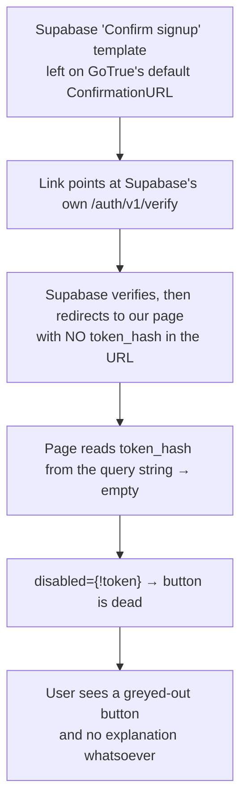

# Issue #22 — Email verification link button is disabled, and unverified accounts can log in

| | |
|---|---|
| **Issue** | [#22](https://github.com/painful-bug/MAY2026-Team-035/issues/22) |
| **Reported by** | Aishik Bandyopadhyay (`painful-bug`), 2026-08-05 |
| **Fixed by** | Lee Johns Shaji (`LeeJSC`), 2026-08-08 |
| **Branch** | `issues/22-email-verification` |
| **Commits** | `9c28904` (backend), `3dcd149` (frontend + docs) |
| **Status** | Code fixed and verified. **One dashboard change is still outstanding** — see [What still needs a human](#what-still-needs-a-human) |

---

## The short version

Two bugs were reported together. They turned out to have nothing to do with each other.

| | What was reported | What was actually wrong | Where the fix lives |
|---|---|---|---|
| **A** | Unverified accounts can log in | The backend accepted whatever the auth provider handed back, and never checked whether the email had been confirmed | Backend |
| **B** | The **Confirm email** button is greyed out | The Supabase email template sends a link with no verification token in it, and the page had no way to say so | Supabase dashboard (root cause) + frontend (it now explains itself) |

**A is the serious one.** It meant anyone could type an email address they did not own, pick a
password, and be inside the community — email ownership was never actually proven.

---

## Bug A — unverified accounts could log in

### What was happening

Signing in with a password ran through one function, which took whatever the provider returned:

```python
# before — backend/app/services/auth_service.py
result = get_auth_client().auth.sign_in_with_password({...})
if result.session is None:
    raise AuthenticationError("Invalid email or password.", ...)
return _session_from_result(result.session)     # session handed out, no questions asked
```

Supabase has a project setting called **Confirm email**. It controls whether *Supabase* refuses to
issue a session for an unconfirmed address.

- **Setting on:** Supabase refuses first. Our missing check never gets reached, and everything looks
  fine.
- **Setting off:** Supabase happily returns a completely valid session for an address nobody has ever
  proven they own — and our code was the last thing that could have objected. It didn't.

That is why the hole was invisible for so long. **The security of the whole flow was resting on a
checkbox in a web dashboard that no file in this repository can see, and which nobody would think to
look at when reviewing the auth code.**

### The trap we nearly walked into

The obvious fix looks like this, and it would have been a disaster:

```python
# DON'T — this locks out every Google user
if not principal.email_verified:
    raise AuthorizationError(...)
```

`Principal` already has an `email_verified` field, so gating on it in the shared request dependency
looks like a one-line fix that covers every endpoint at once. Two things in the repository exist
specifically to stop someone doing that:

1. **`docs/BACKEND_CHANGES.md`** records the ruling that Google OAuth sign-in must not depend on
   Supabase's optional `email_confirmed_at` claim being present in the token. It often isn't.
2. **`backend/tests/test_registration_contracts.py`** has a test whose entire job is to fail if
   anyone writes `not principal.email_verified` into the join or invitation flows.

So the check had to go somewhere that only affects the email/password path, and that reads something
more trustworthy than a token claim.

### Where the check actually went

**At the provider exchange** — the one moment where we hold the provider's own user record, which is
the authoritative source for whether an email is confirmed:

```python
# after — backend/app/services/auth_service.py
if not getattr(result.user, "email_confirmed_at", None):
    _discard_session(client)
    raise _unconfirmed_email()
```

Three deliberate decisions inside that:

**1. Both failure paths produce the same error.** If Supabase refuses the grant itself (setting on),
we catch its `email_not_confirmed` error and re-raise it as ours. If Supabase allows it (setting
off), the check above catches it. Either way the caller sees `401 email_not_confirmed`. **The
behaviour no longer depends on the dashboard toggle** — which was the actual root cause, not just the
missing check.

**2. The error says what is wrong.** Everywhere else in this flow we deliberately return vague errors
so an attacker cannot discover which email addresses have accounts. That rule does not apply here,
because *you only reach this branch by supplying the correct password*. Someone who got that far
already knows the account exists. Staying vague would buy no security at all and would strand a real
user staring at "invalid email or password" for an account they know is fine.

**3. The rejected session gets thrown away.** Supabase has already minted access and refresh tokens
by the time we decide to refuse. We never put them in a cookie, but the refresh token would stay
alive at the provider. `_discard_session` spends it, so refusing a sign-in doesn't leave a usable
credential lying around for an account that was never verified.

Also, if the provider returns a session but no user record at all, we **refuse**. There is nothing to
check, and nothing-to-check is not the same as nothing-to-worry-about.

### A latent bug found next door

While reading how the system decides whether an email is verified, we found that it had never worked:

```python
# before — backend/app/core/security.py
email_verified=bool(claims.get("email_confirmed_at") or claims.get("email_verified"))
```

Supabase doesn't put that flag at the top level of the token. It nests it inside `user_metadata`. So
`Principal.email_verified` was **`False` for every real user of the system, always**.

Harmless today, because nothing reads the field. But it is a loaded gun: the next person to reach for
the obvious fix (`if not principal.email_verified`) would have locked out one hundred percent of
users, and the test that guards the join flows wouldn't have caught it happening somewhere else.
Fixed to read the right place, with a comment saying plainly that the field is **descriptive and
never a permission gate**.

---

## Bug B — the greyed-out Confirm email button

### The chain of causes



**The root cause is configuration, not code.** And the correct configuration was already written
down, in our own setup guide, months ago:

> `docs/SUPABASE_AUTH_SETUP.md`, step 3:
> `https://app.example.com/auth/confirm-email?token_hash={{ .TokenHash }}&type=signup`

The project simply does not match its own document. So there was nothing to change in that document —
it was right all along.

### Why the page was still partly at fault

Even with the template fixed, this page could be reached with no token to spend — an already-used
link, or a bookmarked URL. The old page's entire response to that situation was to grey out the
button and say nothing.

That is the worst possible presentation of the problem. There is nothing to read, nothing to click,
and no way for the user to tell "your link expired" from "this app is broken". Worse, in the
misconfigured case **the user's email has actually just been verified by Supabase** on the way here —
they are staring at a dead button on a page telling them nothing, for a task that already succeeded.

### What the page does now

When there is no token to spend, it explains both possibilities and offers a way out of each:

> **This link has nothing left to confirm**
> It was already used, or it arrived without its verification token.
>
> If you have just clicked the link in your email, your address may already be confirmed — try
> signing in first. Otherwise, send yourself a fresh link.
>
> [ Email address ______ ] **Send a new link**

The sign-in page got the matching treatment. When sign-in is refused with the new
`email_not_confirmed` code, a **"Send me a new confirmation link"** button appears beneath the error,
so the message carries its own remedy instead of just naming the problem.

### The endpoint that had to become real first

The resend button needs somewhere to send to. `POST /auth/email/resend` existed — and was a placebo:

```python
# before — backend/app/api/v1/routers/auth.py
async def resend_email(_: PasswordResetRequest) -> MessageResponse:
    # Supabase does not expose a safe standalone resend primitive through this BFF.
    return MessageResponse(message="If an unconfirmed account exists, a confirmation email will be sent.")
```

It told the user mail was coming and sent nothing. The comment explained the reasoning honestly, and
the reasoning was simply out of date — the Supabase client does expose `auth.resend(...)`, in exactly
the same shape as the password-recovery call this codebase was already using.

This was worth revisiting the moment Bug A was fixed. **Before the fix, an unconfirmed user could
just log in anyway, so a broken resend didn't strand anyone. After the fix, they cannot — so a user
whose confirmation link is dead has nowhere else to go.** Fixing A without fixing this would have
turned a security hole into a lockout.

The endpoint now really sends. It still swallows provider errors and returns the same neutral message
either way, so it cannot be used to discover who has registered — which means **a 200 from it is not
a delivery receipt**, and that is now written into the API docs so no client waits forever on it.

---

## Everything that changed

### Backend

| File | Change |
|---|---|
| `app/services/auth_service.py` | The verification check; `resend_confirmation_email`; `_discard_session`; one shared `confirmation_redirect_url()` so sign-up and resend cannot drift apart |
| `app/api/v1/routers/auth.py` | `/auth/email/resend` wired to the real service call, with CAPTCHA and provider-enabled checks like its neighbours |
| `app/core/security.py` | Read `email_verified` from where Supabase actually puts it |
| `scripts/api_annotations.py` | New `401 email_not_confirmed` documented on sign-in; the resend description rewritten from "does not currently send anything" to what it now does |

### Frontend

| File | Change |
|---|---|
| `pages/Auth/EmailConfirmationPage.jsx` | Explains a missing token and offers a resend, instead of a silent dead button |
| `components/auth/AuthEntryPage.jsx` | Surfaces a resend link when sign-in returns `email_not_confirmed` |
| `lib/auth/authService.js` | `resendEmailConfirmation()` |

### Tests — 11 new

`tests/test_auth_verification.py` (9) and `tests/api/test_auth.py` (2):

- an unconfirmed address cannot exchange a password for a session
- refusing a sign-in does not leave a live session behind
- a provider that refuses the grant reports the same reason
- a confirmed address still signs in
- a wrong password is **not** reported as an unconfirmed address
- a session without a user record fails closed
- resending asks for a signup link pointing at the confirmation page
- resending stays silent when the provider fails
- email confirmation is read from where Supabase actually puts it
- the sign-in endpoint returns `401 email_not_confirmed` and sets no cookie
- the resend endpoint reaches the provider and reveals nothing

### Docs

`docs/API.md` §3 (the whole authentication chapter), `docs/CHANGE_LOG.md`, `docs/openapi.yaml`
(regenerated, never hand-edited), and a new `docs/potential issues/` folder.

---

## What we deliberately did **not** do

**Gate every request on `email_verified`.** Covered above — it would lock out every Google user, and
two separate artifacts in the repo exist to prevent it.

**Change `docs/SUPABASE_AUTH_SETUP.md`.** It was already correct. The project is what's wrong.

**Fix the 149 backend lint violations.** They are pre-existing and concentrated in the auth
workstream's files. We confirmed the count was identical with our changes stashed, and wrapped our
own long lines so the number did not climb. Raised separately instead.

---

## What still needs a human

**The Supabase dashboard change has not been made.** Nothing in the code can do it, and it is the
actual root cause of Bug B.

1. **Authentication → Email Templates → Confirm signup.** Set the URL to:
   `https://<your-frontend>/auth/confirm-email?token_hash={{ .TokenHash }}&type=signup`
2. Do the same for recovery, with `/auth/reset-password` and `type=recovery`.
3. **Authentication → URL Configuration.** Confirm both frontend redirect URLs are listed exactly.
4. **Authentication → Providers → Email.** Turning **Confirm email** on is now belt-and-braces rather
   than load-bearing, but turn it on anyway.

**To verify:** register a fresh account, open the email, and check the link's query string contains
`token_hash=`. The button on the confirmation page should be live.

---

## How to check this yourself

```bash
cd backend && python -m pytest tests/test_auth_verification.py tests/api/test_auth.py -v
```

Full evidence at the time of the fix:

| Check | Result |
|---|---|
| Backend test suite | **686 passed** (675 before) |
| `python scripts/export_openapi.py --check` | Spec up to date |
| `ruff check .` (backend) | 149 — unchanged from before this branch |
| Frontend lint / test / build | All clean |

---

## Related findings

Investigating this issue surfaced eight problems that are **not** part of it — including an OAuth
callback that never checks which provider started the sign-in, and an RBAC module whose
documentation describes a model the code abandoned. Each is written up ready to raise as its own
issue in **[`docs/potential issues/`](../potential%20issues/README.md)**.
