# Implemented Flows

This document lists the user-facing flows currently implemented in HomeBandhu. Each flow is kept separate so it can be reviewed and discussed independently.

## Public: Login With OTP

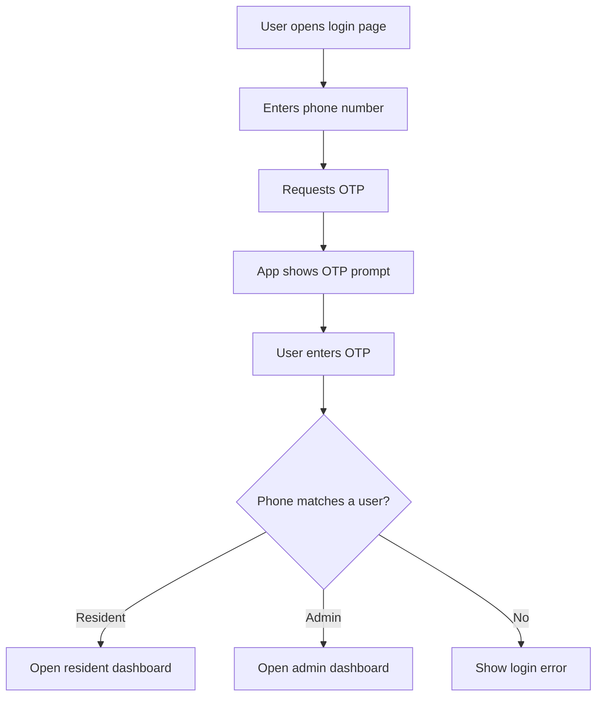
```mermaid
flowchart TD
  A[User opens login page] --> B[Enters phone number]
  B --> C[Requests OTP]
  C --> D[App shows OTP prompt]
  D --> E[User enters OTP]
  E --> F{Phone matches a user?}
  F -->|Resident| G[Open resident dashboard]
  F -->|Admin| H[Open admin dashboard]
  F -->|No| I[Show login error]
```

## Public: Submit Access Request

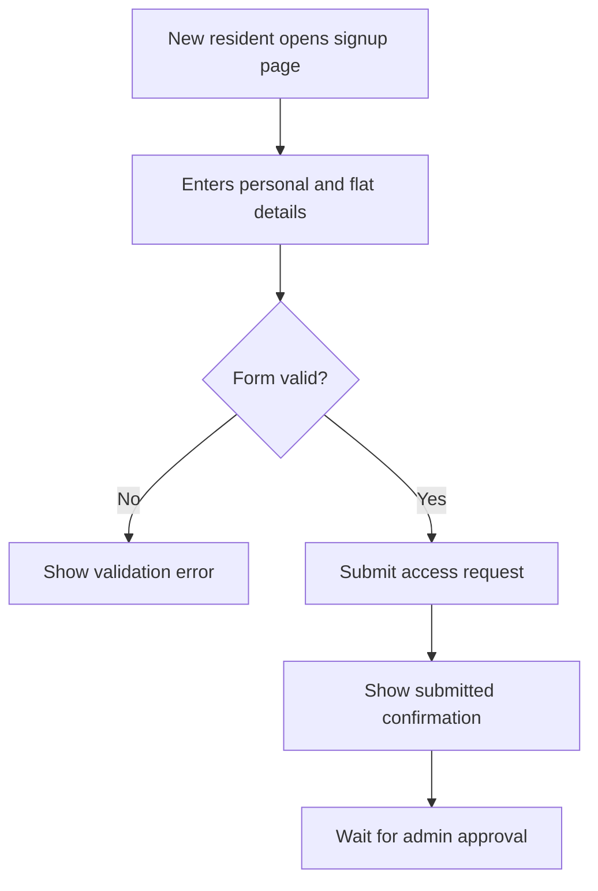
```mermaid
flowchart TD
  A[New resident opens signup page] --> B[Enters personal and flat details]
  B --> C{Form valid?}
  C -->|No| D[Show validation error]
  C -->|Yes| E[Submit access request]
  E --> F[Show submitted confirmation]
  F --> G[Wait for admin approval]
```

## Public: Join With Invite Link

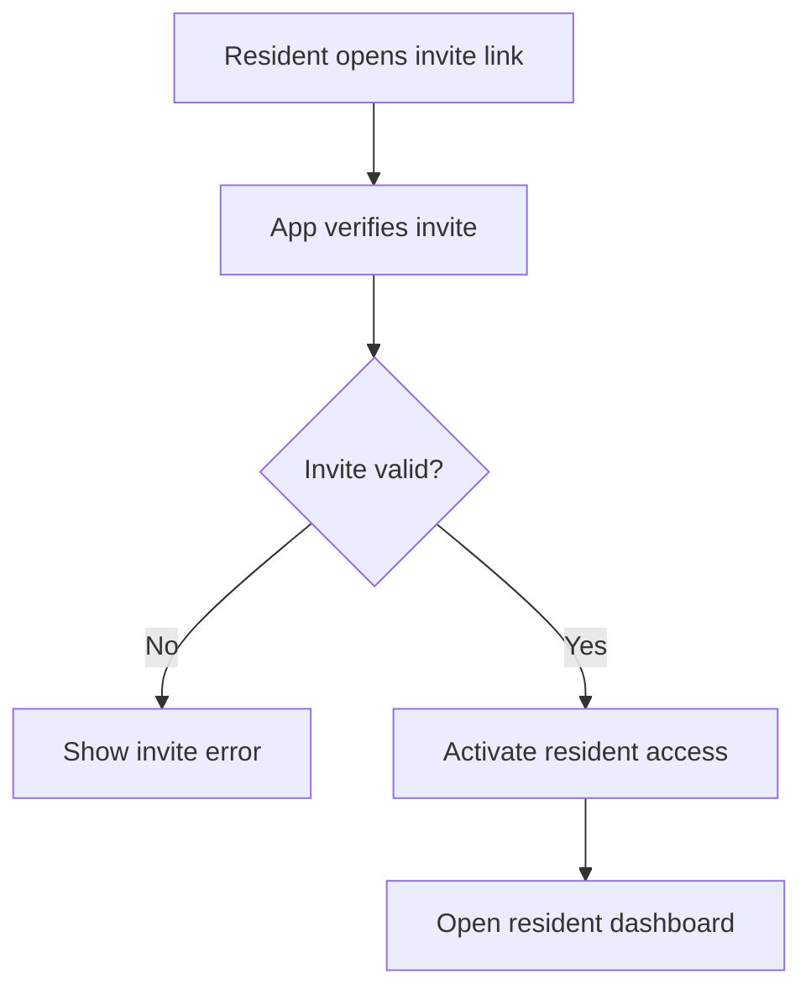
```mermaid
flowchart TD
  A[Resident opens invite link] --> B[App verifies invite]
  B --> C{Invite valid?}
  C -->|No| D[Show invite error]
  C -->|Yes| E[Activate resident access]
  E --> F[Open resident dashboard]
```

## Public: Join With Invite Code

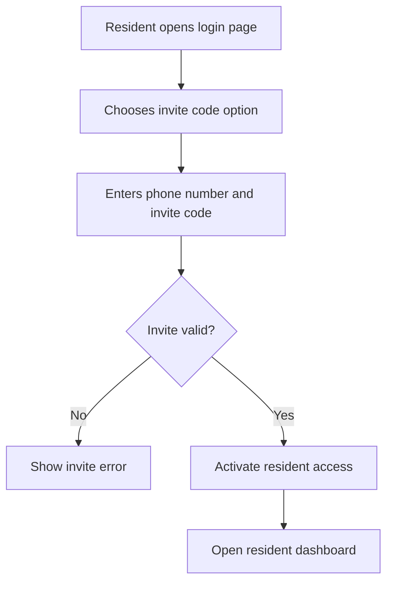
```mermaid
flowchart TD
  A[Resident opens login page] --> B[Chooses invite code option]
  B --> C[Enters phone number and invite code]
  C --> D{Invite valid?}
  D -->|No| E[Show invite error]
  D -->|Yes| F[Activate resident access]
  F --> G[Open resident dashboard]
```

## Resident: Pre-Approve Visitor

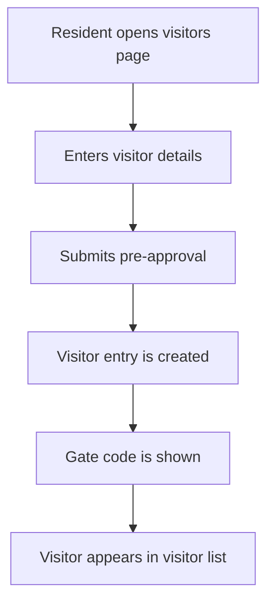
```mermaid
flowchart TD
  A[Resident opens visitors page] --> B[Enters visitor details]
  B --> C[Submits pre-approval]
  C --> D[Visitor entry is created]
  D --> E[Gate code is shown]
  E --> F[Visitor appears in visitor list]
```

## Resident: Raise Complaint

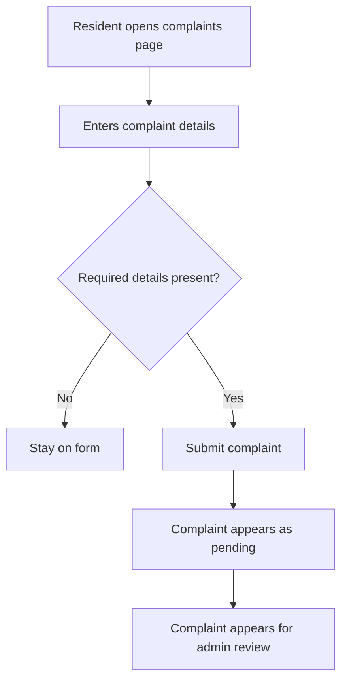
```mermaid
flowchart TD
  A[Resident opens complaints page] --> B[Enters complaint details]
  B --> C{Required details present?}
  C -->|No| D[Stay on form]
  C -->|Yes| E[Submit complaint]
  E --> F[Complaint appears as pending]
  F --> G[Complaint appears for admin review]
```

## Resident: Book Amenity

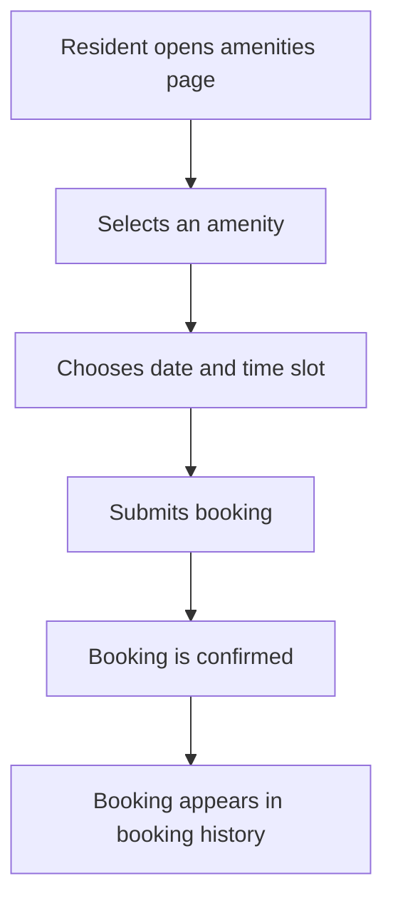
```mermaid
flowchart TD
  A[Resident opens amenities page] --> B[Selects an amenity]
  B --> C[Chooses date and time slot]
  C --> D[Submits booking]
  D --> E[Booking is confirmed]
  E --> F[Booking appears in booking history]
```

## Resident: Pay Maintenance Invoice

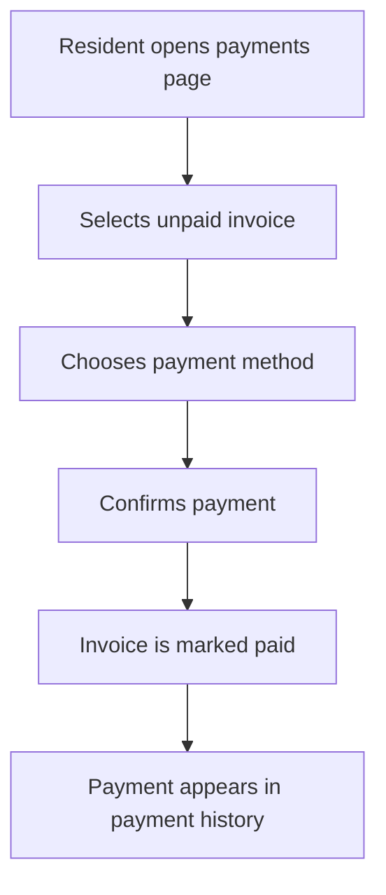
```mermaid
flowchart TD
  A[Resident opens payments page] --> B[Selects unpaid invoice]
  B --> C[Chooses payment method]
  C --> D[Confirms payment]
  D --> E[Invoice is marked paid]
  E --> F[Payment appears in payment history]
```

## Resident: View Notices

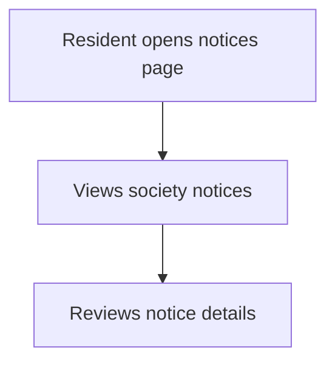
```mermaid
flowchart TD
  A[Resident opens notices page] --> B[Views society notices]
  B --> C[Reviews notice details]
```

## Resident: Add Phone Number To Flat

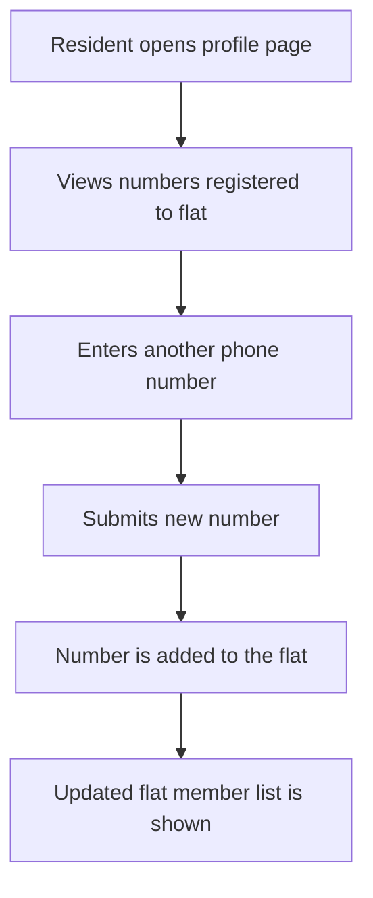
```mermaid
flowchart TD
  A[Resident opens profile page] --> B[Views numbers registered to flat]
  B --> C[Enters another phone number]
  C --> D[Submits new number]
  D --> E[Number is added to the flat]
  E --> F[Updated flat member list is shown]
```

## Admin: Review Pending Registration

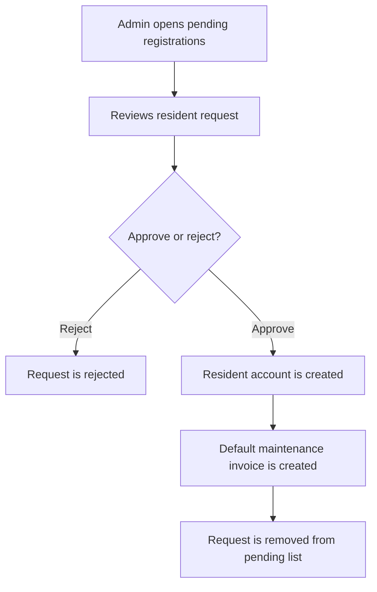
```mermaid
flowchart TD
  A[Admin opens pending registrations] --> B[Reviews resident request]
  B --> C{Approve or reject?}
  C -->|Reject| D[Request is rejected]
  C -->|Approve| E[Resident account is created]
  E --> F[Default maintenance invoice is created]
  F --> G[Request is removed from pending list]
```

## Admin: Invite Resident

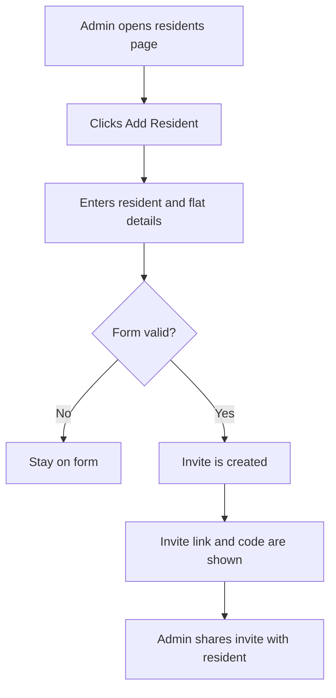
```mermaid
flowchart TD
  A[Admin opens residents page] --> B[Clicks Add Resident]
  B --> C[Enters resident and flat details]
  C --> D{Form valid?}
  D -->|No| E[Stay on form]
  D -->|Yes| F[Invite is created]
  F --> G[Invite link and code are shown]
  G --> H[Admin shares invite with resident]
```

## Admin: Edit Or Remove Resident

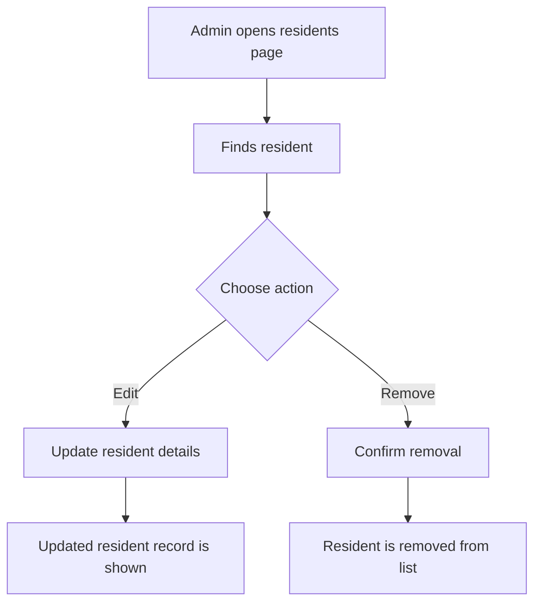
```mermaid
flowchart TD
  A[Admin opens residents page] --> B[Finds resident]
  B --> C{Choose action}
  C -->|Edit| D[Update resident details]
  D --> E[Updated resident record is shown]
  C -->|Remove| F[Confirm removal]
  F --> G[Resident is removed from list]
```

## Admin: Add Admin

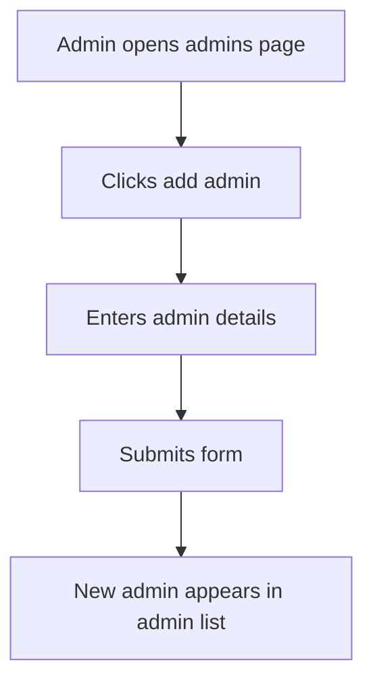
```mermaid
flowchart TD
  A[Admin opens admins page] --> B[Clicks add admin]
  B --> C[Enters admin details]
  C --> D[Submits form]
  D --> E[New admin appears in admin list]
```

## Admin: Manage Amenities

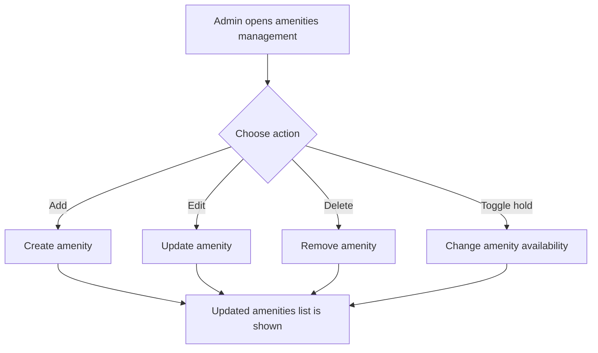
```mermaid
flowchart TD
  A[Admin opens amenities management] --> B{Choose action}
  B -->|Add| C[Create amenity]
  B -->|Edit| D[Update amenity]
  B -->|Delete| E[Remove amenity]
  B -->|Toggle hold| F[Change amenity availability]
  C --> G[Updated amenities list is shown]
  D --> G
  E --> G
  F --> G
```

## Admin: Post Notice

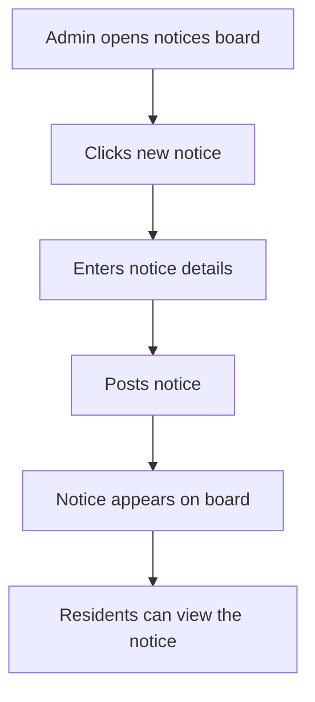
```mermaid
flowchart TD
  A[Admin opens notices board] --> B[Clicks new notice]
  B --> C[Enters notice details]
  C --> D[Posts notice]
  D --> E[Notice appears on board]
  E --> F[Residents can view the notice]
```

## Admin: Update Complaint

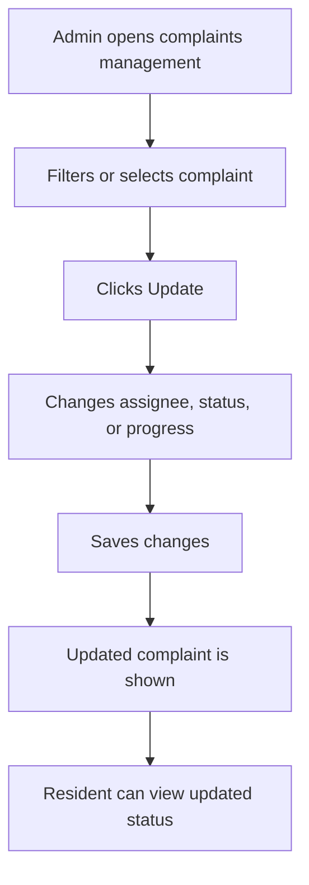
```mermaid
flowchart TD
  A[Admin opens complaints management] --> B[Filters or selects complaint]
  B --> C[Clicks Update]
  C --> D[Changes assignee, status, or progress]
  D --> E[Saves changes]
  E --> F[Updated complaint is shown]
  F --> G[Resident can view updated status]
```

## Admin: View Maintenance Payments

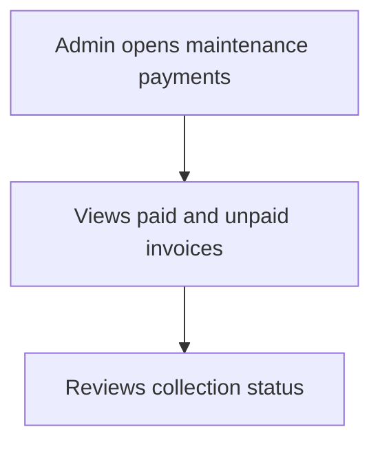
```mermaid
flowchart TD
  A[Admin opens maintenance payments] --> B[Views paid and unpaid invoices]
  B --> C[Reviews collection status]
```

## Admin: View Dashboard

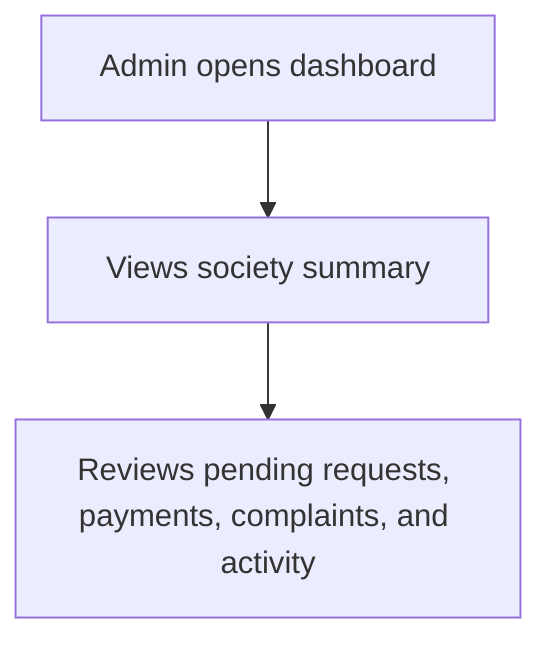
```mermaid
flowchart TD
  A[Admin opens dashboard] --> B[Views society summary]
  B --> C[Reviews pending requests, payments, complaints, and activity]
```

## Resident: View Dashboard

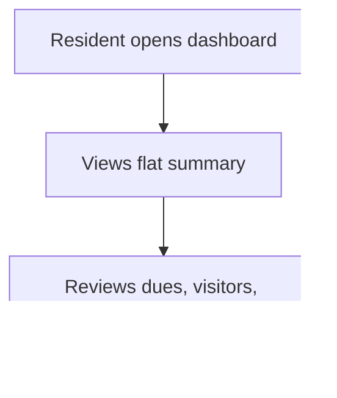
```mermaid
flowchart TD
  A[Resident opens dashboard] --> B[Views flat summary]
  B --> C[Reviews dues, visitors, notices, complaints, and activity]
```
