# Implemented Flows

HomeBandhu is currently implemented as a frontend-first React app. The backend is planned for a later phase. For now, domain data is stored in a Zustand store persisted to browser storage, while authentication is simulated.

This document lists the user-facing flows currently implemented on the `dev` branch. Each flow is intentionally kept separate so it can be reviewed, tested, and later mapped to backend APIs independently.

## Storage Model

- Domain data is stored in `localStorage` through the app Zustand store.
- The current logged-in user is stored in `sessionStorage` through the auth Zustand store.
- App data is rehydrated across tabs using the browser `storage` event.
- OTP, payments, and invite delivery are simulated in the frontend.

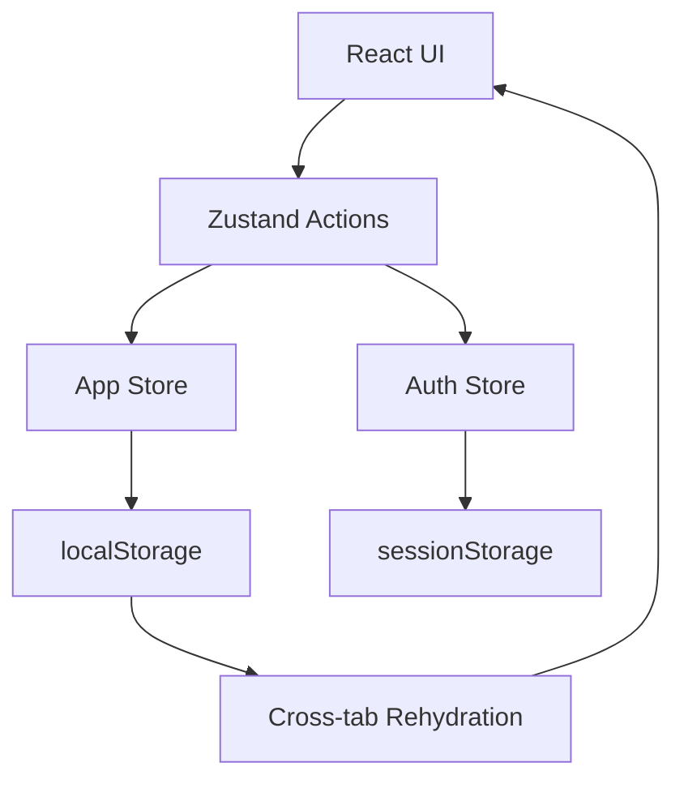

## Public: Login With OTP

**Actor:** Resident or Admin  
**Entry point:** `/login`  
**State touched:** `currentUser`

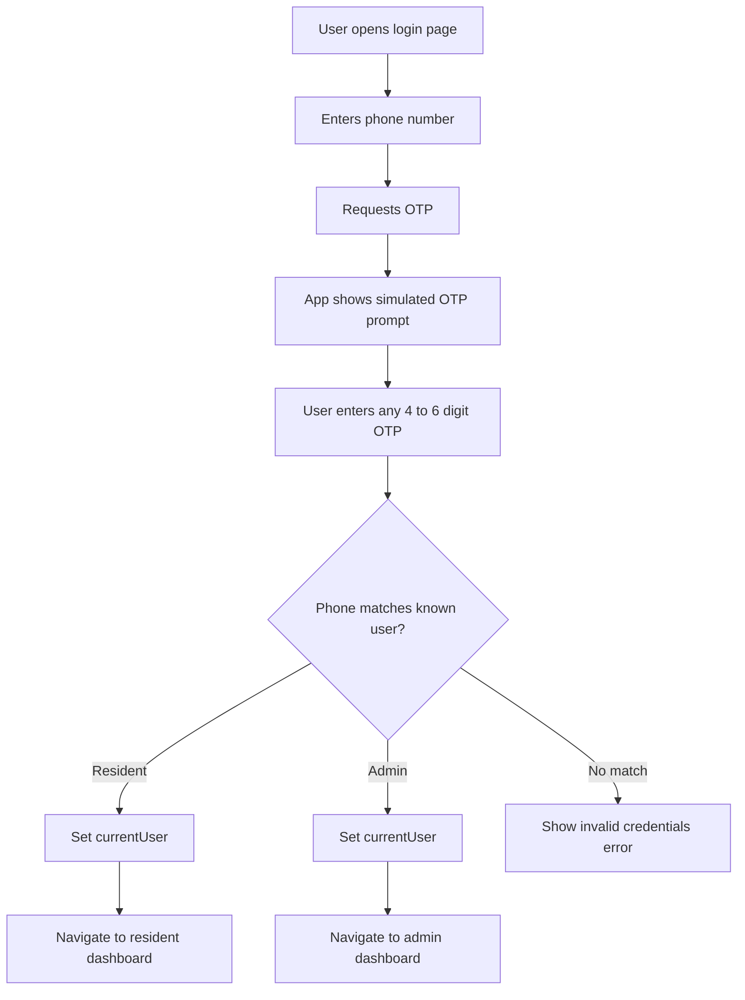

**Notes**

- OTP validation is simulated.
- Demo resident and admin phone numbers are supported.
- Login state is per tab because it uses `sessionStorage`.

## Public: Submit Access Request

**Actor:** New resident  
**Entry point:** `/signup`  
**State touched:** `pendingRequests`

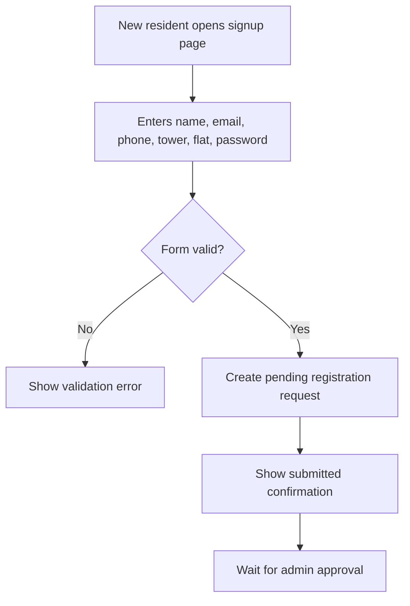

**Notes**

- Password is collected by the form but is not used for real authentication yet.
- Approval is handled by an admin from the admin dashboard.

## Public: Join With Invite Link

**Actor:** Invited resident  
**Entry point:** `/join/:token`  
**State touched:** `users`, `invitations`, `currentUser`, `activities`

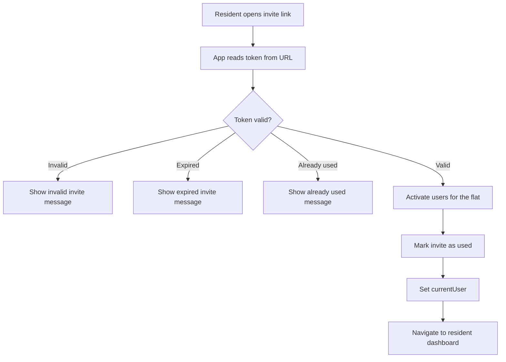

**Notes**

- Invite tokens are opaque and single-use.
- Redeeming one invite activates all invited users for that flat.

## Public: Join With Invite Code

**Actor:** Invited resident  
**Entry point:** `/login` invite mode  
**State touched:** `users`, `invitations`, `currentUser`, `activities`

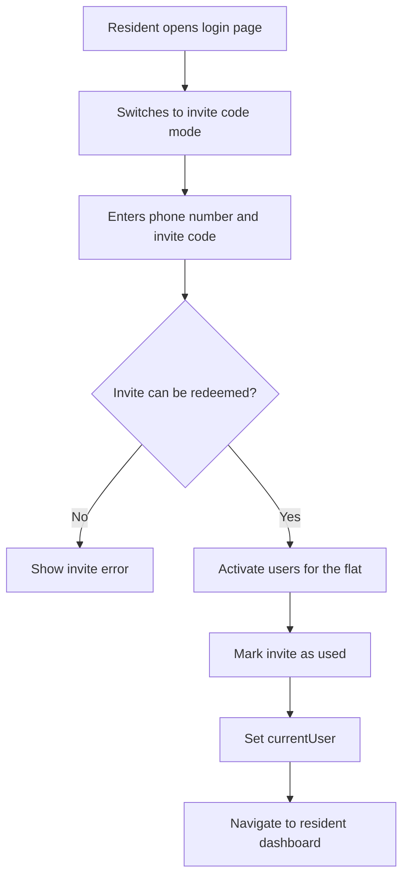

## Resident: Pre-Approve Visitor

**Actor:** Resident  
**Entry point:** `/resident/visitors`  
**State touched:** `visitors`, `activities`

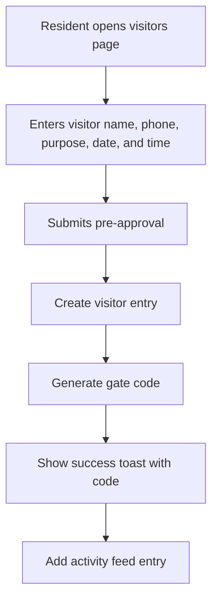

**Notes**

- Gate codes are generated on the frontend.

## Resident: Raise Complaint

**Actor:** Resident  
**Entry point:** `/resident/complaints`  
**State touched:** `complaints`, `activities`

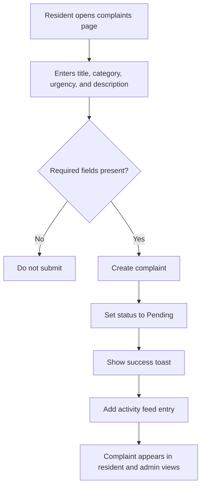

## Resident: Book Amenity

**Actor:** Resident  
**Entry point:** `/resident/amenities`  
**State touched:** `bookings`, `activities`

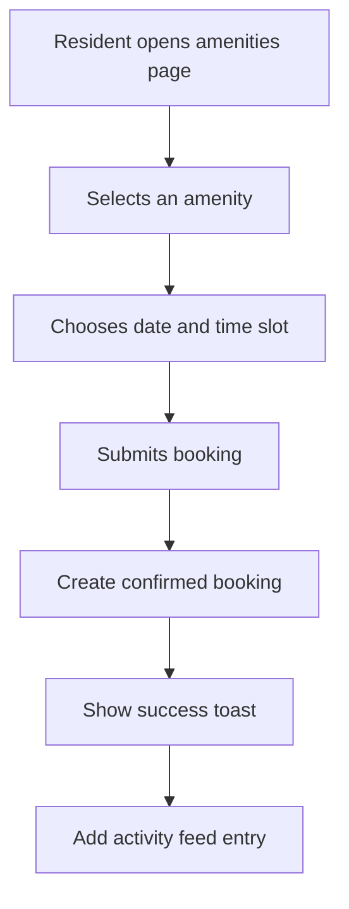

## Resident: Pay Maintenance Invoice

**Actor:** Resident  
**Entry point:** `/resident/payments`  
**State touched:** `payments`, `activities`

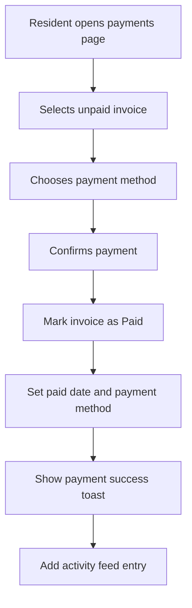

**Notes**

- Payment processing is simulated.

## Resident: View Notices

**Actor:** Resident  
**Entry point:** `/resident/notices`  
**State touched:** Read-only `notices`

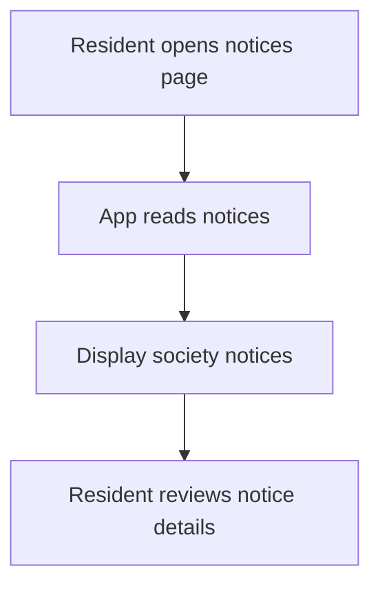

## Resident: Add Phone Number To Flat

**Actor:** Resident  
**Entry point:** `/resident/profile`  
**State touched:** `users`, `activities`

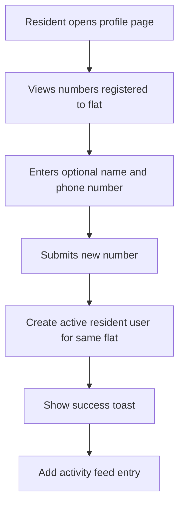

## Admin: Review Pending Registration

**Actor:** Admin  
**Entry point:** `/admin/pending`  
**State touched:** `pendingRequests`, `users`, `payments`, `activities`

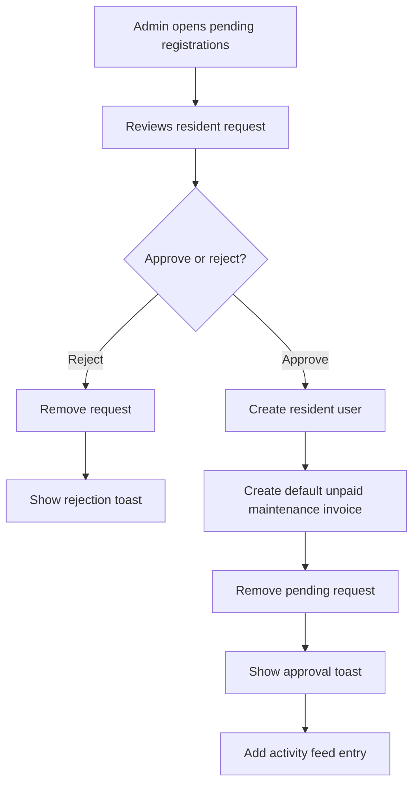

## Admin: Invite Resident

**Actor:** Admin  
**Entry point:** `/admin/residents`  
**State touched:** `users`, `invitations`, `activities`

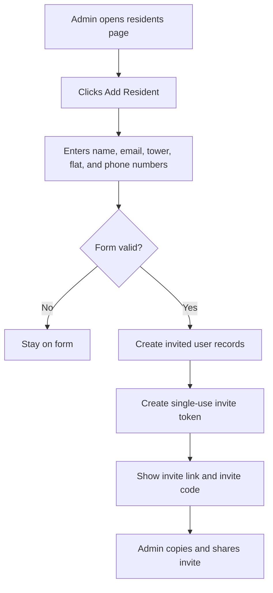

**Notes**

- One invite can cover multiple phone numbers for the same flat.
- Created users start with `Invited` status.

## Admin: Edit Or Remove Resident

**Actor:** Admin  
**Entry point:** `/admin/residents`  
**State touched:** `users`, `activities`

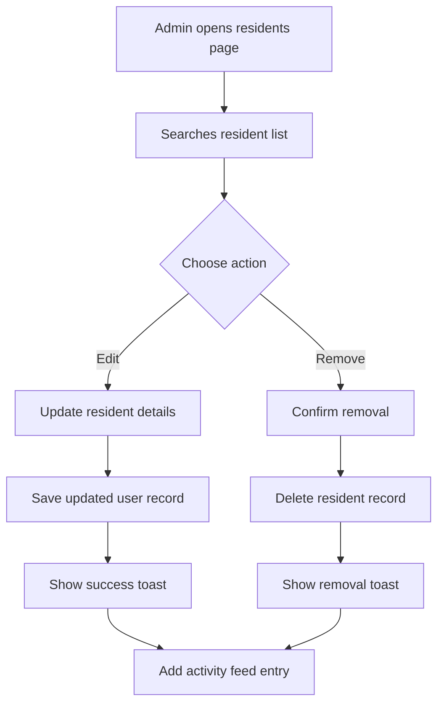

## Admin: Add Admin

**Actor:** Admin  
**Entry point:** `/admin/admins`  
**State touched:** `users`, `activities`

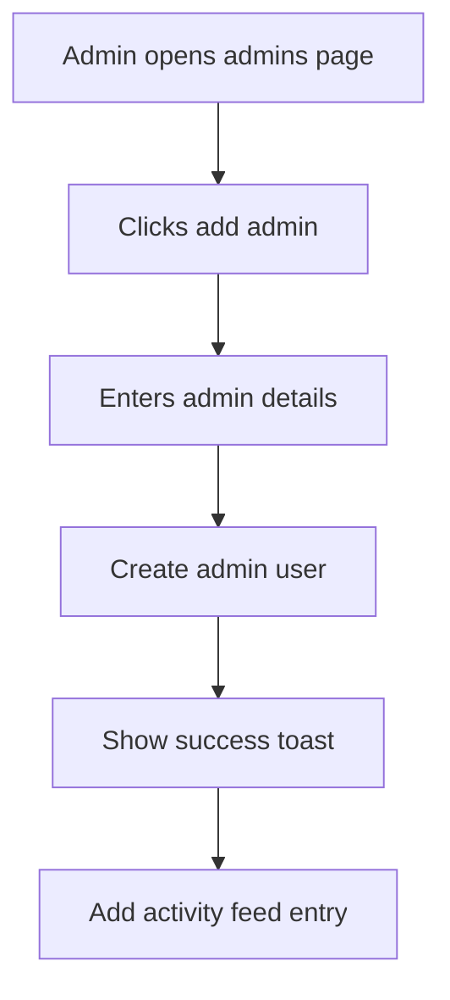

## Admin: Manage Amenities

**Actor:** Admin  
**Entry point:** `/admin/amenities`  
**State touched:** `amenities`, `activities`

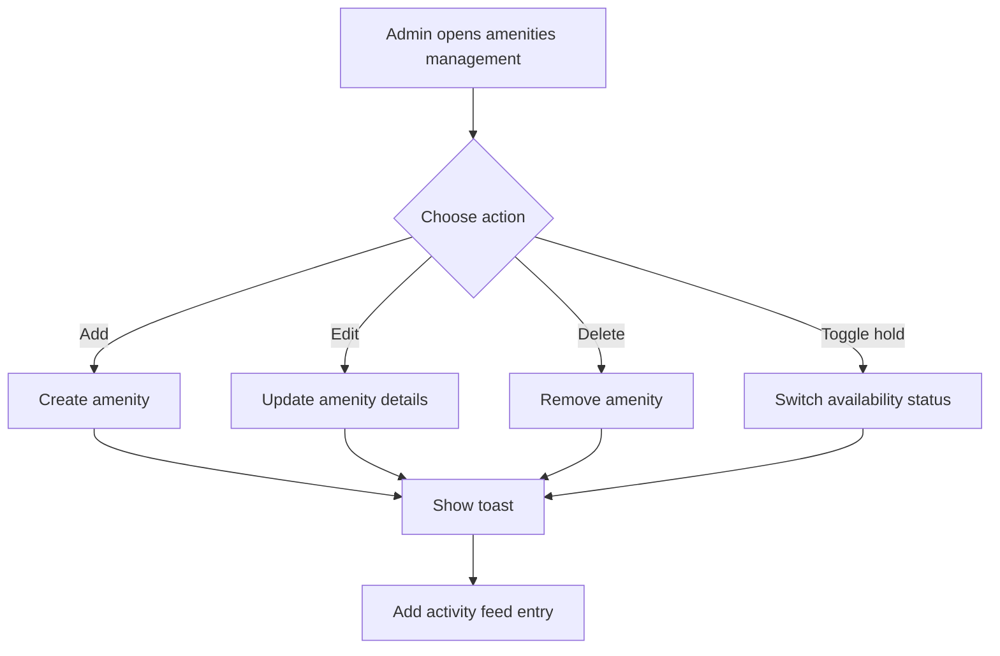

## Admin: Post Notice

**Actor:** Admin  
**Entry point:** `/admin/notices`  
**State touched:** `notices`, `activities`

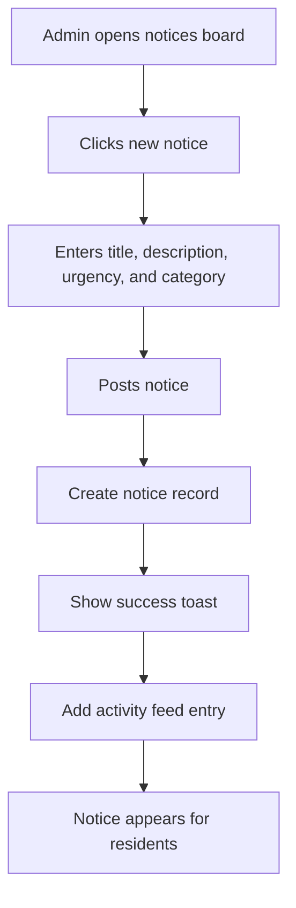

## Admin: Update Complaint

**Actor:** Admin  
**Entry point:** `/admin/complaints`  
**State touched:** `complaints`, `activities`

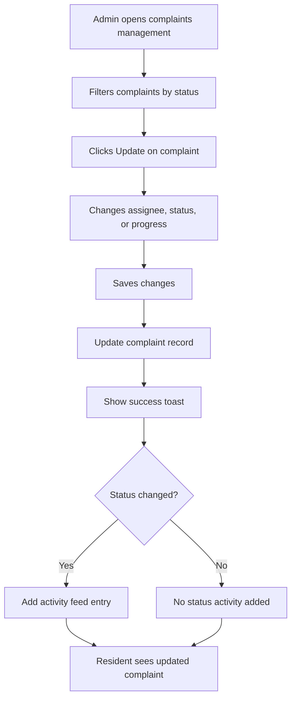

## Admin: View Maintenance Payments

**Actor:** Admin  
**Entry point:** `/admin/maintenance`  
**State touched:** Read-only `payments`

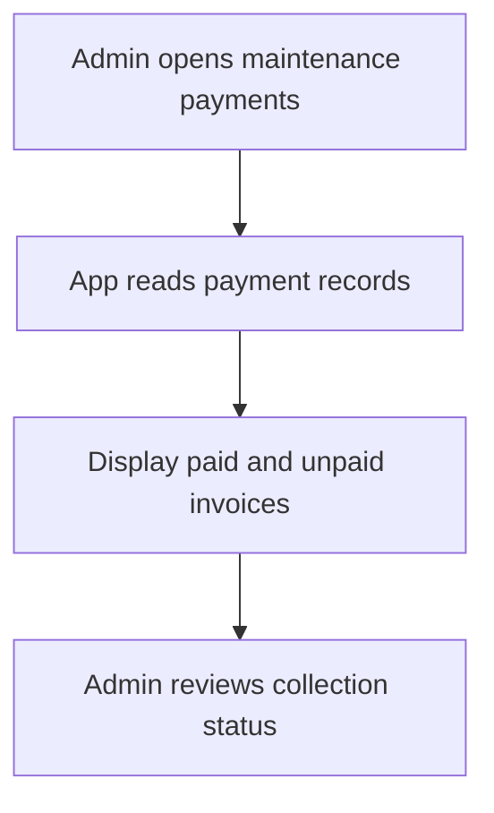

## Admin: View Dashboard

**Actor:** Admin  
**Entry point:** `/admin`  
**State touched:** Read-only dashboard collections

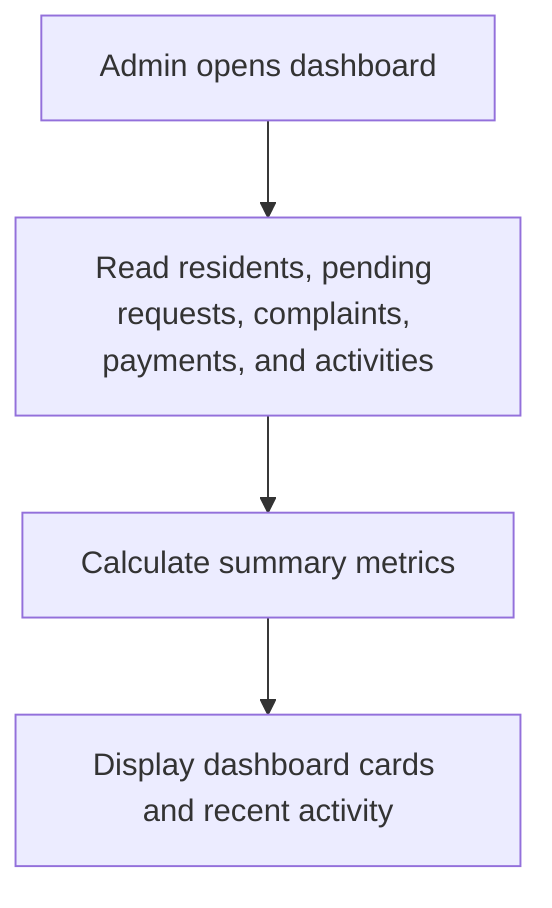

## Resident: View Dashboard

**Actor:** Resident  
**Entry point:** `/resident`  
**State touched:** Read-only dashboard collections

```mermaid
flowchart TD
  A[Resident opens dashboard] --> B[Read notices, visitors, complaints, payments, bookings, and activities]
  B --> C[Calculate resident summary]
  C --> D[Display cards, recent activity, dues, visitors, and notices]
```

## Future Backend Mapping

When backend work begins, the frontend actions in this document can be mapped to API endpoints. Examples:

- Login and OTP flows can map to authentication endpoints.
- Registration requests can map to resident onboarding endpoints.
- Invite creation and redemption can move from browser storage to server-side validation.
- Complaints, visitors, payments, notices, amenities, and users can become persisted database-backed resources.
- Cross-tab browser sync can later be complemented or replaced by API refetching, WebSocket updates, or server-sent events.
